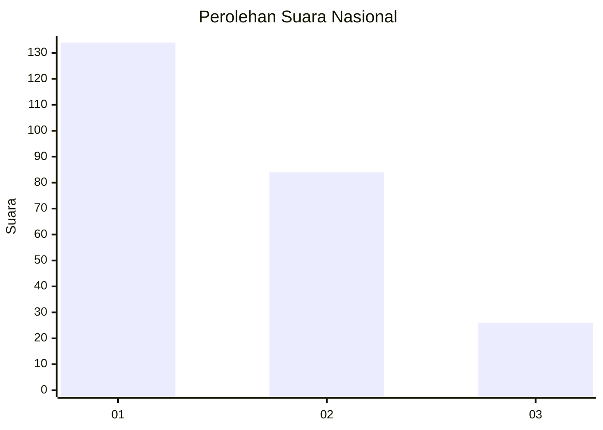
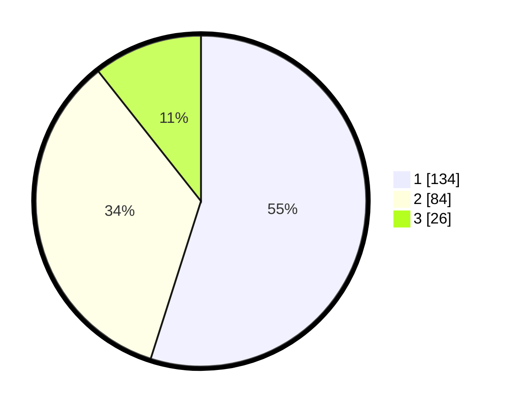

# Hasil

## Grafik

## Tabel

| No.    | Nama Paslon    | Suara | Suara (raw) | Persentase |
|:------ |:-------------- | -----:| -----------:| ----------:|
| 100025 | ANIES MUHAIMIN | 134   | [134][p-1]  | 54,92      |
| 100026 | PRABOWO GIBRAN | 84    | [84][p-2]   | 34,43      |
| 100027 | GANJAR MAHFUD  | 26    | [26][p-3]   | 10,66      |

[p-1]: https://github.com/gigit-pemilu/pemilu-2024/blob/main/pilpres/hitung-suara/sub/31-dki-jakarta/sub/74-jakarta-selatan/sub/07-kebayoran-baru/sub/1009-gandaria-utara/sub/125-tps/sub/paslon-1.txt
[p-2]: https://github.com/gigit-pemilu/pemilu-2024/blob/main/pilpres/hitung-suara/sub/31-dki-jakarta/sub/74-jakarta-selatan/sub/07-kebayoran-baru/sub/1009-gandaria-utara/sub/125-tps/sub/paslon-2.txt
[p-3]: https://github.com/gigit-pemilu/pemilu-2024/blob/main/pilpres/hitung-suara/sub/31-dki-jakarta/sub/74-jakarta-selatan/sub/07-kebayoran-baru/sub/1009-gandaria-utara/sub/125-tps/sub/paslon-3.txt

## Foto C Plano

https://sirekap-obj-formc.kpu.go.id/5d5b/pemilu/ppwp/31/74/07/10/09/3174071009125-20240227-132326--c2d1ac87-b4ea-4c09-9af5-0631beb0dd07.jpg

https://sirekap-obj-formc.kpu.go.id/5d5b/pemilu/ppwp/31/74/07/10/09/3174071009125-20240227-132350--052f5646-69af-4c5e-81af-4195fb40a7dc.jpg

https://sirekap-obj-formc.kpu.go.id/5d5b/pemilu/ppwp/31/74/07/10/09/3174071009125-20240227-132416--75ae065c-797a-4de2-a4ce-66e744a8d6b5.jpg

## Metadata

| Key        | Value               |
| ---------- | ------------------- |
| Time Stamp | 2024-02-27 14:00:00 |

## DATA PEMILIH TETAP

Jumlah pemilih dalam DPT: **883**.
 * L: **553**.
 * P: **528**.

## DATA PENGGUNA HAK PILIH

Jumlah pengguna hak pilih dalam DPT: **352**.
 * L: **399**.
 * P: **435**.

Jumlah pengguna hak pilih dalam DPTb: **887**.
 * L: **383**.
 * P: **884**.

Jumlah pengguna hak pilih dalam DPK: **883**.
 * L: **385**.
 * P: **888**.

Jumlah pengguna hak pilih: **327**.
 * L: **493**.
 * P: **338**.

## JUMLAH SUARA SAH DAN TIDAK SAH

JUMLAH SELURUH SUARA SAH: **224**.

JUMLAH SUARA TIDAK SAH: **843**.

JUMLAH SELURUH SUARA SAH DAN SUARA TIDAK SAH: **223**.

