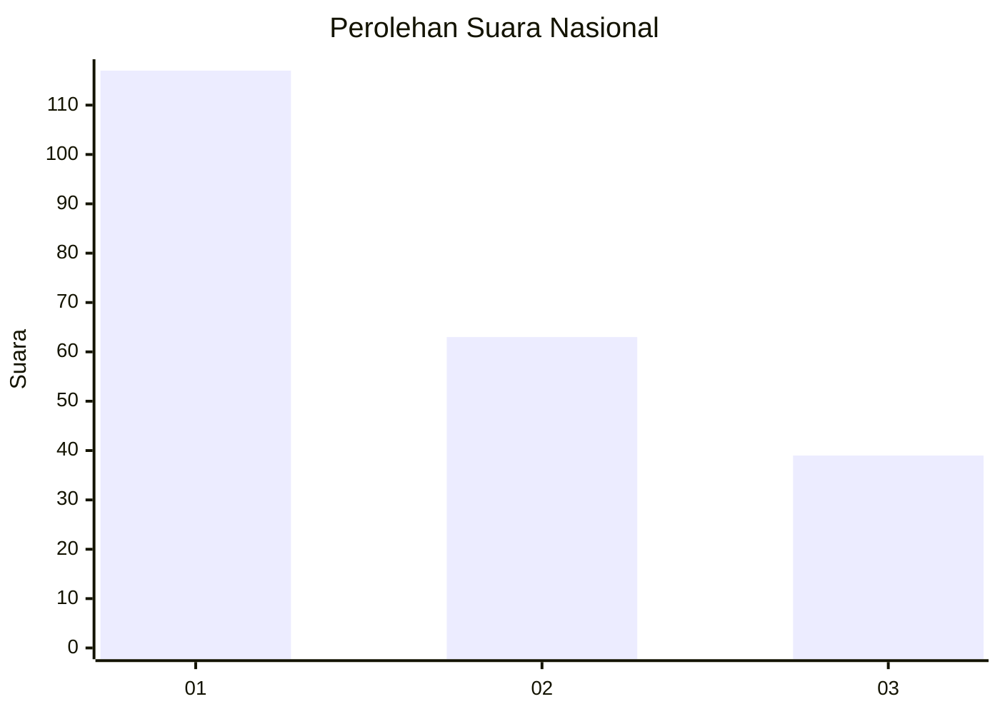
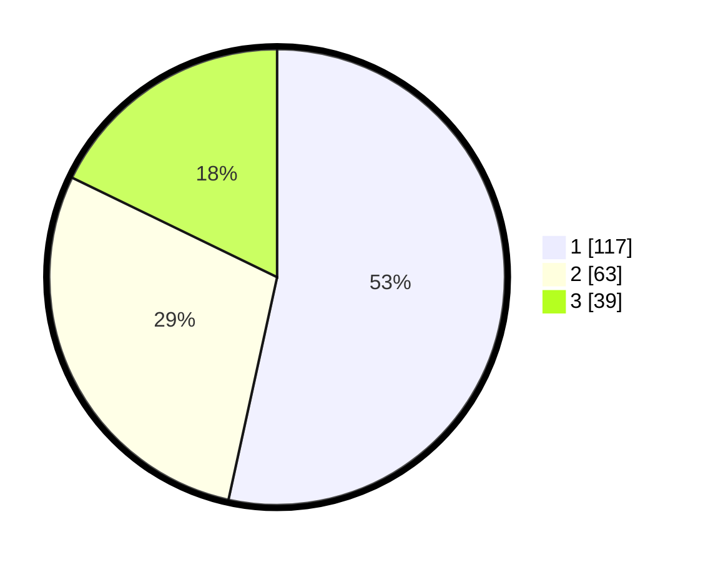

# Hasil

## Grafik

## Tabel

| No.    | Nama Paslon    | Suara | Suara (raw) | Persentase |
|:------ |:-------------- | -----:| -----------:| ----------:|
| 100025 | ANIES MUHAIMIN | 117   | [117][p-1]  | 53,42      |
| 100026 | PRABOWO GIBRAN | 63    | [63][p-2]   | 28,77      |
| 100027 | GANJAR MAHFUD  | 39    | [39][p-3]   | 17,81      |

[p-1]: https://github.com/gigit-pemilu/pemilu-2024/blob/main/pilpres/hitung-suara/sub/31-dki-jakarta/sub/74-jakarta-selatan/sub/07-kebayoran-baru/sub/1009-gandaria-utara/sub/127-tps/sub/paslon-1.txt
[p-2]: https://github.com/gigit-pemilu/pemilu-2024/blob/main/pilpres/hitung-suara/sub/31-dki-jakarta/sub/74-jakarta-selatan/sub/07-kebayoran-baru/sub/1009-gandaria-utara/sub/127-tps/sub/paslon-2.txt
[p-3]: https://github.com/gigit-pemilu/pemilu-2024/blob/main/pilpres/hitung-suara/sub/31-dki-jakarta/sub/74-jakarta-selatan/sub/07-kebayoran-baru/sub/1009-gandaria-utara/sub/127-tps/sub/paslon-3.txt

## Foto C Plano

https://sirekap-obj-formc.kpu.go.id/ad6b/pemilu/ppwp/31/74/07/10/09/3174071009127-20240227-115030--247ac5d5-9d69-4530-9859-ba771c1c0306.jpg

https://sirekap-obj-formc.kpu.go.id/ad6b/pemilu/ppwp/31/74/07/10/09/3174071009127-20240227-115046--18f1885c-bd78-4c74-b294-70337444f40c.jpg

https://sirekap-obj-formc.kpu.go.id/ad6b/pemilu/ppwp/31/74/07/10/09/3174071009127-20240227-115158--eed37f3c-0d62-4255-b95b-8b32febe924b.jpg

## Metadata

| Key        | Value               |
| ---------- | ------------------- |
| Time Stamp | 2024-02-27 22:00:00 |

## DATA PEMILIH TETAP

Jumlah pemilih dalam DPT: **283**.
 * L: **439**.
 * P: **843**.

## DATA PENGGUNA HAK PILIH

Jumlah pengguna hak pilih dalam DPT: **242**.
 * L: **842**.
 * P: **566**.

Jumlah pengguna hak pilih dalam DPTb: **885**.
 * L: **884**.
 * P: **880**.

Jumlah pengguna hak pilih dalam DPK: **884**.
 * L: **882**.
 * P: **888**.

Jumlah pengguna hak pilih: **323**.
 * L: **556**.
 * P: **293**.

## JUMLAH SUARA SAH DAN TIDAK SAH

JUMLAH SELURUH SUARA SAH: **219**.

JUMLAH SUARA TIDAK SAH: **4**.

JUMLAH SELURUH SUARA SAH DAN SUARA TIDAK SAH: **223**.

