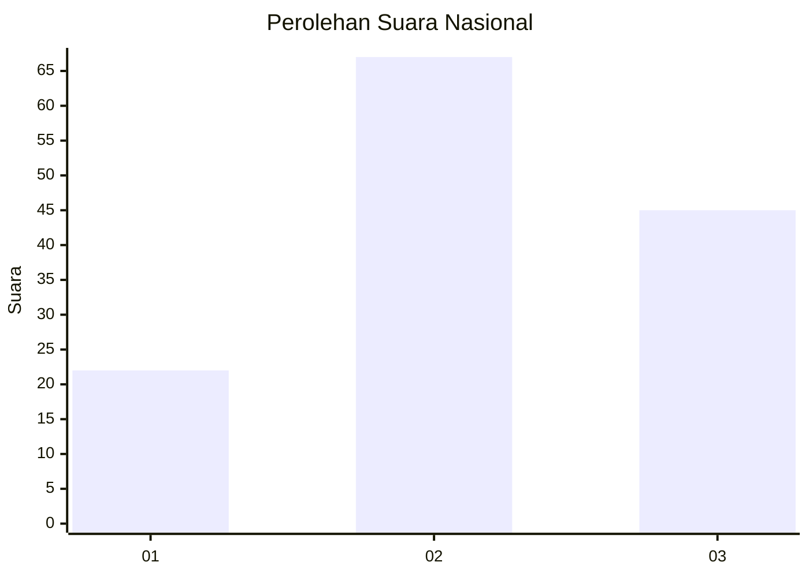
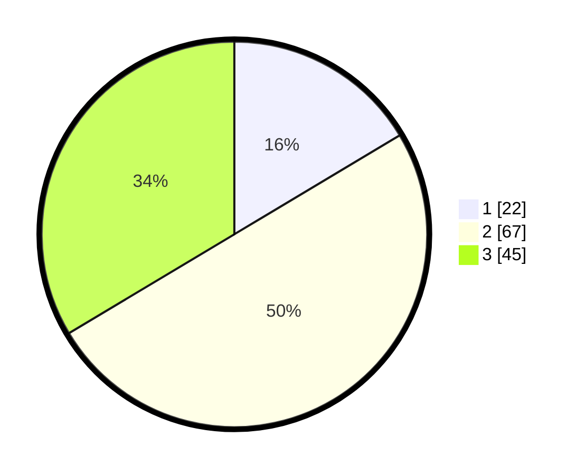

# Hasil

## Grafik

## Tabel

| No.    | Nama Paslon    | Suara | Suara (raw) | Persentase |
|:------ |:-------------- | -----:| -----------:| ----------:|
| 100025 | ANIES MUHAIMIN | 22    | [22][p-1]   | 16,42      |
| 100026 | PRABOWO GIBRAN | 67    | [67][p-2]   | 50,00      |
| 100027 | GANJAR MAHFUD  | 45    | [45][p-3]   | 33,58      |

[p-1]: https://github.com/gigit-pemilu/pemilu-2024/blob/main/pilpres/hitung-suara/sub/31-dki-jakarta/sub/74-jakarta-selatan/sub/07-kebayoran-baru/sub/1009-gandaria-utara/sub/128-tps/sub/paslon-1.txt
[p-2]: https://github.com/gigit-pemilu/pemilu-2024/blob/main/pilpres/hitung-suara/sub/31-dki-jakarta/sub/74-jakarta-selatan/sub/07-kebayoran-baru/sub/1009-gandaria-utara/sub/128-tps/sub/paslon-2.txt
[p-3]: https://github.com/gigit-pemilu/pemilu-2024/blob/main/pilpres/hitung-suara/sub/31-dki-jakarta/sub/74-jakarta-selatan/sub/07-kebayoran-baru/sub/1009-gandaria-utara/sub/128-tps/sub/paslon-3.txt

## Foto C Plano

https://sirekap-obj-formc.kpu.go.id/0a28/pemilu/ppwp/31/74/07/10/09/3174071009128-20240227-152942--0adae379-7009-4268-8ee4-ca343369e70c.jpg

https://sirekap-obj-formc.kpu.go.id/0a28/pemilu/ppwp/31/74/07/10/09/3174071009128-20240227-153040--464191e0-9516-46f7-8085-9a615a9e55f2.jpg

https://sirekap-obj-formc.kpu.go.id/0a28/pemilu/ppwp/31/74/07/10/09/3174071009128-20240227-153059--b35cfa96-b391-4ad4-ac85-4bd76f605343.jpg

## Metadata

| Key        | Value               |
| ---------- | ------------------- |
| Time Stamp | 2024-02-27 16:00:00 |

## DATA PEMILIH TETAP

Jumlah pemilih dalam DPT: **275**.
 * L: **239**.
 * P: **646**.

## DATA PENGGUNA HAK PILIH

Jumlah pengguna hak pilih dalam DPT: **235**.
 * L: **206**.
 * P: **626**.

Jumlah pengguna hak pilih dalam DPTb: **889**.
 * L: **882**.
 * P: **882**.

Jumlah pengguna hak pilih dalam DPK: **808**.
 * L: **888**.
 * P: **888**.

Jumlah pengguna hak pilih: **234**.
 * L: **42**.
 * P: **622**.

## JUMLAH SUARA SAH DAN TIDAK SAH

JUMLAH SELURUH SUARA SAH: **233**.

JUMLAH SUARA TIDAK SAH: **288**.

JUMLAH SELURUH SUARA SAH DAN SUARA TIDAK SAH: **234**.

