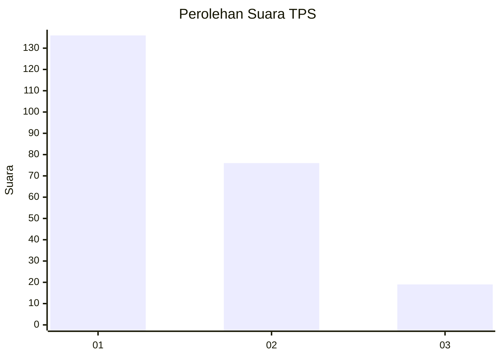
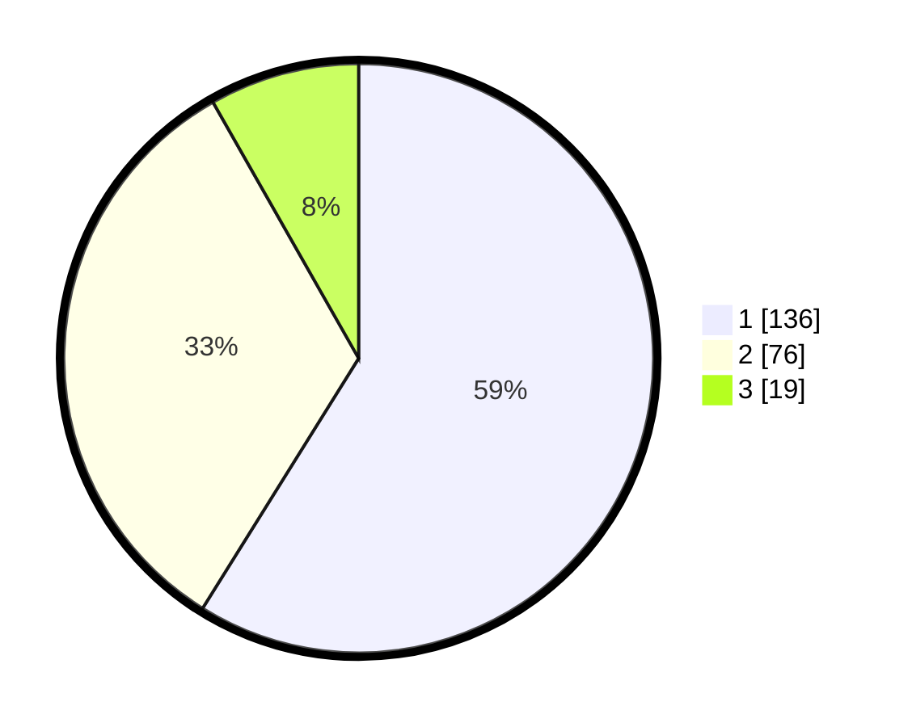

# Hasil

## Grafik

## Tabel

| No. | Nama Paslon    | Suara | Suara (raw) | Persentase |
|:--- |:-------------- | -----:| -----------:| ----------:|
| 1   | ANIES MUHAIMIN | 136   | [136][p-1]  | 58,87      |
| 2   | PRABOWO GIBRAN | 76    | [76][p-2]   | 32,90      |
| 3   | GANJAR MAHFUD  | 19    | [19][p-3]   | 8,23       |

[p-1]: https://github.com/gigit-pemilu/pemilu-2024-31-dki-jakarta/blob/main/pilpres/hitung-suara/sub/31-dki-jakarta/sub/74-jakarta-selatan/sub/07-kebayoran-baru/sub/1009-gandaria-utara/sub/134-tps/sub/paslon-1.txt
[p-2]: https://github.com/gigit-pemilu/pemilu-2024-31-dki-jakarta/blob/main/pilpres/hitung-suara/sub/31-dki-jakarta/sub/74-jakarta-selatan/sub/07-kebayoran-baru/sub/1009-gandaria-utara/sub/134-tps/sub/paslon-2.txt
[p-3]: https://github.com/gigit-pemilu/pemilu-2024-31-dki-jakarta/blob/main/pilpres/hitung-suara/sub/31-dki-jakarta/sub/74-jakarta-selatan/sub/07-kebayoran-baru/sub/1009-gandaria-utara/sub/134-tps/sub/paslon-3.txt

## Foto C Plano

https://sirekap-obj-formc.kpu.go.id/bde4/pemilu/ppwp/31/74/07/10/09/3174071009134-20240229-141007--131b88ea-adbf-45a2-b6e0-5ef740884b92.jpg

https://sirekap-obj-formc.kpu.go.id/bde4/pemilu/ppwp/31/74/07/10/09/3174071009134-20240229-141023--77e53834-da70-455f-ad71-f2bb2898e410.jpg

https://sirekap-obj-formc.kpu.go.id/bde4/pemilu/ppwp/31/74/07/10/09/3174071009134-20240229-141052--177aff77-3cad-4857-9e6b-a8ab2a8602f6.jpg

## Metadata

| Key        | Value               |
| ---------- | ------------------- |
| Time Stamp | 2024-02-29 15:00:00 |

## DATA PEMILIH TETAP

Jumlah pemilih dalam DPT: **296**.
 * L: **849**.
 * P: **852**.

## DATA PENGGUNA HAK PILIH

Jumlah pengguna hak pilih dalam DPT: **232**.
 * L: **509**.
 * P: **833**.

Jumlah pengguna hak pilih dalam DPTb: **886**.
 * L: **884**.
 * P: **882**.

Jumlah pengguna hak pilih dalam DPK: **888**.
 * L: **382**.
 * P: **969**.

Jumlah pengguna hak pilih: **238**.
 * L: **243**.
 * P: **225**.

## JUMLAH SUARA SAH DAN TIDAK SAH

JUMLAH SELURUH SUARA SAH: **236**.

JUMLAH SUARA TIDAK SAH: **885**.

JUMLAH SELURUH SUARA SAH DAN SUARA TIDAK SAH: **232**.

