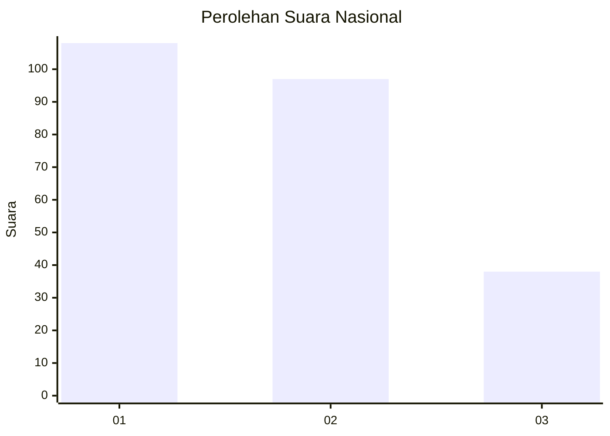
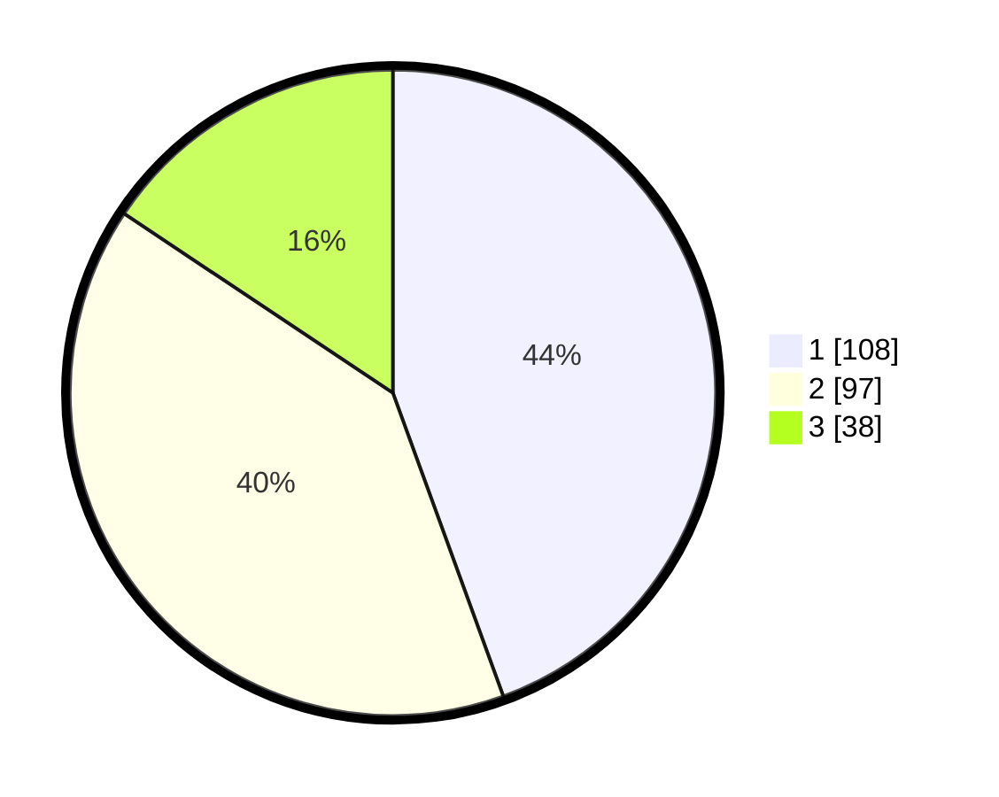

# Hasil

## Grafik

## Tabel

| No. | Nama Paslon    | Suara | Suara (raw) | Persentase |
|:--- |:-------------- | -----:| -----------:| ----------:|
| 1   | ANIES MUHAIMIN | 108   | [108][p-1]  | 44,44      |
| 2   | PRABOWO GIBRAN | 97    | [97][p-2]   | 39,92      |
| 3   | GANJAR MAHFUD  | 38    | [38][p-3]   | 15,64      |

[p-1]: https://github.com/gigit-pemilu/pemilu-2024/blob/main/pilpres/hitung-suara/sub/31-dki-jakarta/sub/74-jakarta-selatan/sub/07-kebayoran-baru/sub/1009-gandaria-utara/sub/138-tps/sub/paslon-1.txt
[p-2]: https://github.com/gigit-pemilu/pemilu-2024/blob/main/pilpres/hitung-suara/sub/31-dki-jakarta/sub/74-jakarta-selatan/sub/07-kebayoran-baru/sub/1009-gandaria-utara/sub/138-tps/sub/paslon-2.txt
[p-3]: https://github.com/gigit-pemilu/pemilu-2024/blob/main/pilpres/hitung-suara/sub/31-dki-jakarta/sub/74-jakarta-selatan/sub/07-kebayoran-baru/sub/1009-gandaria-utara/sub/138-tps/sub/paslon-3.txt

## Foto C Plano

https://sirekap-obj-formc.kpu.go.id/503b/pemilu/ppwp/31/74/07/10/09/3174071009138-20240229-134136--81e0f996-ac20-40cc-baa6-10895443a19f.jpg

https://sirekap-obj-formc.kpu.go.id/503b/pemilu/ppwp/31/74/07/10/09/3174071009138-20240229-134153--7d366c9a-a587-4f69-b15d-8ba57cf592ae.jpg

https://sirekap-obj-formc.kpu.go.id/503b/pemilu/ppwp/31/74/07/10/09/3174071009138-20240229-134211--fe73b471-46ff-4ce7-b47c-4207df0589a3.jpg

## Metadata

| Key        | Value               |
| ---------- | ------------------- |
| Time Stamp | 2024-02-29 14:00:00 |

## DATA PEMILIH TETAP

Jumlah pemilih dalam DPT: **296**.
 * L: **542**.
 * P: **754**.

## DATA PENGGUNA HAK PILIH

Jumlah pengguna hak pilih dalam DPT: **240**.
 * L: **345**.
 * P: **225**.

Jumlah pengguna hak pilih dalam DPTb: **863**.
 * L: **884**.
 * P: **89**.

Jumlah pengguna hak pilih dalam DPK: **3**.
 * L: **884**.
 * P: **882**.

Jumlah pengguna hak pilih: **256**.
 * L: **320**.
 * P: **436**.

## JUMLAH SUARA SAH DAN TIDAK SAH

JUMLAH SELURUH SUARA SAH: **353**.

JUMLAH SUARA TIDAK SAH: **803**.

JUMLAH SELURUH SUARA SAH DAN SUARA TIDAK SAH: **256**.

