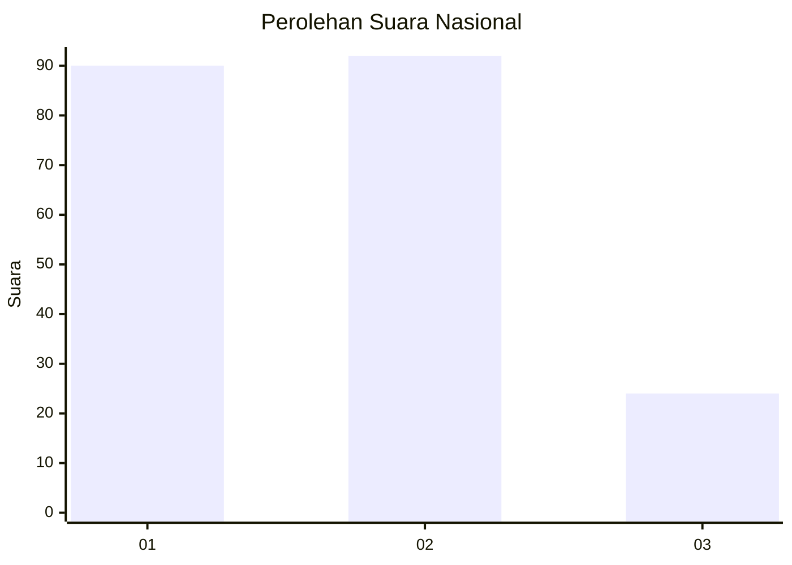
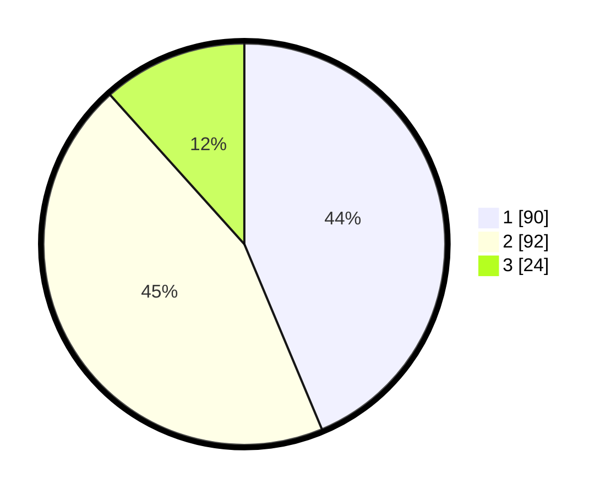

# Hasil

## Grafik

## Tabel

| No.    | Nama Paslon    | Suara | Suara (raw) | Persentase |
|:------ |:-------------- | -----:| -----------:| ----------:|
| 100025 | ANIES MUHAIMIN | 90    | [90][p-1]   | 43,69      |
| 100026 | PRABOWO GIBRAN | 92    | [92][p-2]   | 44,66      |
| 100027 | GANJAR MAHFUD  | 24    | [24][p-3]   | 11,65      |

[p-1]: https://github.com/gigit-pemilu/pemilu-2024/blob/main/pilpres/hitung-suara/sub/31-dki-jakarta/sub/74-jakarta-selatan/sub/07-kebayoran-baru/sub/1010-cipete-utara/sub/005-tps/sub/paslon-1.txt
[p-2]: https://github.com/gigit-pemilu/pemilu-2024/blob/main/pilpres/hitung-suara/sub/31-dki-jakarta/sub/74-jakarta-selatan/sub/07-kebayoran-baru/sub/1010-cipete-utara/sub/005-tps/sub/paslon-2.txt
[p-3]: https://github.com/gigit-pemilu/pemilu-2024/blob/main/pilpres/hitung-suara/sub/31-dki-jakarta/sub/74-jakarta-selatan/sub/07-kebayoran-baru/sub/1010-cipete-utara/sub/005-tps/sub/paslon-3.txt

## Foto C Plano

https://sirekap-obj-formc.kpu.go.id/0e32/pemilu/ppwp/31/74/07/10/10/3174071010005-20240219-122358--0f420efd-c30c-4fbc-973e-40c2803f8b57.jpg

https://sirekap-obj-formc.kpu.go.id/0e32/pemilu/ppwp/31/74/07/10/10/3174071010005-20240219-122630--06568e5e-9da9-473b-ac22-f5c157a955c5.jpg

https://sirekap-obj-formc.kpu.go.id/0e32/pemilu/ppwp/31/74/07/10/10/3174071010005-20240219-122730--57ec8441-9e0a-4cfb-9de0-5abc9b2595e2.jpg

## Metadata

| Key        | Value               |
| ---------- | ------------------- |
| Time Stamp | 2024-02-24 22:31:28 |

