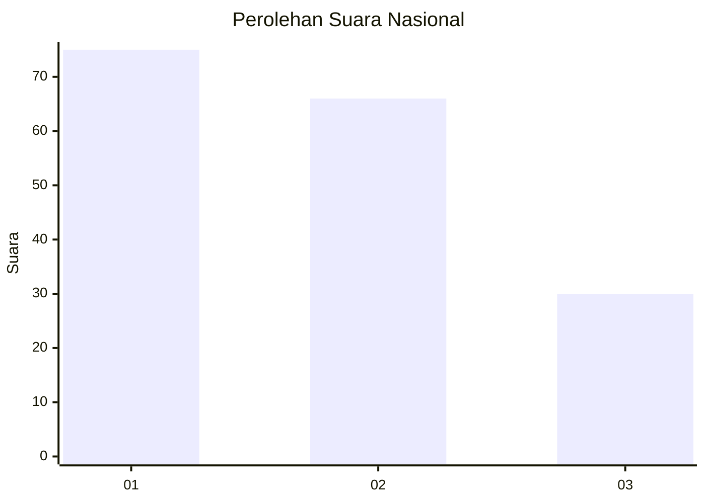
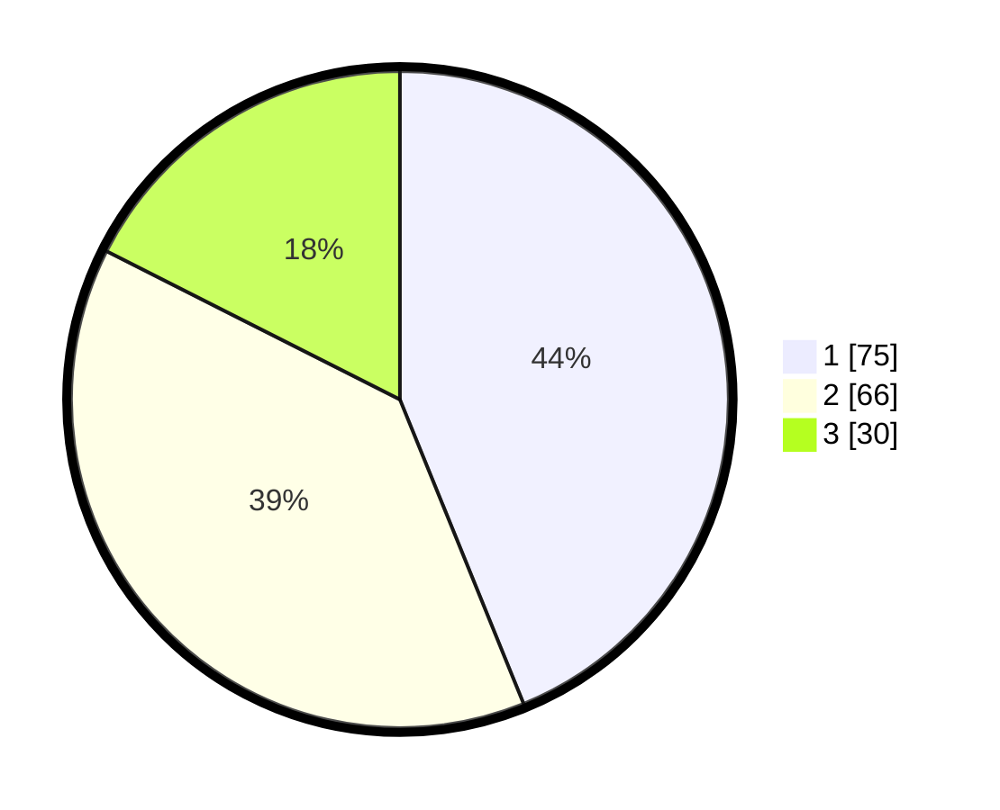

# Hasil

## Grafik

## Tabel

| No.    | Nama Paslon    | Suara | Suara (raw) | Persentase |
|:------ |:-------------- | -----:| -----------:| ----------:|
| 100025 | ANIES MUHAIMIN | 75    | [75][p-1]   | 43,86      |
| 100026 | PRABOWO GIBRAN | 66    | [66][p-2]   | 38,60      |
| 100027 | GANJAR MAHFUD  | 30    | [30][p-3]   | 17,54      |

[p-1]: https://github.com/gigit-pemilu/pemilu-2024/blob/main/pilpres/hitung-suara/sub/31-dki-jakarta/sub/74-jakarta-selatan/sub/07-kebayoran-baru/sub/1010-cipete-utara/sub/007-tps/sub/paslon-1.txt
[p-2]: https://github.com/gigit-pemilu/pemilu-2024/blob/main/pilpres/hitung-suara/sub/31-dki-jakarta/sub/74-jakarta-selatan/sub/07-kebayoran-baru/sub/1010-cipete-utara/sub/007-tps/sub/paslon-2.txt
[p-3]: https://github.com/gigit-pemilu/pemilu-2024/blob/main/pilpres/hitung-suara/sub/31-dki-jakarta/sub/74-jakarta-selatan/sub/07-kebayoran-baru/sub/1010-cipete-utara/sub/007-tps/sub/paslon-3.txt

## Foto C Plano

https://sirekap-obj-formc.kpu.go.id/3f6a/pemilu/ppwp/31/74/07/10/10/3174071010007-20240219-115546--4e12e6fe-3e4d-4388-a0e5-02b93eee3945.jpg

https://sirekap-obj-formc.kpu.go.id/3f6a/pemilu/ppwp/31/74/07/10/10/3174071010007-20240219-115845--9a628294-51a6-425a-9dee-f8a7c2bf34f2.jpg

https://sirekap-obj-formc.kpu.go.id/3f6a/pemilu/ppwp/31/74/07/10/10/3174071010007-20240219-120238--252e1b6d-3d27-4909-a93c-8c0c47a1596b.jpg

## Metadata

| Key        | Value               |
| ---------- | ------------------- |
| Time Stamp | 2024-02-24 22:31:28 |

