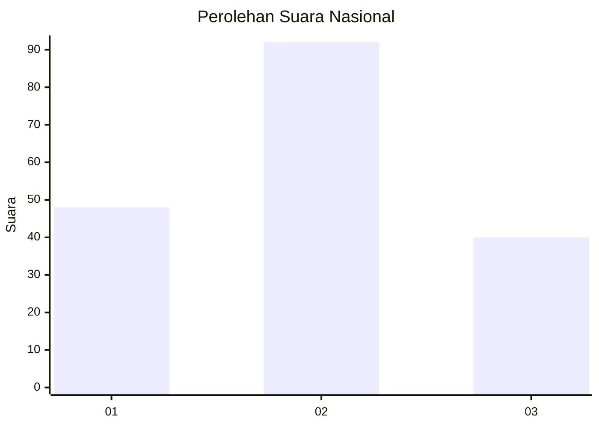
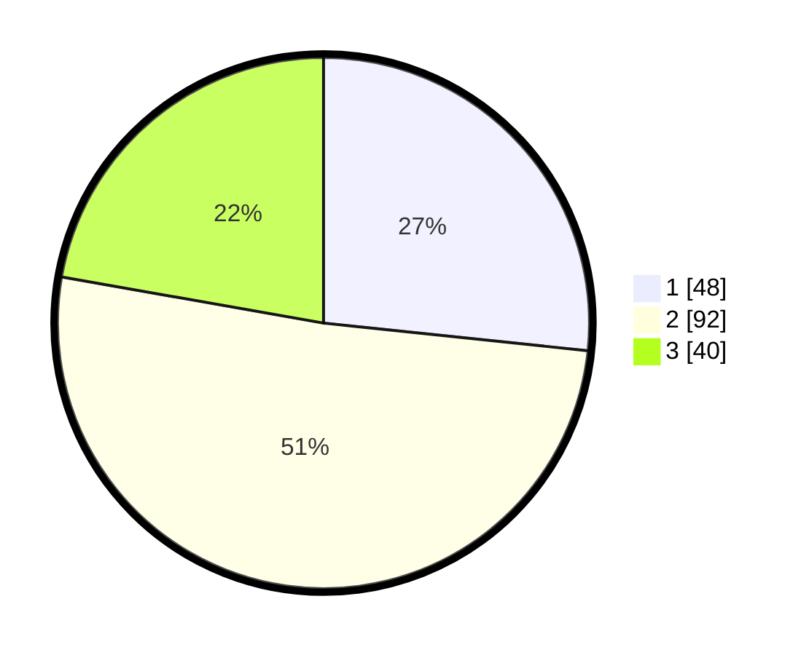

# Hasil

## Grafik

## Tabel

| No.    | Nama Paslon    | Suara | Suara (raw) | Persentase |
|:------ |:-------------- | -----:| -----------:| ----------:|
| 100025 | ANIES MUHAIMIN | 48    | [48][p-1]   | 26,67      |
| 100026 | PRABOWO GIBRAN | 92    | [92][p-2]   | 51,11      |
| 100027 | GANJAR MAHFUD  | 40    | [40][p-3]   | 22,22      |

[p-1]: https://github.com/gigit-pemilu/pemilu-2024/blob/main/pilpres/hitung-suara/sub/31-dki-jakarta/sub/74-jakarta-selatan/sub/07-kebayoran-baru/sub/1010-cipete-utara/sub/014-tps/sub/paslon-1.txt
[p-2]: https://github.com/gigit-pemilu/pemilu-2024/blob/main/pilpres/hitung-suara/sub/31-dki-jakarta/sub/74-jakarta-selatan/sub/07-kebayoran-baru/sub/1010-cipete-utara/sub/014-tps/sub/paslon-2.txt
[p-3]: https://github.com/gigit-pemilu/pemilu-2024/blob/main/pilpres/hitung-suara/sub/31-dki-jakarta/sub/74-jakarta-selatan/sub/07-kebayoran-baru/sub/1010-cipete-utara/sub/014-tps/sub/paslon-3.txt

## Foto C Plano

https://sirekap-obj-formc.kpu.go.id/4c9b/pemilu/ppwp/31/74/07/10/10/3174071010014-20240220-110823--f1c7c888-f603-45af-a9e9-568f2ce4a84d.jpg

https://sirekap-obj-formc.kpu.go.id/4c9b/pemilu/ppwp/31/74/07/10/10/3174071010014-20240220-110845--55e3d738-c641-40a4-a2fa-e8b6fc103397.jpg

https://sirekap-obj-formc.kpu.go.id/4c9b/pemilu/ppwp/31/74/07/10/10/3174071010014-20240220-110905--235e553a-f4c0-447e-aeaf-38df20fe4672.jpg

## Metadata

| Key        | Value               |
| ---------- | ------------------- |
| Time Stamp | 2024-02-20 12:00:00 |

## DATA PEMILIH TETAP

Jumlah pemilih dalam DPT: **228**.
 * L: **406**.
 * P: **422**.

## DATA PENGGUNA HAK PILIH

Jumlah pengguna hak pilih dalam DPT: **680**.
 * L: **873**.
 * P: **893**.

Jumlah pengguna hak pilih dalam DPTb: **842**.
 * L: **288**.
 * P: **885**.

Jumlah pengguna hak pilih dalam DPK: **548**.
 * L: **382**.
 * P: **852**.

Jumlah pengguna hak pilih: **439**.
 * L: **286**.
 * P: **424**.

## JUMLAH SUARA SAH DAN TIDAK SAH

JUMLAH SELURUH SUARA SAH: **685**.

JUMLAH SUARA TIDAK SAH: **884**.

JUMLAH SELURUH SUARA SAH DAN SUARA TIDAK SAH: **89**.

