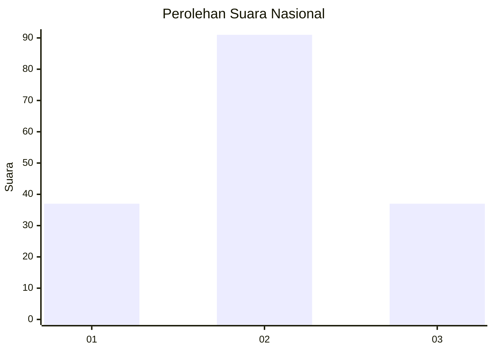
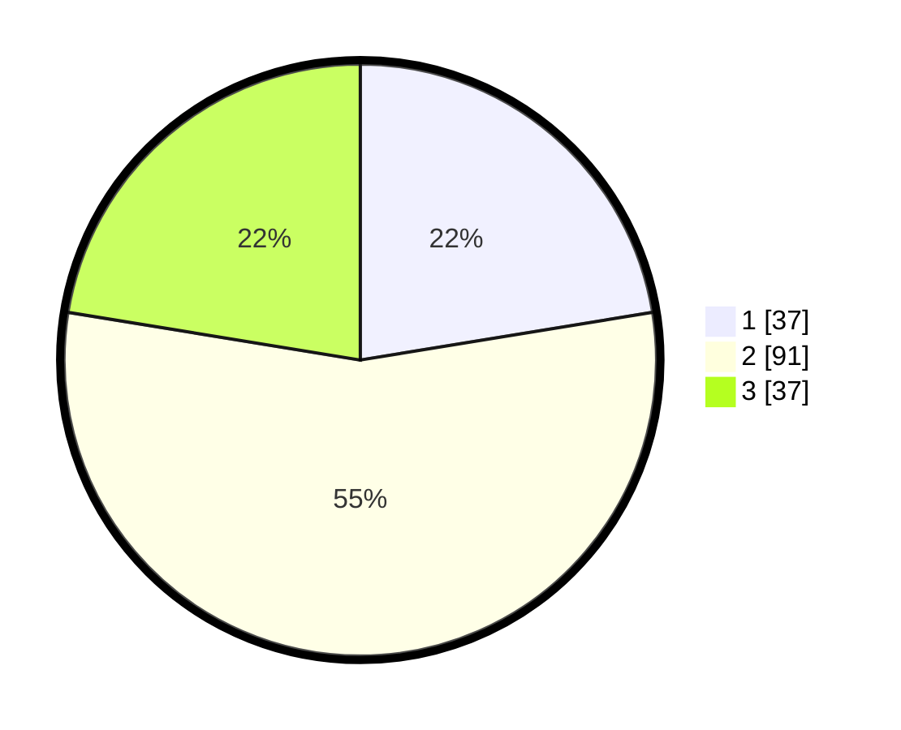

# Hasil

## Grafik

## Tabel

| No.    | Nama Paslon    | Suara | Suara (raw) | Persentase |
|:------ |:-------------- | -----:| -----------:| ----------:|
| 100025 | ANIES MUHAIMIN | 37    | [37][p-1]   | 22,42      |
| 100026 | PRABOWO GIBRAN | 91    | [91][p-2]   | 55,15      |
| 100027 | GANJAR MAHFUD  | 37    | [37][p-3]   | 22,42      |

[p-1]: https://github.com/gigit-pemilu/pemilu-2024/blob/main/pilpres/hitung-suara/sub/31-dki-jakarta/sub/74-jakarta-selatan/sub/07-kebayoran-baru/sub/1010-cipete-utara/sub/036-tps/sub/paslon-1.txt
[p-2]: https://github.com/gigit-pemilu/pemilu-2024/blob/main/pilpres/hitung-suara/sub/31-dki-jakarta/sub/74-jakarta-selatan/sub/07-kebayoran-baru/sub/1010-cipete-utara/sub/036-tps/sub/paslon-2.txt
[p-3]: https://github.com/gigit-pemilu/pemilu-2024/blob/main/pilpres/hitung-suara/sub/31-dki-jakarta/sub/74-jakarta-selatan/sub/07-kebayoran-baru/sub/1010-cipete-utara/sub/036-tps/sub/paslon-3.txt

## Foto C Plano

https://sirekap-obj-formc.kpu.go.id/3e94/pemilu/ppwp/31/74/07/10/10/3174071010036-20240223-141503--956e8875-7ceb-4029-9e20-866151c50f68.jpg

https://sirekap-obj-formc.kpu.go.id/3e94/pemilu/ppwp/31/74/07/10/10/3174071010036-20240214-203947--9234dd9e-566d-4f9e-b3b1-deff53916ac2.jpg

https://sirekap-obj-formc.kpu.go.id/3e94/pemilu/ppwp/31/74/07/10/10/3174071010036-20240214-204256--247ff47a-eaee-412d-b0d0-e68415af3d15.jpg

## Metadata

| Key        | Value               |
| ---------- | ------------------- |
| Time Stamp | 2024-02-24 22:31:28 |

## DATA PEMILIH TETAP

Jumlah pemilih dalam DPT: **240**.
 * L: **122**.
 * P: **778**.

## DATA PENGGUNA HAK PILIH

Jumlah pengguna hak pilih dalam DPT: **266**.
 * L: **222**.
 * P: **224**.

Jumlah pengguna hak pilih dalam DPTb: **2**.
 * L: **200**.
 * P: **2**.

Jumlah pengguna hak pilih dalam DPK: **1**.
 * L: **207**.
 * P: **0**.

Jumlah pengguna hak pilih: **169**.
 * L: **283**.
 * P: **486**.

## JUMLAH SUARA SAH DAN TIDAK SAH

JUMLAH SELURUH SUARA SAH: **165**.

JUMLAH SUARA TIDAK SAH: **4**.

JUMLAH SELURUH SUARA SAH DAN SUARA TIDAK SAH: **169**.

