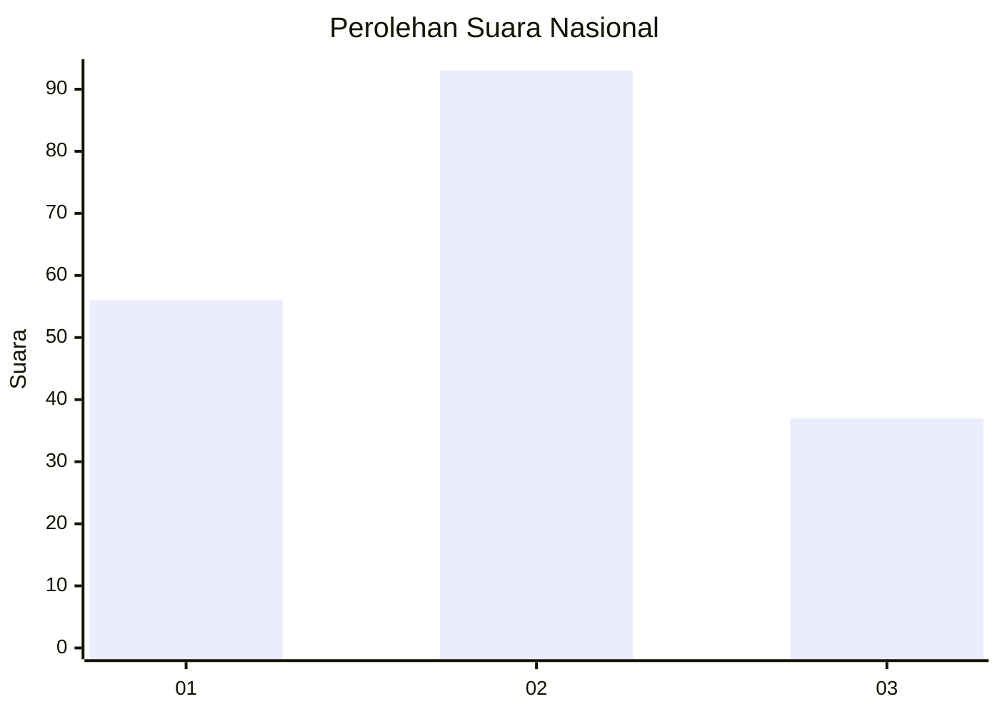
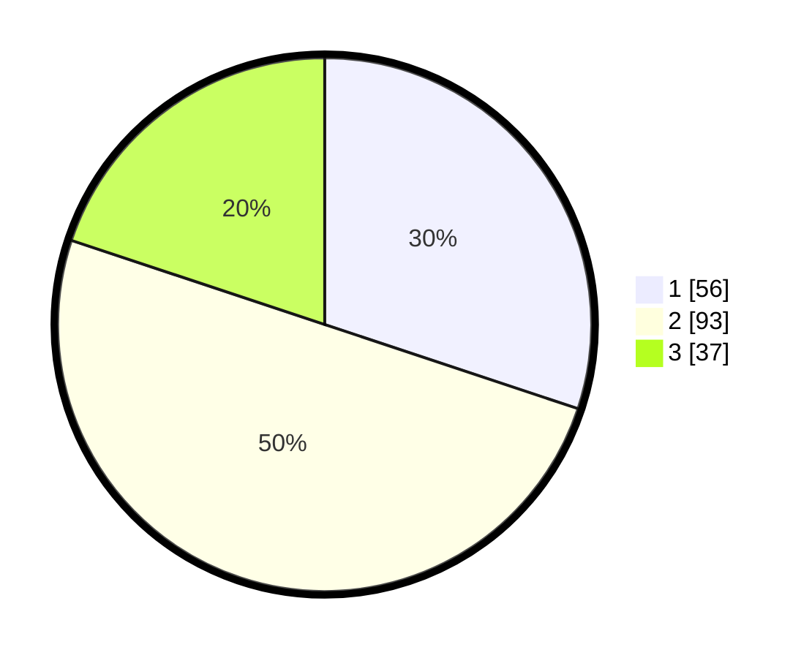

# Hasil

## Grafik

## Tabel

| No.    | Nama Paslon    | Suara | Suara (raw) | Persentase |
|:------ |:-------------- | -----:| -----------:| ----------:|
| 100025 | ANIES MUHAIMIN | 56    | [56][p-1]   | 30,11      |
| 100026 | PRABOWO GIBRAN | 93    | [93][p-2]   | 50,00      |
| 100027 | GANJAR MAHFUD  | 37    | [37][p-3]   | 19,89      |

[p-1]: https://github.com/gigit-pemilu/pemilu-2024/blob/main/pilpres/hitung-suara/sub/31-dki-jakarta/sub/74-jakarta-selatan/sub/07-kebayoran-baru/sub/1010-cipete-utara/sub/050-tps/sub/paslon-1.txt
[p-2]: https://github.com/gigit-pemilu/pemilu-2024/blob/main/pilpres/hitung-suara/sub/31-dki-jakarta/sub/74-jakarta-selatan/sub/07-kebayoran-baru/sub/1010-cipete-utara/sub/050-tps/sub/paslon-2.txt
[p-3]: https://github.com/gigit-pemilu/pemilu-2024/blob/main/pilpres/hitung-suara/sub/31-dki-jakarta/sub/74-jakarta-selatan/sub/07-kebayoran-baru/sub/1010-cipete-utara/sub/050-tps/sub/paslon-3.txt

## Foto C Plano

https://sirekap-obj-formc.kpu.go.id/e904/pemilu/ppwp/31/74/07/10/10/3174071010050-20240215-015655--e63a974b-8132-483f-9b4c-095f6659b970.jpg

https://sirekap-obj-formc.kpu.go.id/e904/pemilu/ppwp/31/74/07/10/10/3174071010050-20240215-020358--9d3c6ff6-a0f7-493d-b2c2-ead215015e70.jpg

https://sirekap-obj-formc.kpu.go.id/e904/pemilu/ppwp/31/74/07/10/10/3174071010050-20240215-020821--5e19ce03-0263-4021-992f-d9e116b51102.jpg

## Metadata

| Key        | Value               |
| ---------- | ------------------- |
| Time Stamp | 2024-02-25 13:00:00 |

