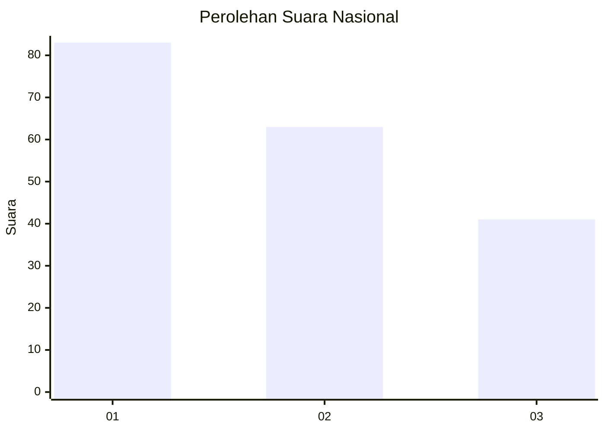
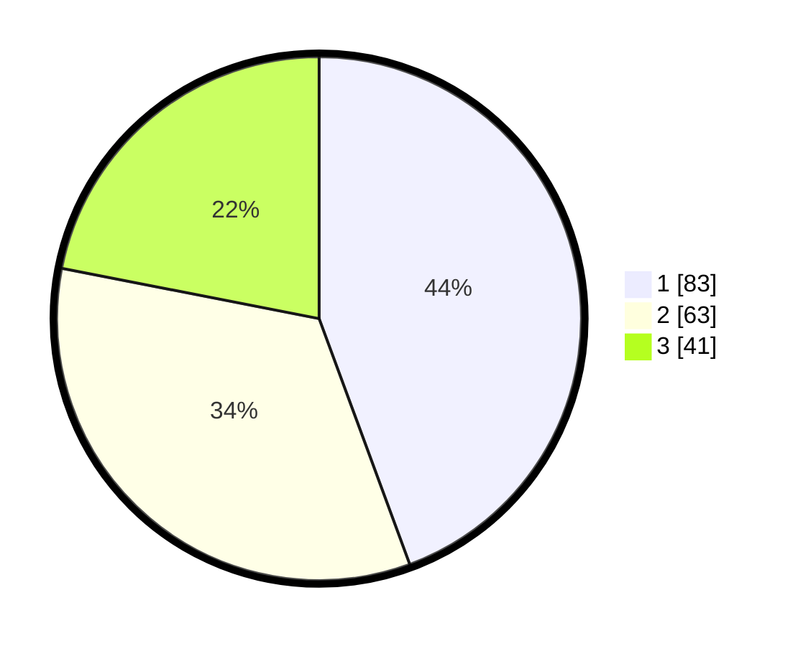

# Hasil

## Grafik

## Tabel

| No.    | Nama Paslon    | Suara | Suara (raw) | Persentase |
|:------ |:-------------- | -----:| -----------:| ----------:|
| 100025 | ANIES MUHAIMIN | 83    | [83][p-1]   | 44,39      |
| 100026 | PRABOWO GIBRAN | 63    | [63][p-2]   | 33,69      |
| 100027 | GANJAR MAHFUD  | 41    | [41][p-3]   | 21,93      |

[p-1]: https://github.com/gigit-pemilu/pemilu-2024/blob/main/pilpres/hitung-suara/sub/31-dki-jakarta/sub/74-jakarta-selatan/sub/07-kebayoran-baru/sub/1010-cipete-utara/sub/052-tps/sub/paslon-1.txt
[p-2]: https://github.com/gigit-pemilu/pemilu-2024/blob/main/pilpres/hitung-suara/sub/31-dki-jakarta/sub/74-jakarta-selatan/sub/07-kebayoran-baru/sub/1010-cipete-utara/sub/052-tps/sub/paslon-2.txt
[p-3]: https://github.com/gigit-pemilu/pemilu-2024/blob/main/pilpres/hitung-suara/sub/31-dki-jakarta/sub/74-jakarta-selatan/sub/07-kebayoran-baru/sub/1010-cipete-utara/sub/052-tps/sub/paslon-3.txt

## Foto C Plano

https://sirekap-obj-formc.kpu.go.id/4340/pemilu/ppwp/31/74/07/10/10/3174071010052-20240224-112533--5397b0e8-47d2-468d-a6fa-a862a8aa7e00.jpg

https://sirekap-obj-formc.kpu.go.id/4340/pemilu/ppwp/31/74/07/10/10/3174071010052-20240224-112757--b9bcc606-b6e2-406f-b912-707eb87e69e8.jpg

https://sirekap-obj-formc.kpu.go.id/4340/pemilu/ppwp/31/74/07/10/10/3174071010052-20240224-113053--6240e278-8567-4a27-b298-12f8124224d6.jpg

## Metadata

| Key        | Value               |
| ---------- | ------------------- |
| Time Stamp | 2024-02-25 12:00:00 |

## DATA PEMILIH TETAP

Jumlah pemilih dalam DPT: **440**.
 * L: **444**.
 * P: **451**.

## DATA PENGGUNA HAK PILIH

Jumlah pengguna hak pilih dalam DPT: **0**.
 * L: **0**.
 * P: **0**.

Jumlah pengguna hak pilih dalam DPTb: **550**.
 * L: **0**.
 * P: **7**.

Jumlah pengguna hak pilih dalam DPK: **771**.
 * L: **0**.
 * P: **7**.

Jumlah pengguna hak pilih: **7**.
 * L: **0**.
 * P: **1**.

## JUMLAH SUARA SAH DAN TIDAK SAH

JUMLAH SELURUH SUARA SAH: **187**.

JUMLAH SUARA TIDAK SAH: **2**.

JUMLAH SELURUH SUARA SAH DAN SUARA TIDAK SAH: **189**.

