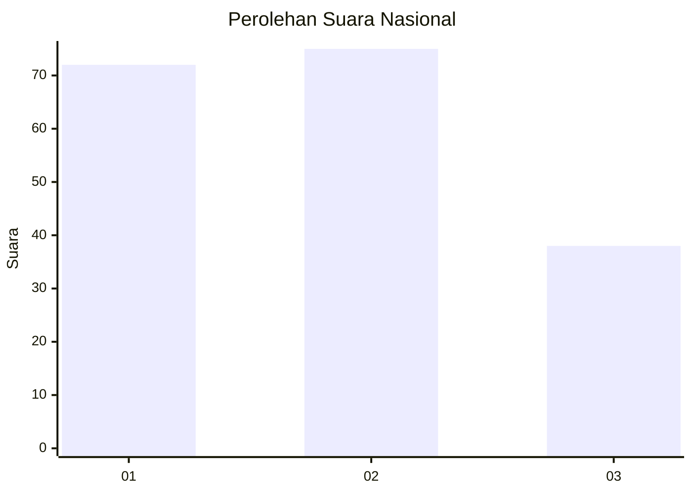
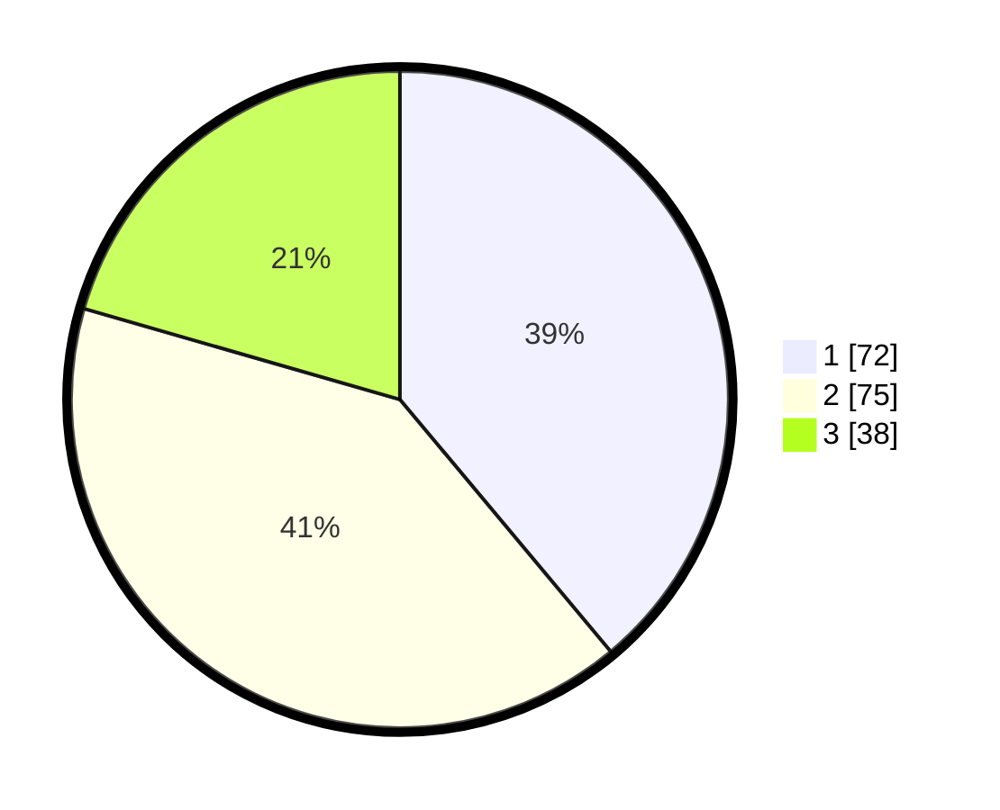

# Hasil

## Grafik

## Tabel

| No.    | Nama Paslon    | Suara | Suara (raw) | Persentase |
|:------ |:-------------- | -----:| -----------:| ----------:|
| 100025 | ANIES MUHAIMIN | 72    | [72][p-1]   | 38,92      |
| 100026 | PRABOWO GIBRAN | 75    | [75][p-2]   | 40,54      |
| 100027 | GANJAR MAHFUD  | 38    | [38][p-3]   | 20,54      |

[p-1]: https://github.com/gigit-pemilu/pemilu-2024/blob/main/pilpres/hitung-suara/sub/31-dki-jakarta/sub/74-jakarta-selatan/sub/07-kebayoran-baru/sub/1010-cipete-utara/sub/055-tps/sub/paslon-1.txt
[p-2]: https://github.com/gigit-pemilu/pemilu-2024/blob/main/pilpres/hitung-suara/sub/31-dki-jakarta/sub/74-jakarta-selatan/sub/07-kebayoran-baru/sub/1010-cipete-utara/sub/055-tps/sub/paslon-2.txt
[p-3]: https://github.com/gigit-pemilu/pemilu-2024/blob/main/pilpres/hitung-suara/sub/31-dki-jakarta/sub/74-jakarta-selatan/sub/07-kebayoran-baru/sub/1010-cipete-utara/sub/055-tps/sub/paslon-3.txt

## Foto C Plano

https://sirekap-obj-formc.kpu.go.id/d6fd/pemilu/ppwp/31/74/07/10/10/3174071010055-20240226-120306--ed10f594-e52d-4a34-8bb4-b4c628f444cd.jpg

https://sirekap-obj-formc.kpu.go.id/d6fd/pemilu/ppwp/31/74/07/10/10/3174071010055-20240226-120331--79f2b1f2-7e9c-4e86-8228-bf841bbb56e1.jpg

https://sirekap-obj-formc.kpu.go.id/d6fd/pemilu/ppwp/31/74/07/10/10/3174071010055-20240226-120358--b99f1437-81cf-48d6-bbac-51cc9ff58528.jpg

## Metadata

| Key        | Value               |
| ---------- | ------------------- |
| Time Stamp | 2024-02-26 15:00:00 |

## DATA PEMILIH TETAP

Jumlah pemilih dalam DPT: **254**.
 * L: **28**.
 * P: **626**.

## DATA PENGGUNA HAK PILIH

Jumlah pengguna hak pilih dalam DPT: **403**.
 * L: **89**.
 * P: **98**.

Jumlah pengguna hak pilih dalam DPTb: **804**.
 * L: **0**.
 * P: **1**.

Jumlah pengguna hak pilih dalam DPK: **888**.
 * L: **0**.
 * P: **880**.

Jumlah pengguna hak pilih: **188**.
 * L: **89**.
 * P: **892**.

## JUMLAH SUARA SAH DAN TIDAK SAH

JUMLAH SELURUH SUARA SAH: **185**.

JUMLAH SUARA TIDAK SAH: **3**.

JUMLAH SELURUH SUARA SAH DAN SUARA TIDAK SAH: **188**.

