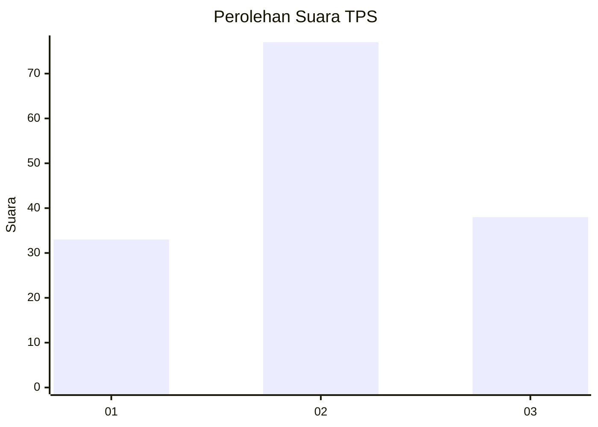
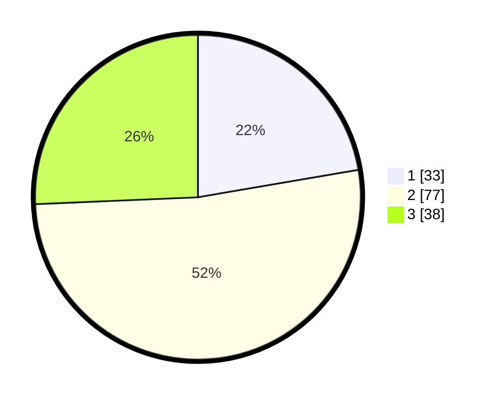

# Hasil

## Grafik

## Tabel

| No. | Nama Paslon    | Suara | Suara (raw) | Persentase |
|:--- |:-------------- | -----:| -----------:| ----------:|
| 1   | ANIES MUHAIMIN | 33    | [33][p-1]   | 22,30      |
| 2   | PRABOWO GIBRAN | 77    | [77][p-2]   | 52,03      |
| 3   | GANJAR MAHFUD  | 38    | [38][p-3]   | 25,68      |

[p-1]: https://github.com/gigit-pemilu/pemilu-2024-31-dki-jakarta/blob/main/pilpres/hitung-suara/sub/31-dki-jakarta/sub/74-jakarta-selatan/sub/07-kebayoran-baru/sub/1010-cipete-utara/sub/056-tps/sub/paslon-1.txt
[p-2]: https://github.com/gigit-pemilu/pemilu-2024-31-dki-jakarta/blob/main/pilpres/hitung-suara/sub/31-dki-jakarta/sub/74-jakarta-selatan/sub/07-kebayoran-baru/sub/1010-cipete-utara/sub/056-tps/sub/paslon-2.txt
[p-3]: https://github.com/gigit-pemilu/pemilu-2024-31-dki-jakarta/blob/main/pilpres/hitung-suara/sub/31-dki-jakarta/sub/74-jakarta-selatan/sub/07-kebayoran-baru/sub/1010-cipete-utara/sub/056-tps/sub/paslon-3.txt

## Foto C Plano

https://sirekap-obj-formc.kpu.go.id/06a5/pemilu/ppwp/31/74/07/10/10/3174071010056-20240224-140219--f9c75022-df4b-43c0-a252-39b7e4e9da7b.jpg

https://sirekap-obj-formc.kpu.go.id/06a5/pemilu/ppwp/31/74/07/10/10/3174071010056-20240224-140301--a907a5f3-e055-4537-b64b-671cafc1584e.jpg

https://sirekap-obj-formc.kpu.go.id/06a5/pemilu/ppwp/31/74/07/10/10/3174071010056-20240224-142646--31f90b26-7919-43e5-a10d-d5fc1fa39713.jpg

## Metadata

| Key        | Value               |
| ---------- | ------------------- |
| Time Stamp | 2024-02-24 22:31:28 |

## DATA PEMILIH TETAP

Jumlah pemilih dalam DPT: **300**.
 * L: **159**.
 * P: **145**.

## DATA PENGGUNA HAK PILIH

Jumlah pengguna hak pilih dalam DPT: **233**.
 * L: **19**.
 * P: **121**.

Jumlah pengguna hak pilih dalam DPTb: **884**.
 * L: **382**.
 * P: **822**.

Jumlah pengguna hak pilih dalam DPK: **801**.
 * L: **0**.
 * P: **821**.

Jumlah pengguna hak pilih: **243**.
 * L: **143**.
 * P: **124**.

## JUMLAH SUARA SAH DAN TIDAK SAH

JUMLAH SELURUH SUARA SAH: **234**.

JUMLAH SUARA TIDAK SAH: **810**.

JUMLAH SELURUH SUARA SAH DAN SUARA TIDAK SAH: **242**.

