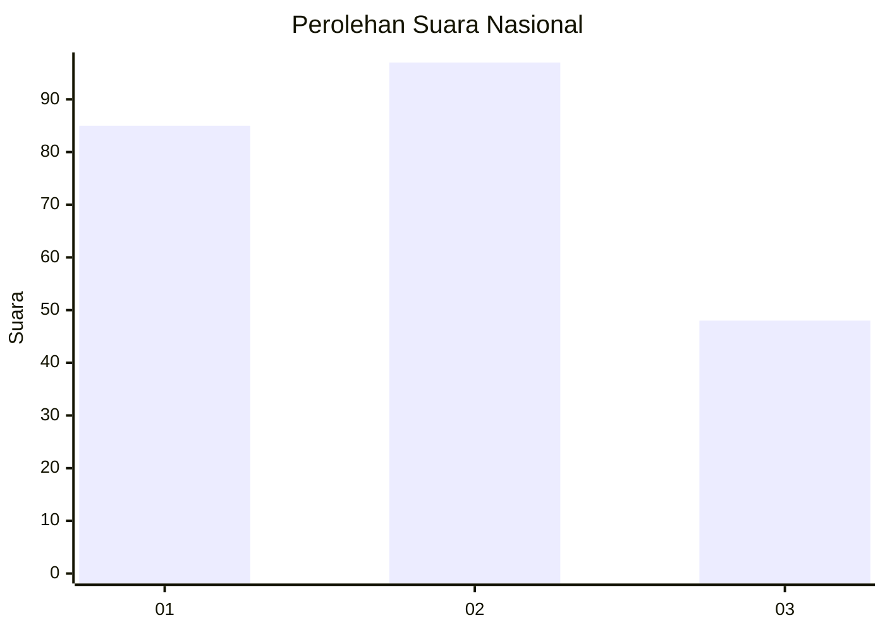
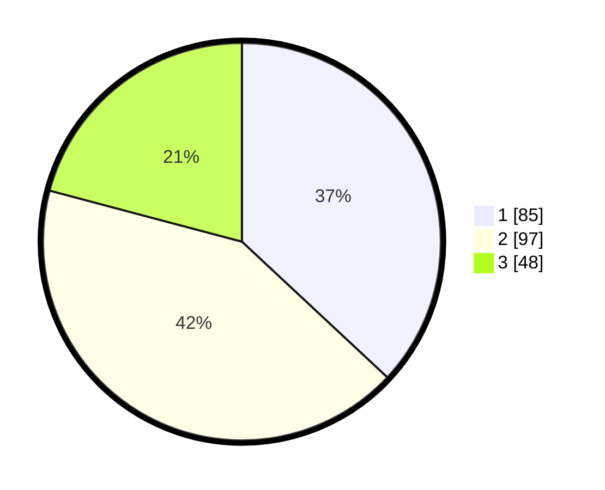

# Hasil

## Grafik

## Tabel

| No.    | Nama Paslon    | Suara | Suara (raw) | Persentase |
|:------ |:-------------- | -----:| -----------:| ----------:|
| 100025 | ANIES MUHAIMIN | 85    | [85][p-1]   | 36,96      |
| 100026 | PRABOWO GIBRAN | 97    | [97][p-2]   | 42,17      |
| 100027 | GANJAR MAHFUD  | 48    | [48][p-3]   | 20,87      |

[p-1]: https://github.com/gigit-pemilu/pemilu-2024/blob/main/pilpres/hitung-suara/sub/31-dki-jakarta/sub/74-jakarta-selatan/sub/07-kebayoran-baru/sub/1010-cipete-utara/sub/084-tps/sub/paslon-1.txt
[p-2]: https://github.com/gigit-pemilu/pemilu-2024/blob/main/pilpres/hitung-suara/sub/31-dki-jakarta/sub/74-jakarta-selatan/sub/07-kebayoran-baru/sub/1010-cipete-utara/sub/084-tps/sub/paslon-2.txt
[p-3]: https://github.com/gigit-pemilu/pemilu-2024/blob/main/pilpres/hitung-suara/sub/31-dki-jakarta/sub/74-jakarta-selatan/sub/07-kebayoran-baru/sub/1010-cipete-utara/sub/084-tps/sub/paslon-3.txt

## Foto C Plano

https://sirekap-obj-formc.kpu.go.id/0d87/pemilu/ppwp/31/74/07/10/10/3174071010084-20240214-223817--59bfa68a-c6a3-48bf-8de0-9ef85efaa300.jpg

https://sirekap-obj-formc.kpu.go.id/0d87/pemilu/ppwp/31/74/07/10/10/3174071010084-20240214-201212--f362856e-cc6b-4a9d-bb9f-a91c4bde89f6.jpg

https://sirekap-obj-formc.kpu.go.id/0d87/pemilu/ppwp/31/74/07/10/10/3174071010084-20240214-204749--e081634a-1240-4ed0-9c51-42cd9ba65d15.jpg

## Metadata

| Key        | Value               |
| ---------- | ------------------- |
| Time Stamp | 2024-02-15 12:00:28 |

