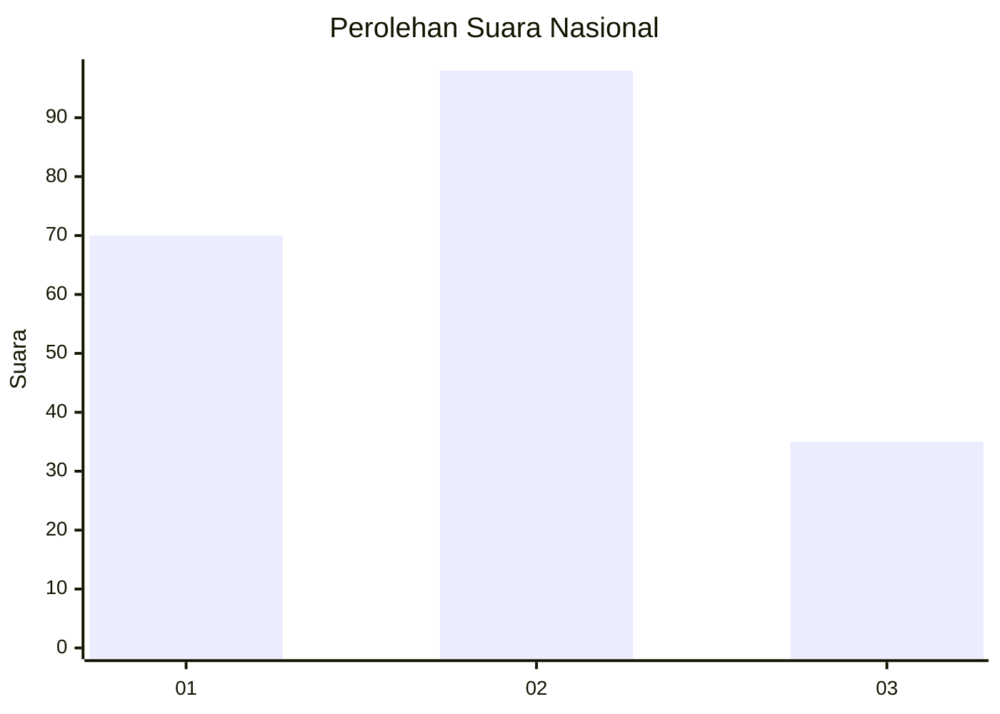
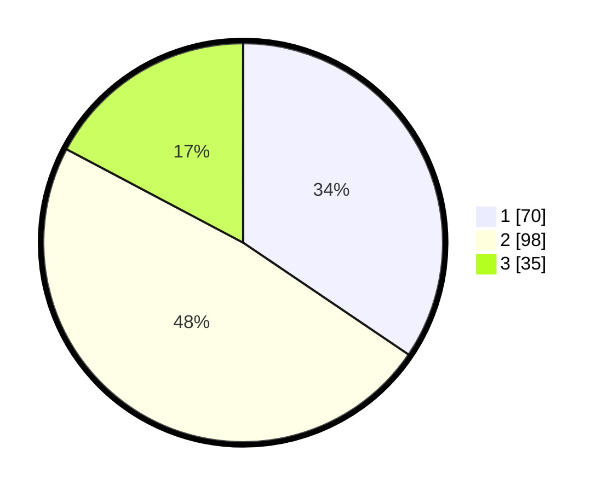

# Hasil

## Grafik

## Tabel

| No.    | Nama Paslon    | Suara | Suara (raw) | Persentase |
|:------ |:-------------- | -----:| -----------:| ----------:|
| 100025 | ANIES MUHAIMIN | 70    | [70][p-1]   | 34,48      |
| 100026 | PRABOWO GIBRAN | 98    | [98][p-2]   | 48,28      |
| 100027 | GANJAR MAHFUD  | 35    | [35][p-3]   | 17,24      |

[p-1]: https://github.com/gigit-pemilu/pemilu-2024/blob/main/pilpres/hitung-suara/sub/31-dki-jakarta/sub/74-jakarta-selatan/sub/07-kebayoran-baru/sub/1010-cipete-utara/sub/085-tps/sub/paslon-1.txt
[p-2]: https://github.com/gigit-pemilu/pemilu-2024/blob/main/pilpres/hitung-suara/sub/31-dki-jakarta/sub/74-jakarta-selatan/sub/07-kebayoran-baru/sub/1010-cipete-utara/sub/085-tps/sub/paslon-2.txt
[p-3]: https://github.com/gigit-pemilu/pemilu-2024/blob/main/pilpres/hitung-suara/sub/31-dki-jakarta/sub/74-jakarta-selatan/sub/07-kebayoran-baru/sub/1010-cipete-utara/sub/085-tps/sub/paslon-3.txt

## Foto C Plano

https://sirekap-obj-formc.kpu.go.id/4890/pemilu/ppwp/31/74/07/10/10/3174071010085-20240214-155755--991c9561-8e87-4118-88e3-7e992daa8aec.jpg

https://sirekap-obj-formc.kpu.go.id/4890/pemilu/ppwp/31/74/07/10/10/3174071010085-20240214-155344--55c04d12-c549-4e53-8ef0-b0a401159305.jpg

https://sirekap-obj-formc.kpu.go.id/4890/pemilu/ppwp/31/74/07/10/10/3174071010085-20240214-155901--dffefb75-c804-4aed-91c4-d3e09a24498e.jpg

## Metadata

| Key        | Value               |
| ---------- | ------------------- |
| Time Stamp | 2024-02-24 22:31:28 |

