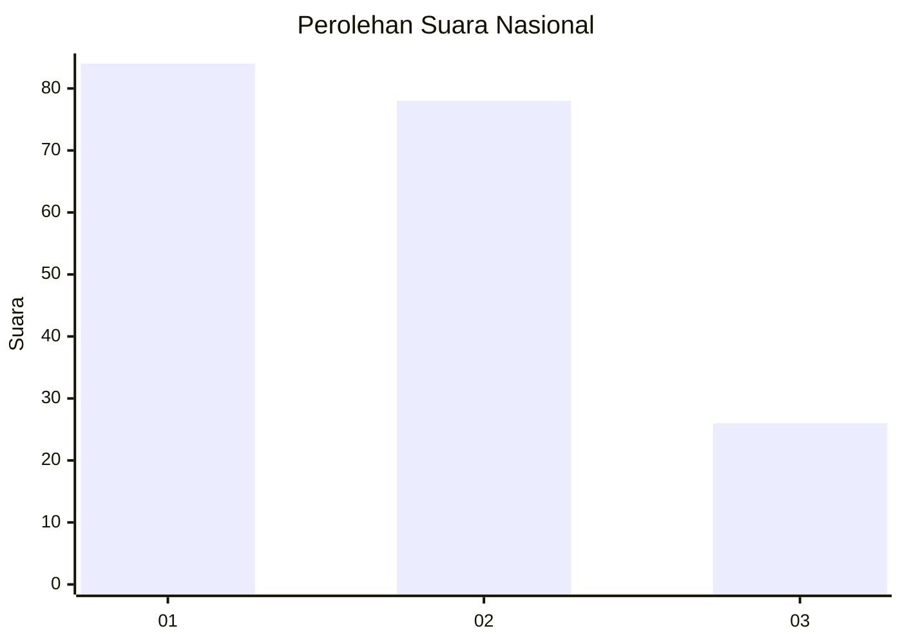
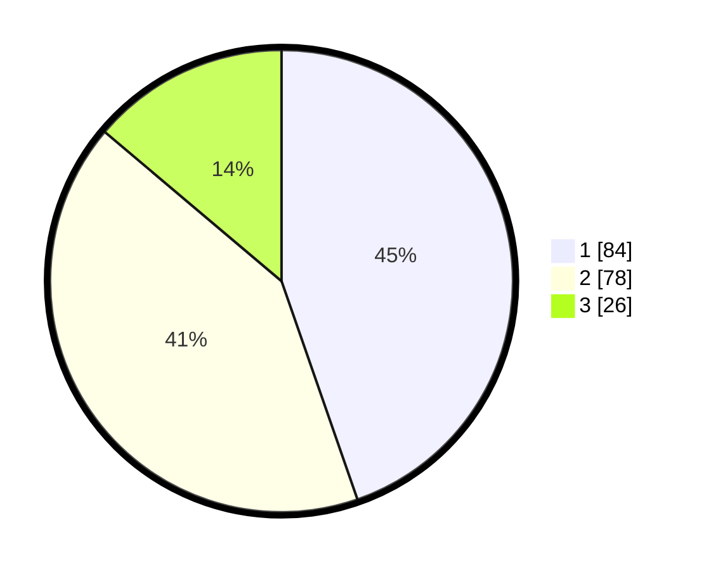

# Hasil

## Grafik

## Tabel

| No.    | Nama Paslon    | Suara | Suara (raw) | Persentase |
|:------ |:-------------- | -----:| -----------:| ----------:|
| 100025 | ANIES MUHAIMIN | 84    | [84][p-1]   | 44,68      |
| 100026 | PRABOWO GIBRAN | 78    | [78][p-2]   | 41,49      |
| 100027 | GANJAR MAHFUD  | 26    | [26][p-3]   | 13,83      |

[p-1]: https://github.com/gigit-pemilu/pemilu-2024/blob/main/pilpres/hitung-suara/sub/31-dki-jakarta/sub/74-jakarta-selatan/sub/07-kebayoran-baru/sub/1010-cipete-utara/sub/089-tps/sub/paslon-1.txt
[p-2]: https://github.com/gigit-pemilu/pemilu-2024/blob/main/pilpres/hitung-suara/sub/31-dki-jakarta/sub/74-jakarta-selatan/sub/07-kebayoran-baru/sub/1010-cipete-utara/sub/089-tps/sub/paslon-2.txt
[p-3]: https://github.com/gigit-pemilu/pemilu-2024/blob/main/pilpres/hitung-suara/sub/31-dki-jakarta/sub/74-jakarta-selatan/sub/07-kebayoran-baru/sub/1010-cipete-utara/sub/089-tps/sub/paslon-3.txt

## Foto C Plano

https://sirekap-obj-formc.kpu.go.id/4790/pemilu/ppwp/31/74/07/10/10/3174071010089-20240218-110717--861803be-cd6e-4252-b0d1-79d845ce5027.jpg

https://sirekap-obj-formc.kpu.go.id/4790/pemilu/ppwp/31/74/07/10/10/3174071010089-20240218-110408--525822ea-0003-498b-aea5-b32c7128f859.jpg

https://sirekap-obj-formc.kpu.go.id/4790/pemilu/ppwp/31/74/07/10/10/3174071010089-20240218-110555--b2bb9167-6eaf-4fd7-9fe4-2cd1b5fd3945.jpg

## Metadata

| Key        | Value               |
| ---------- | ------------------- |
| Time Stamp | 2024-02-24 22:31:28 |

