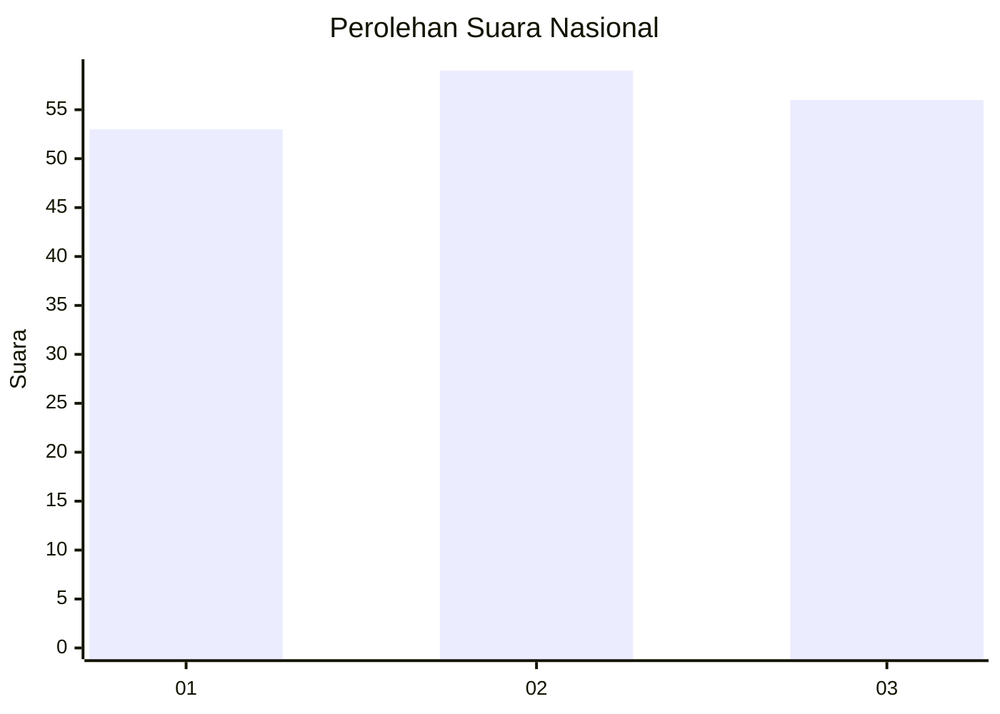
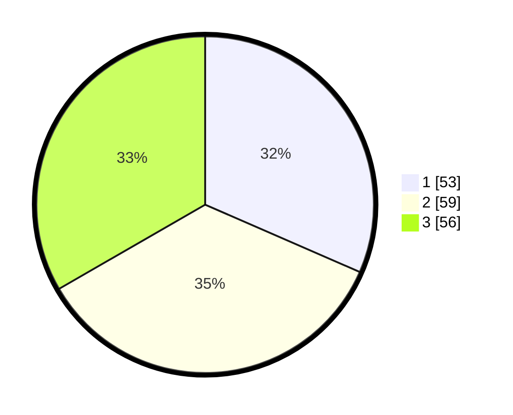

# Hasil

## Grafik

## Tabel

| No.    | Nama Paslon    | Suara | Suara (raw) | Persentase |
|:------ |:-------------- | -----:| -----------:| ----------:|
| 100025 | ANIES MUHAIMIN | 53    | [53][p-1]   | 31,55      |
| 100026 | PRABOWO GIBRAN | 59    | [59][p-2]   | 35,12      |
| 100027 | GANJAR MAHFUD  | 56    | [56][p-3]   | 33,33      |

[p-1]: https://github.com/gigit-pemilu/pemilu-2024/blob/main/pilpres/hitung-suara/sub/31-dki-jakarta/sub/74-jakarta-selatan/sub/07-kebayoran-baru/sub/1010-cipete-utara/sub/104-tps/sub/paslon-1.txt
[p-2]: https://github.com/gigit-pemilu/pemilu-2024/blob/main/pilpres/hitung-suara/sub/31-dki-jakarta/sub/74-jakarta-selatan/sub/07-kebayoran-baru/sub/1010-cipete-utara/sub/104-tps/sub/paslon-2.txt
[p-3]: https://github.com/gigit-pemilu/pemilu-2024/blob/main/pilpres/hitung-suara/sub/31-dki-jakarta/sub/74-jakarta-selatan/sub/07-kebayoran-baru/sub/1010-cipete-utara/sub/104-tps/sub/paslon-3.txt

## Foto C Plano

https://sirekap-obj-formc.kpu.go.id/d40f/pemilu/ppwp/31/74/07/10/10/3174071010104-20240214-233913--33556622-e851-49b4-a883-a5d65ab61678.jpg

https://sirekap-obj-formc.kpu.go.id/d40f/pemilu/ppwp/31/74/07/10/10/3174071010104-20240214-233943--3179e493-58f0-4d12-b9bf-346d1abdd461.jpg

https://sirekap-obj-formc.kpu.go.id/d40f/pemilu/ppwp/31/74/07/10/10/3174071010104-20240215-000027--3b234d81-6621-40c3-97a1-c40fb6be53ab.jpg

## Metadata

| Key        | Value               |
| ---------- | ------------------- |
| Time Stamp | 2024-02-24 22:31:28 |

