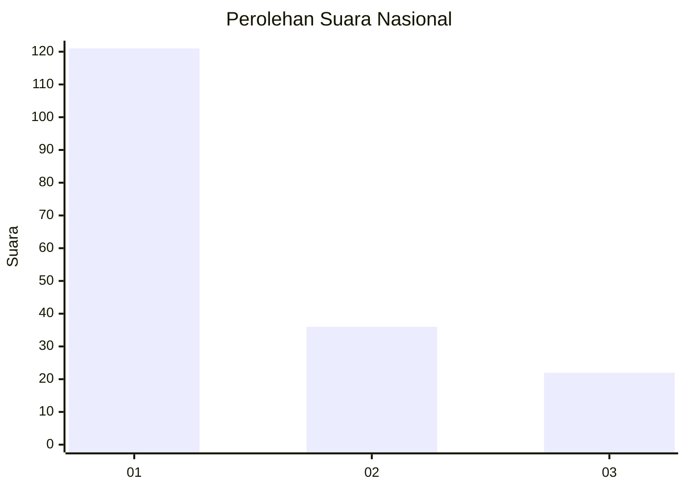
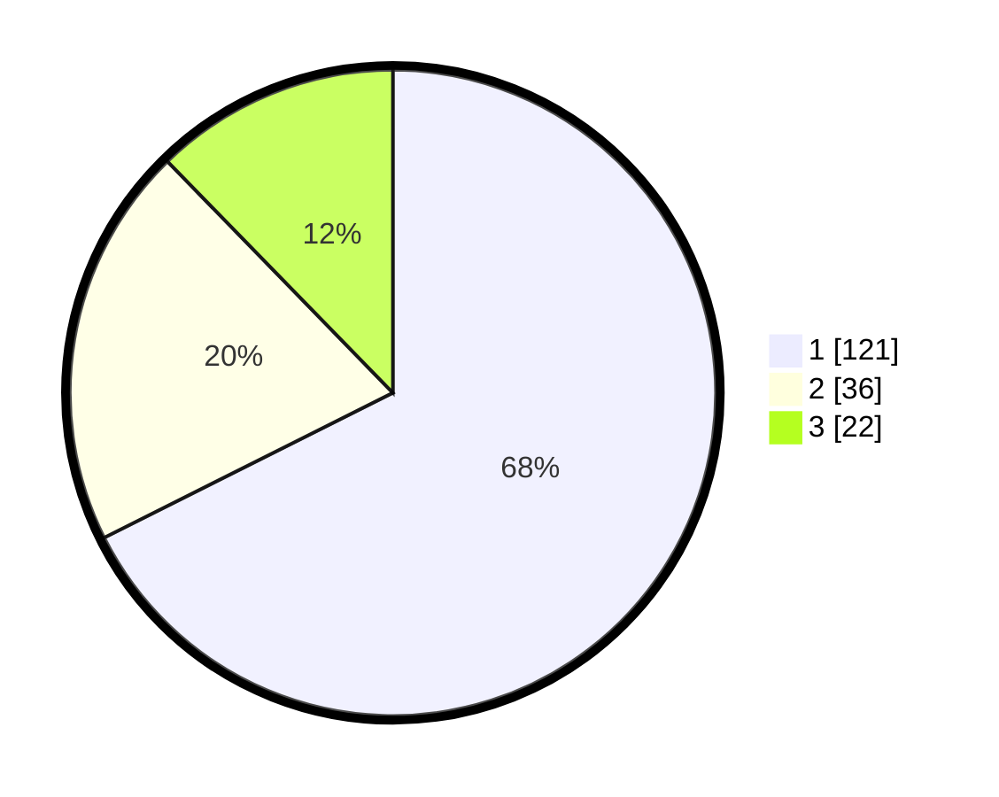

# Hasil

## Grafik

## Tabel

| No. | Nama Paslon    | Suara | Suara (raw) | Persentase |
|:--- |:-------------- | -----:| -----------:| ----------:|
| 1   | ANIES MUHAIMIN | 121   | [121][p-1]  | 67,60      |
| 2   | PRABOWO GIBRAN | 36    | [36][p-2]   | 20,11      |
| 3   | GANJAR MAHFUD  | 22    | [22][p-3]   | 12,29      |

[p-1]: https://github.com/gigit-pemilu/pemilu-2024/blob/main/pilpres/hitung-suara/sub/31-dki-jakarta/sub/74-jakarta-selatan/sub/07-kebayoran-baru/sub/1010-cipete-utara/sub/122-tps/sub/paslon-1.txt
[p-2]: https://github.com/gigit-pemilu/pemilu-2024/blob/main/pilpres/hitung-suara/sub/31-dki-jakarta/sub/74-jakarta-selatan/sub/07-kebayoran-baru/sub/1010-cipete-utara/sub/122-tps/sub/paslon-2.txt
[p-3]: https://github.com/gigit-pemilu/pemilu-2024/blob/main/pilpres/hitung-suara/sub/31-dki-jakarta/sub/74-jakarta-selatan/sub/07-kebayoran-baru/sub/1010-cipete-utara/sub/122-tps/sub/paslon-3.txt

## Foto C Plano

https://sirekap-obj-formc.kpu.go.id/22ea/pemilu/ppwp/31/74/07/10/10/3174071010122-20240215-001726--7852b507-4aa7-4dd9-8072-3d7b3f1be4cd.jpg

https://sirekap-obj-formc.kpu.go.id/22ea/pemilu/ppwp/31/74/07/10/10/3174071010122-20240215-001831--9d1b8036-7aad-4240-ba0a-b597f9e77097.jpg

https://sirekap-obj-formc.kpu.go.id/22ea/pemilu/ppwp/31/74/07/10/10/3174071010122-20240215-001952--ca1a8bcf-e1aa-4b43-9a97-bc3740a4b421.jpg

## Metadata

| Key        | Value               |
| ---------- | ------------------- |
| Time Stamp | 2024-02-24 22:31:28 |

