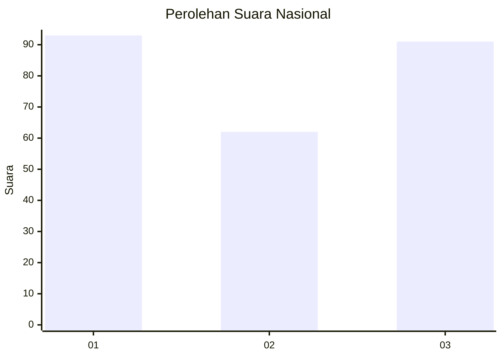
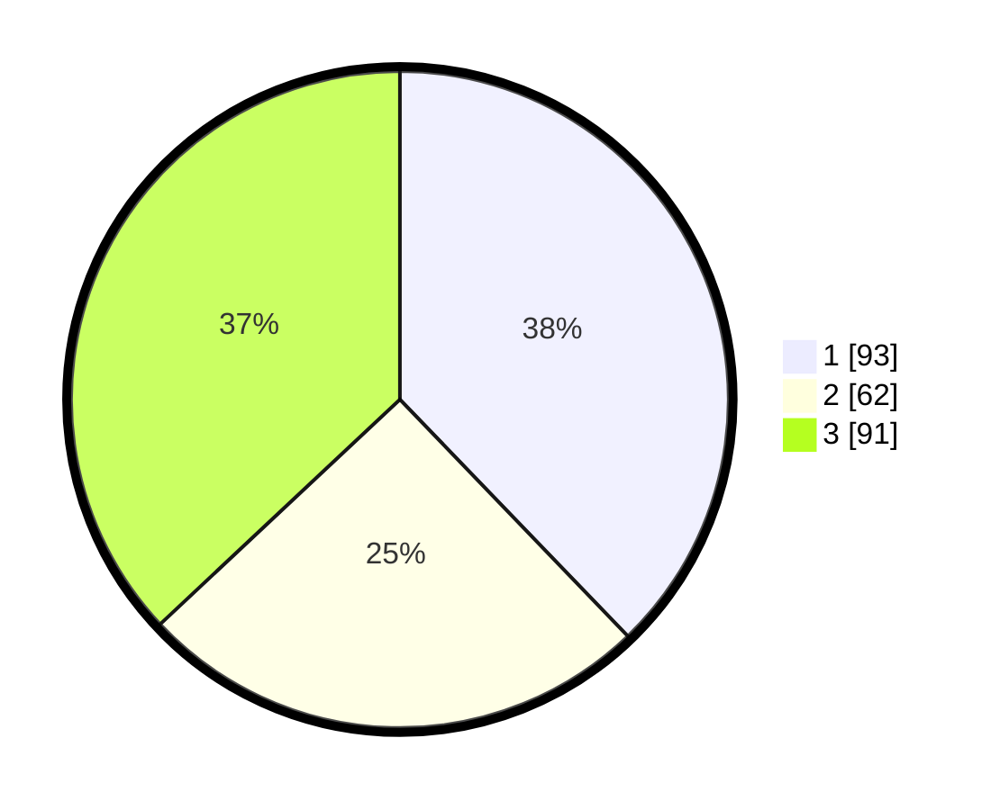

# Hasil

## Grafik

## Tabel

| No.    | Nama Paslon    | Suara | Suara (raw) | Persentase |
|:------ |:-------------- | -----:| -----------:| ----------:|
| 100025 | ANIES MUHAIMIN | 93    | [93][p-1]   | 37,80      |
| 100026 | PRABOWO GIBRAN | 62    | [62][p-2]   | 25,20      |
| 100027 | GANJAR MAHFUD  | 91    | [91][p-3]   | 36,99      |

[p-1]: https://github.com/gigit-pemilu/pemilu-2024/blob/main/pilpres/hitung-suara/sub/31-dki-jakarta/sub/74-jakarta-selatan/sub/08-pancoran/sub/1001-pancoran/sub/021-tps/sub/paslon-1.txt
[p-2]: https://github.com/gigit-pemilu/pemilu-2024/blob/main/pilpres/hitung-suara/sub/31-dki-jakarta/sub/74-jakarta-selatan/sub/08-pancoran/sub/1001-pancoran/sub/021-tps/sub/paslon-2.txt
[p-3]: https://github.com/gigit-pemilu/pemilu-2024/blob/main/pilpres/hitung-suara/sub/31-dki-jakarta/sub/74-jakarta-selatan/sub/08-pancoran/sub/1001-pancoran/sub/021-tps/sub/paslon-3.txt

## Foto C Plano

https://sirekap-obj-formc.kpu.go.id/6fa5/pemilu/ppwp/31/74/08/10/01/3174081001021-20240218-142519--f944fc59-3252-4d0b-aed3-9e5decc44a56.jpg

https://sirekap-obj-formc.kpu.go.id/6fa5/pemilu/ppwp/31/74/08/10/01/3174081001021-20240218-191652--cb8bd7e8-fd34-4370-90c5-d2a61f761c07.jpg

https://sirekap-obj-formc.kpu.go.id/6fa5/pemilu/ppwp/31/74/08/10/01/3174081001021-20240218-192909--8887e5a3-97c9-4cfc-9bea-208f0be5bc2d.jpg

## Metadata

| Key        | Value               |
| ---------- | ------------------- |
| Time Stamp | 2024-02-24 22:31:28 |

## DATA PEMILIH TETAP

Jumlah pemilih dalam DPT: **241**.
 * L: **115**.
 * P: **226**.

## DATA PENGGUNA HAK PILIH

Jumlah pengguna hak pilih dalam DPT: **188**.
 * L: **86**.
 * P: **202**.

Jumlah pengguna hak pilih dalam DPTb: **14**.
 * L: **11**.
 * P: **803**.

Jumlah pengguna hak pilih dalam DPK: **1**.
 * L: **888**.
 * P: **801**.

Jumlah pengguna hak pilih: **203**.
 * L: **897**.
 * P: **106**.

## JUMLAH SUARA SAH DAN TIDAK SAH

JUMLAH SELURUH SUARA SAH: **203**.

JUMLAH SUARA TIDAK SAH: **7**.

JUMLAH SELURUH SUARA SAH DAN SUARA TIDAK SAH: **210**.

