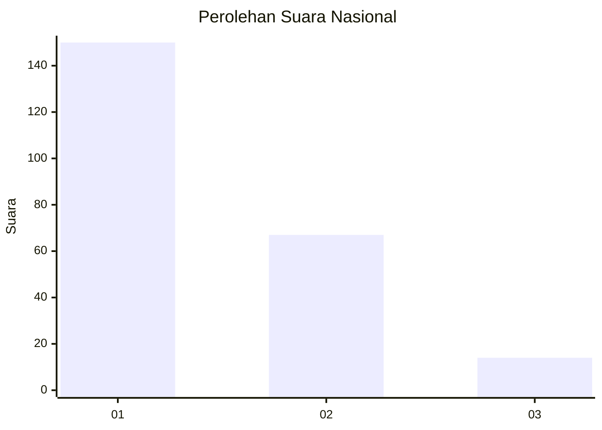
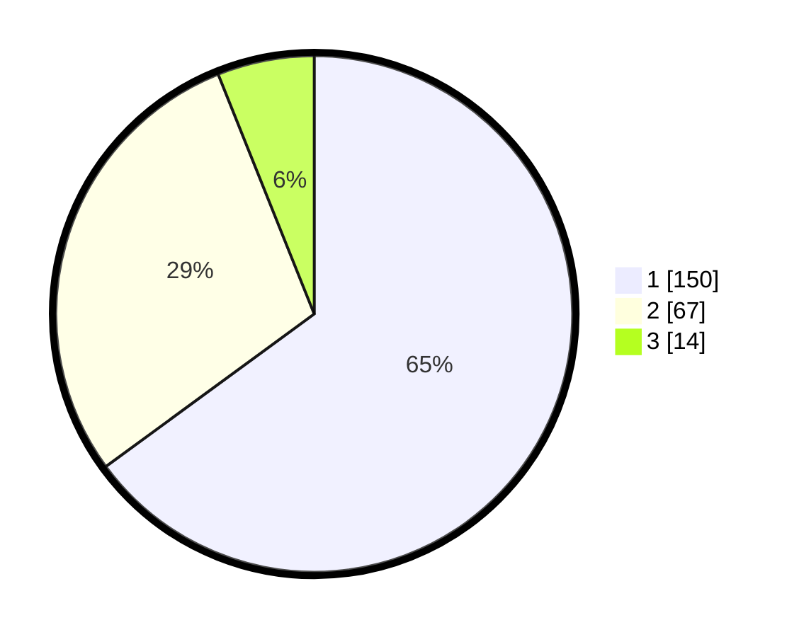

# Hasil

## Grafik

## Tabel

| No.    | Nama Paslon    | Suara | Suara (raw) | Persentase |
|:------ |:-------------- | -----:| -----------:| ----------:|
| 100025 | ANIES MUHAIMIN | 150   | [150][p-1]  | 64,94      |
| 100026 | PRABOWO GIBRAN | 67    | [67][p-2]   | 29,00      |
| 100027 | GANJAR MAHFUD  | 14    | [14][p-3]   | 6,06       |

[p-1]: https://github.com/gigit-pemilu/pemilu-2024/blob/main/pilpres/hitung-suara/sub/31-dki-jakarta/sub/74-jakarta-selatan/sub/08-pancoran/sub/1001-pancoran/sub/059-tps/sub/paslon-1.txt
[p-2]: https://github.com/gigit-pemilu/pemilu-2024/blob/main/pilpres/hitung-suara/sub/31-dki-jakarta/sub/74-jakarta-selatan/sub/08-pancoran/sub/1001-pancoran/sub/059-tps/sub/paslon-2.txt
[p-3]: https://github.com/gigit-pemilu/pemilu-2024/blob/main/pilpres/hitung-suara/sub/31-dki-jakarta/sub/74-jakarta-selatan/sub/08-pancoran/sub/1001-pancoran/sub/059-tps/sub/paslon-3.txt

## Foto C Plano

https://sirekap-obj-formc.kpu.go.id/92fe/pemilu/ppwp/31/74/08/10/01/3174081001059-20240218-105942--87e7a685-286d-4c5d-bfda-c4bf363c1037.jpg

https://sirekap-obj-formc.kpu.go.id/92fe/pemilu/ppwp/31/74/08/10/01/3174081001059-20240218-110039--71cad611-48ae-4874-8942-6c7d245a03bb.jpg

https://sirekap-obj-formc.kpu.go.id/92fe/pemilu/ppwp/31/74/08/10/01/3174081001059-20240218-110122--63ae0421-1a58-4d3b-a6e8-117cbe51e7b2.jpg

## Metadata

| Key        | Value               |
| ---------- | ------------------- |
| Time Stamp | 2024-02-24 22:31:28 |

