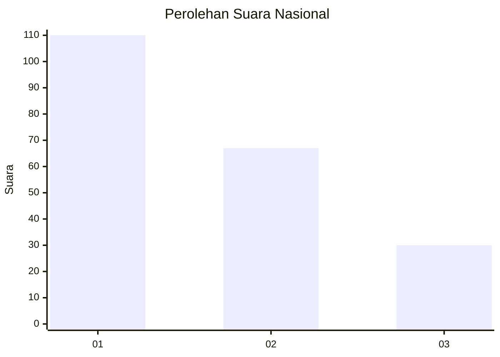
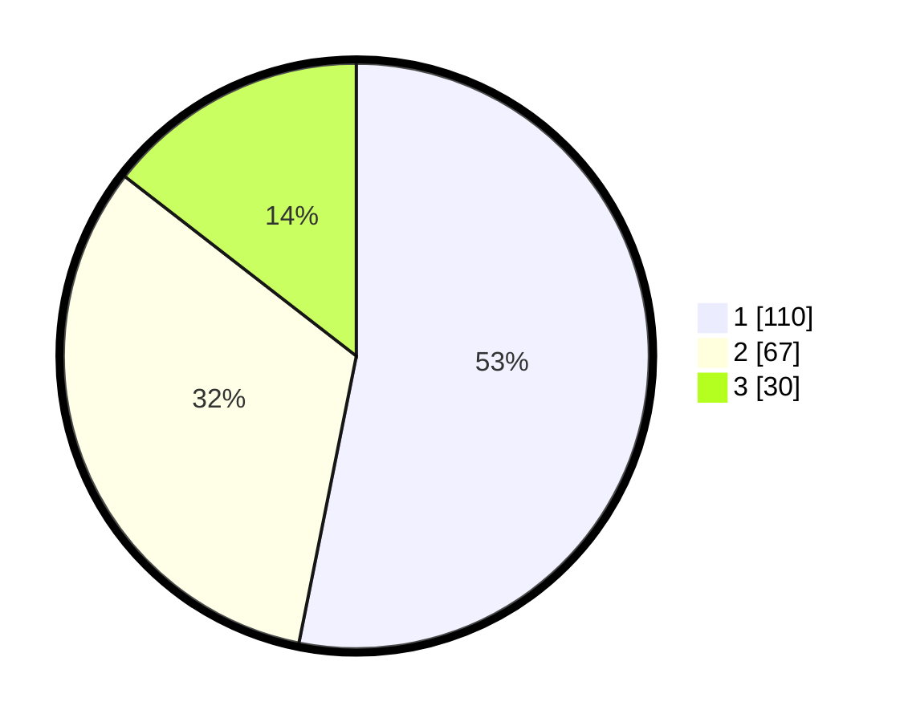

# Hasil

## Grafik

## Tabel

| No.    | Nama Paslon    | Suara | Suara (raw) | Persentase |
|:------ |:-------------- | -----:| -----------:| ----------:|
| 100025 | ANIES MUHAIMIN | 110   | [110][p-1]  | 53,14      |
| 100026 | PRABOWO GIBRAN | 67    | [67][p-2]   | 32,37      |
| 100027 | GANJAR MAHFUD  | 30    | [30][p-3]   | 14,49      |

[p-1]: https://github.com/gigit-pemilu/pemilu-2024/blob/main/pilpres/hitung-suara/sub/31-dki-jakarta/sub/74-jakarta-selatan/sub/08-pancoran/sub/1002-kalibata/sub/023-tps/sub/paslon-1.txt
[p-2]: https://github.com/gigit-pemilu/pemilu-2024/blob/main/pilpres/hitung-suara/sub/31-dki-jakarta/sub/74-jakarta-selatan/sub/08-pancoran/sub/1002-kalibata/sub/023-tps/sub/paslon-2.txt
[p-3]: https://github.com/gigit-pemilu/pemilu-2024/blob/main/pilpres/hitung-suara/sub/31-dki-jakarta/sub/74-jakarta-selatan/sub/08-pancoran/sub/1002-kalibata/sub/023-tps/sub/paslon-3.txt

## Foto C Plano

https://sirekap-obj-formc.kpu.go.id/0f45/pemilu/ppwp/31/74/08/10/02/3174081002023-20240214-194757--26e4c3a6-7f2c-44f4-8c30-8786dacaf718.jpg

https://sirekap-obj-formc.kpu.go.id/0f45/pemilu/ppwp/31/74/08/10/02/3174081002023-20240214-194804--8fd0bbd0-0e58-4eb2-bc37-ba2f8710c67f.jpg

https://sirekap-obj-formc.kpu.go.id/0f45/pemilu/ppwp/31/74/08/10/02/3174081002023-20240214-225934--998096fb-fffa-4588-9c22-562744cf9b1d.jpg

## Metadata

| Key        | Value               |
| ---------- | ------------------- |
| Time Stamp | 2024-02-15 02:10:27 |

