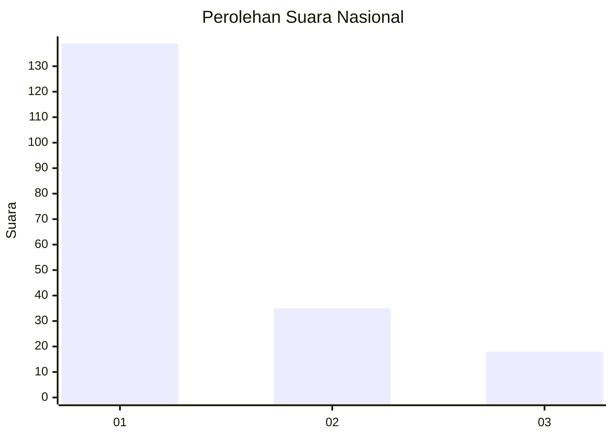
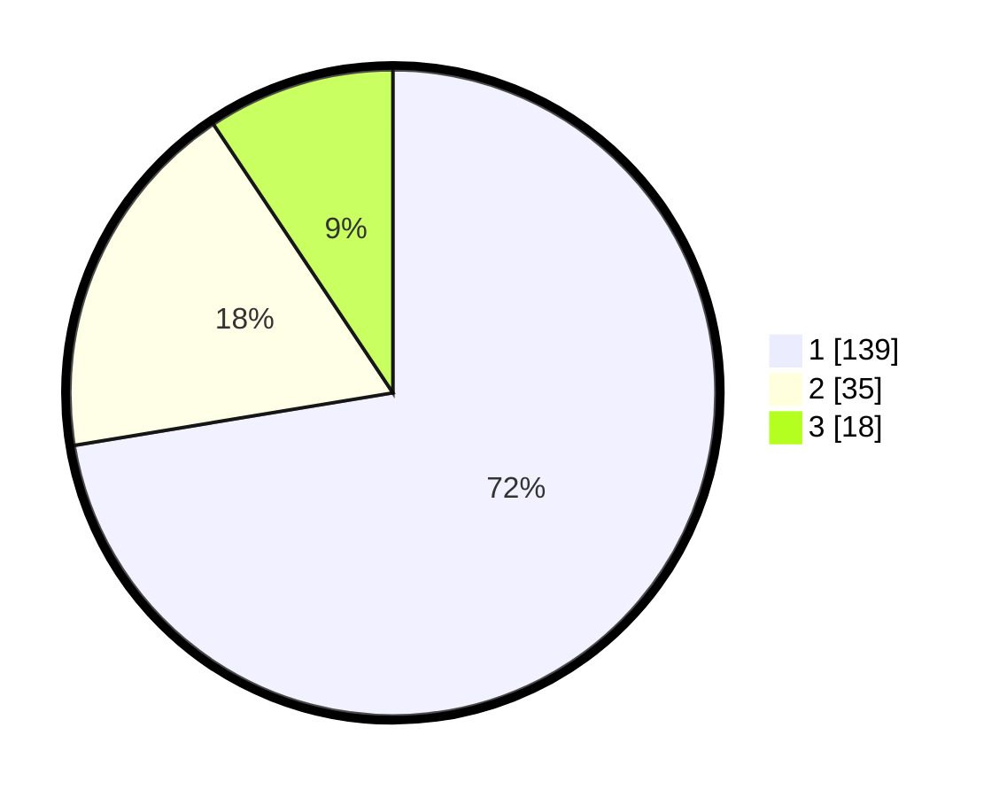

# Hasil

## Grafik

## Tabel

| No.    | Nama Paslon    | Suara | Suara (raw) | Persentase |
|:------ |:-------------- | -----:| -----------:| ----------:|
| 100025 | ANIES MUHAIMIN | 139   | [139][p-1]  | 72,40      |
| 100026 | PRABOWO GIBRAN | 35    | [35][p-2]   | 18,23      |
| 100027 | GANJAR MAHFUD  | 18    | [18][p-3]   | 9,38       |

[p-1]: https://github.com/gigit-pemilu/pemilu-2024/blob/main/pilpres/hitung-suara/sub/31-dki-jakarta/sub/74-jakarta-selatan/sub/08-pancoran/sub/1002-kalibata/sub/035-tps/sub/paslon-1.txt
[p-2]: https://github.com/gigit-pemilu/pemilu-2024/blob/main/pilpres/hitung-suara/sub/31-dki-jakarta/sub/74-jakarta-selatan/sub/08-pancoran/sub/1002-kalibata/sub/035-tps/sub/paslon-2.txt
[p-3]: https://github.com/gigit-pemilu/pemilu-2024/blob/main/pilpres/hitung-suara/sub/31-dki-jakarta/sub/74-jakarta-selatan/sub/08-pancoran/sub/1002-kalibata/sub/035-tps/sub/paslon-3.txt

## Foto C Plano

https://sirekap-obj-formc.kpu.go.id/d7ac/pemilu/ppwp/31/74/08/10/02/3174081002035-20240218-170417--0eb68ac7-ec5c-46e5-89af-81fc04a4a09c.jpg

https://sirekap-obj-formc.kpu.go.id/d7ac/pemilu/ppwp/31/74/08/10/02/3174081002035-20240218-170337--a0af195c-8b3d-4d02-a16c-d081182b7c5e.jpg

https://sirekap-obj-formc.kpu.go.id/d7ac/pemilu/ppwp/31/74/08/10/02/3174081002035-20240218-170442--bd139039-940d-4c35-918a-ca91763b475a.jpg

## Metadata

| Key        | Value               |
| ---------- | ------------------- |
| Time Stamp | 2024-02-24 22:31:28 |

