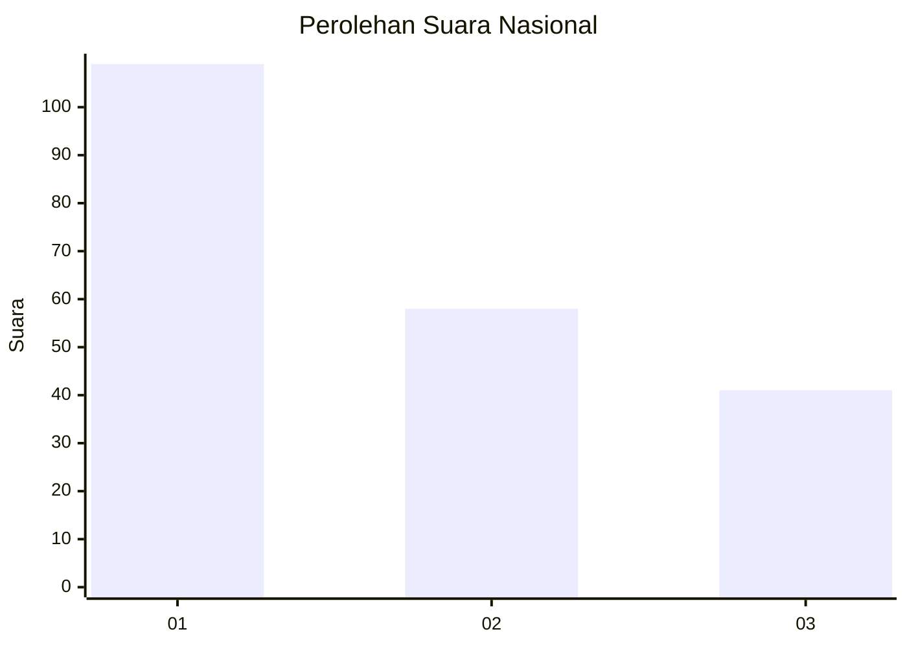
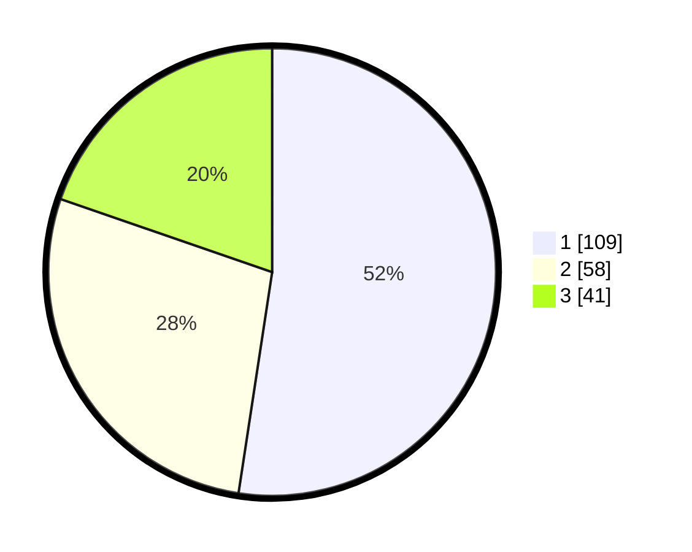

# Hasil

## Grafik

## Tabel

| No.    | Nama Paslon    | Suara | Suara (raw) | Persentase |
|:------ |:-------------- | -----:| -----------:| ----------:|
| 100025 | ANIES MUHAIMIN | 109   | [109][p-1]  | 52,40      |
| 100026 | PRABOWO GIBRAN | 58    | [58][p-2]   | 27,88      |
| 100027 | GANJAR MAHFUD  | 41    | [41][p-3]   | 19,71      |

[p-1]: https://github.com/gigit-pemilu/pemilu-2024/blob/main/pilpres/hitung-suara/sub/31-dki-jakarta/sub/74-jakarta-selatan/sub/08-pancoran/sub/1002-kalibata/sub/037-tps/sub/paslon-1.txt
[p-2]: https://github.com/gigit-pemilu/pemilu-2024/blob/main/pilpres/hitung-suara/sub/31-dki-jakarta/sub/74-jakarta-selatan/sub/08-pancoran/sub/1002-kalibata/sub/037-tps/sub/paslon-2.txt
[p-3]: https://github.com/gigit-pemilu/pemilu-2024/blob/main/pilpres/hitung-suara/sub/31-dki-jakarta/sub/74-jakarta-selatan/sub/08-pancoran/sub/1002-kalibata/sub/037-tps/sub/paslon-3.txt

## Foto C Plano

https://sirekap-obj-formc.kpu.go.id/05f3/pemilu/ppwp/31/74/08/10/02/3174081002037-20240214-204702--dd0f21b1-f037-4f8c-8969-06f8e53eba3e.jpg

https://sirekap-obj-formc.kpu.go.id/05f3/pemilu/ppwp/31/74/08/10/02/3174081002037-20240214-204817--bc5f7b15-8762-4a72-b35d-ed52d48edb8c.jpg

https://sirekap-obj-formc.kpu.go.id/05f3/pemilu/ppwp/31/74/08/10/02/3174081002037-20240214-204921--fe89c4d2-fa6d-42f6-b621-c18ad9da170e.jpg

## Metadata

| Key        | Value               |
| ---------- | ------------------- |
| Time Stamp | 2024-02-24 22:31:28 |

