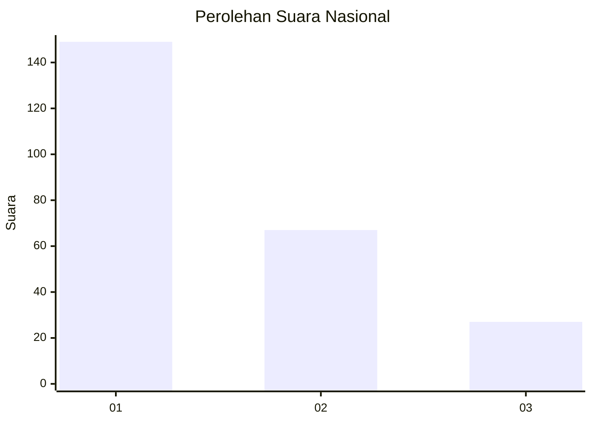
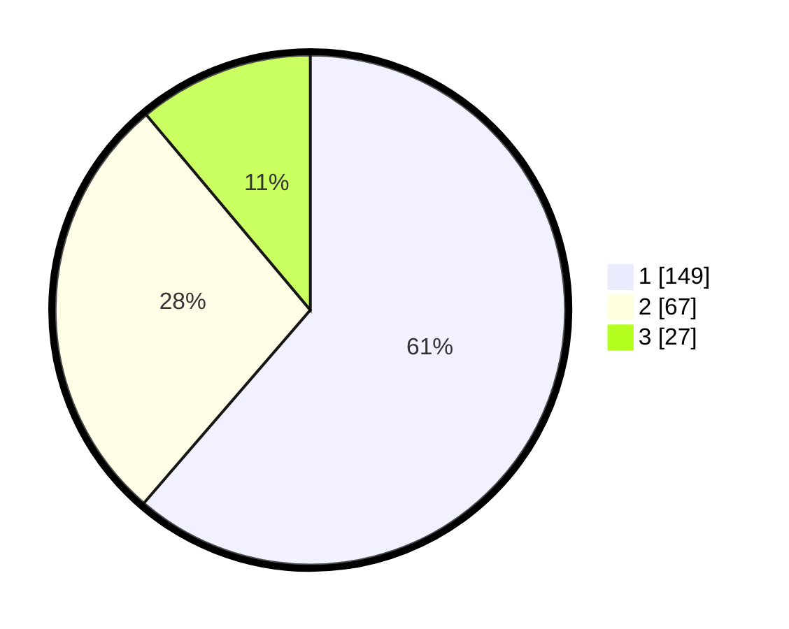

# Hasil

## Grafik

## Tabel

| No.    | Nama Paslon    | Suara | Suara (raw) | Persentase |
|:------ |:-------------- | -----:| -----------:| ----------:|
| 100025 | ANIES MUHAIMIN | 149   | [149][p-1]  | 61,32      |
| 100026 | PRABOWO GIBRAN | 67    | [67][p-2]   | 27,57      |
| 100027 | GANJAR MAHFUD  | 27    | [27][p-3]   | 11,11      |

[p-1]: https://github.com/gigit-pemilu/pemilu-2024/blob/main/pilpres/hitung-suara/sub/31-dki-jakarta/sub/74-jakarta-selatan/sub/08-pancoran/sub/1002-kalibata/sub/042-tps/sub/paslon-1.txt
[p-2]: https://github.com/gigit-pemilu/pemilu-2024/blob/main/pilpres/hitung-suara/sub/31-dki-jakarta/sub/74-jakarta-selatan/sub/08-pancoran/sub/1002-kalibata/sub/042-tps/sub/paslon-2.txt
[p-3]: https://github.com/gigit-pemilu/pemilu-2024/blob/main/pilpres/hitung-suara/sub/31-dki-jakarta/sub/74-jakarta-selatan/sub/08-pancoran/sub/1002-kalibata/sub/042-tps/sub/paslon-3.txt

## Foto C Plano

https://sirekap-obj-formc.kpu.go.id/bbc7/pemilu/ppwp/31/74/08/10/02/3174081002042-20240214-225906--aef0a6c4-fe4d-4279-9f11-d70aabde6e4f.jpg

https://sirekap-obj-formc.kpu.go.id/bbc7/pemilu/ppwp/31/74/08/10/02/3174081002042-20240214-230104--1f9f7899-85f3-4377-94ae-15f9f0685a1f.jpg

https://sirekap-obj-formc.kpu.go.id/bbc7/pemilu/ppwp/31/74/08/10/02/3174081002042-20240214-230327--b6e9c6f5-85de-446c-9851-de5485401aaf.jpg

## Metadata

| Key        | Value               |
| ---------- | ------------------- |
| Time Stamp | 2024-02-24 22:31:28 |

