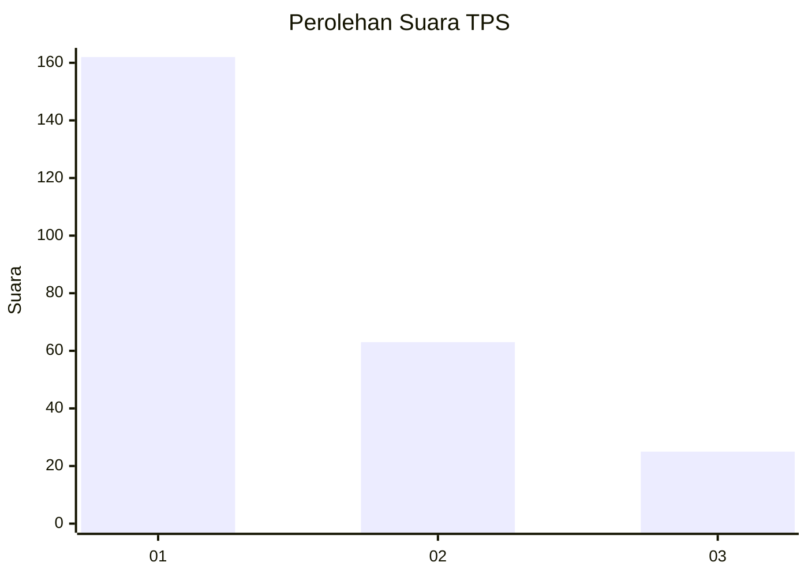
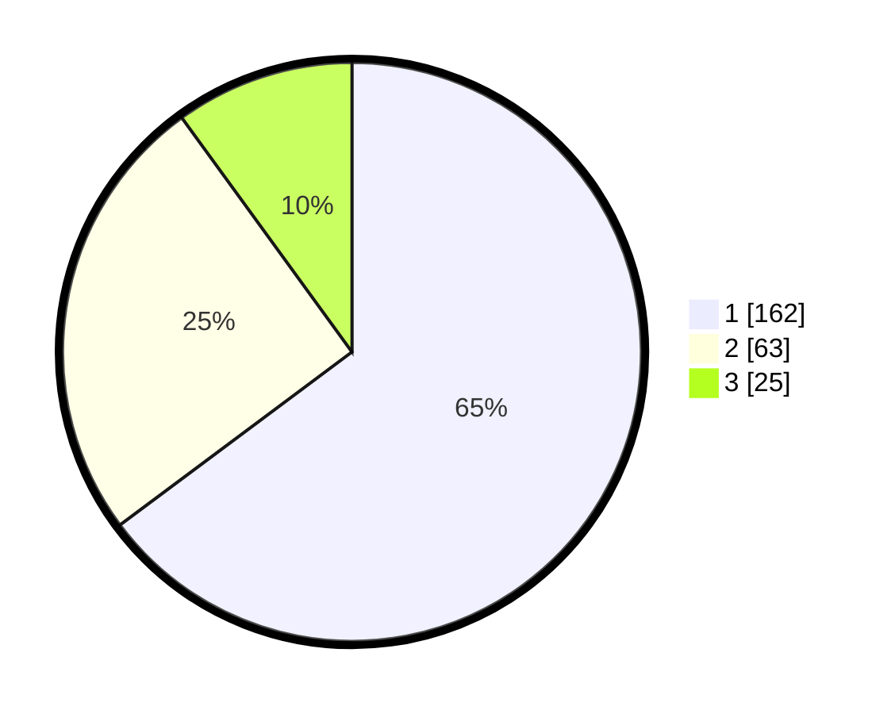

# Hasil

## Grafik

## Tabel

| No. | Nama Paslon    | Suara | Suara (raw) | Persentase |
|:--- |:-------------- | -----:| -----------:| ----------:|
| 1   | ANIES MUHAIMIN | 162   | [162][p-1]  | 64,80      |
| 2   | PRABOWO GIBRAN | 63    | [63][p-2]   | 25,20      |
| 3   | GANJAR MAHFUD  | 25    | [25][p-3]   | 10,00      |

[p-1]: https://github.com/gigit-pemilu/pemilu-2024-31-dki-jakarta/blob/main/pilpres/hitung-suara/sub/31-dki-jakarta/sub/74-jakarta-selatan/sub/08-pancoran/sub/1002-kalibata/sub/044-tps/sub/paslon-1.txt
[p-2]: https://github.com/gigit-pemilu/pemilu-2024-31-dki-jakarta/blob/main/pilpres/hitung-suara/sub/31-dki-jakarta/sub/74-jakarta-selatan/sub/08-pancoran/sub/1002-kalibata/sub/044-tps/sub/paslon-2.txt
[p-3]: https://github.com/gigit-pemilu/pemilu-2024-31-dki-jakarta/blob/main/pilpres/hitung-suara/sub/31-dki-jakarta/sub/74-jakarta-selatan/sub/08-pancoran/sub/1002-kalibata/sub/044-tps/sub/paslon-3.txt

## Foto C Plano

https://sirekap-obj-formc.kpu.go.id/8f76/pemilu/ppwp/31/74/08/10/02/3174081002044-20240215-010236--41943eba-c997-45ed-9841-f1dc7ff6f230.jpg

https://sirekap-obj-formc.kpu.go.id/8f76/pemilu/ppwp/31/74/08/10/02/3174081002044-20240215-011115--6fbc8a2b-6993-49ed-afb8-e4d684cfee00.jpg

https://sirekap-obj-formc.kpu.go.id/8f76/pemilu/ppwp/31/74/08/10/02/3174081002044-20240215-011250--9648d00a-c582-4934-9749-69589566bdab.jpg

## Metadata

| Key        | Value               |
| ---------- | ------------------- |
| Time Stamp | 2024-02-26 15:00:00 |

