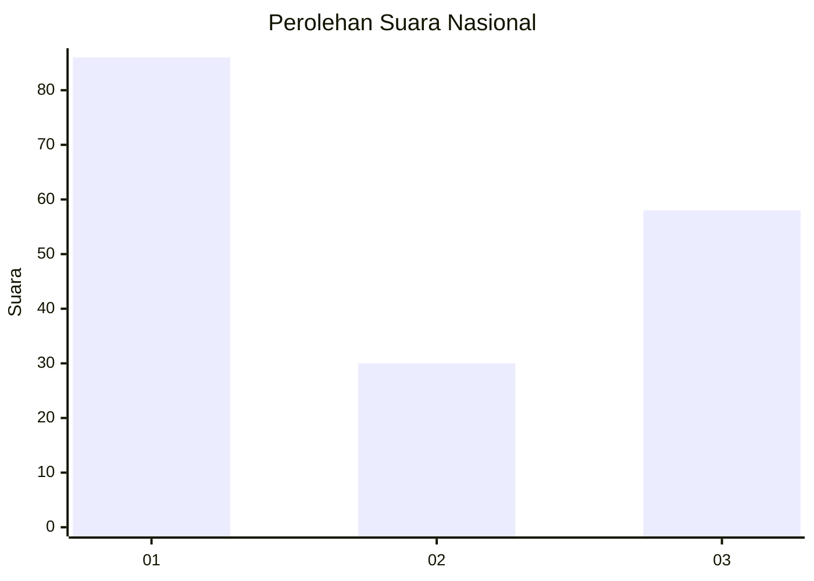
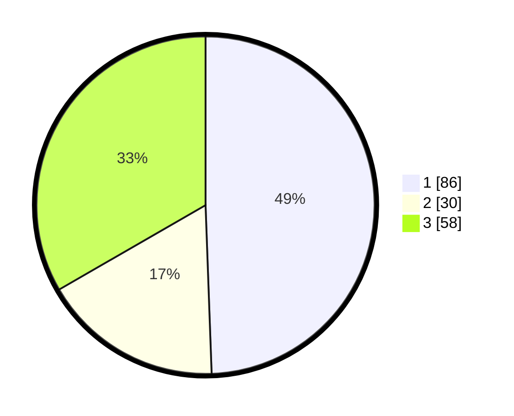

# Hasil

## Grafik

## Tabel

| No.    | Nama Paslon    | Suara | Suara (raw) | Persentase |
|:------ |:-------------- | -----:| -----------:| ----------:|
| 100025 | ANIES MUHAIMIN | 86    | [86][p-1]   | 49,43      |
| 100026 | PRABOWO GIBRAN | 30    | [30][p-2]   | 17,24      |
| 100027 | GANJAR MAHFUD  | 58    | [58][p-3]   | 33,33      |

[p-1]: https://github.com/gigit-pemilu/pemilu-2024/blob/main/pilpres/hitung-suara/sub/31-dki-jakarta/sub/74-jakarta-selatan/sub/08-pancoran/sub/1002-kalibata/sub/057-tps/sub/paslon-1.txt
[p-2]: https://github.com/gigit-pemilu/pemilu-2024/blob/main/pilpres/hitung-suara/sub/31-dki-jakarta/sub/74-jakarta-selatan/sub/08-pancoran/sub/1002-kalibata/sub/057-tps/sub/paslon-2.txt
[p-3]: https://github.com/gigit-pemilu/pemilu-2024/blob/main/pilpres/hitung-suara/sub/31-dki-jakarta/sub/74-jakarta-selatan/sub/08-pancoran/sub/1002-kalibata/sub/057-tps/sub/paslon-3.txt

## Foto C Plano

https://sirekap-obj-formc.kpu.go.id/90b7/pemilu/ppwp/31/74/08/10/02/3174081002057-20240219-155850--02024b96-ef68-4e93-81af-99031b7158f3.jpg

https://sirekap-obj-formc.kpu.go.id/90b7/pemilu/ppwp/31/74/08/10/02/3174081002057-20240219-152210--6500ec2e-5504-4ab9-b137-e1bf23272242.jpg

https://sirekap-obj-formc.kpu.go.id/90b7/pemilu/ppwp/31/74/08/10/02/3174081002057-20240219-152418--198865af-7406-478e-917a-59654c12d807.jpg

## Metadata

| Key        | Value               |
| ---------- | ------------------- |
| Time Stamp | 2024-02-24 22:31:28 |

