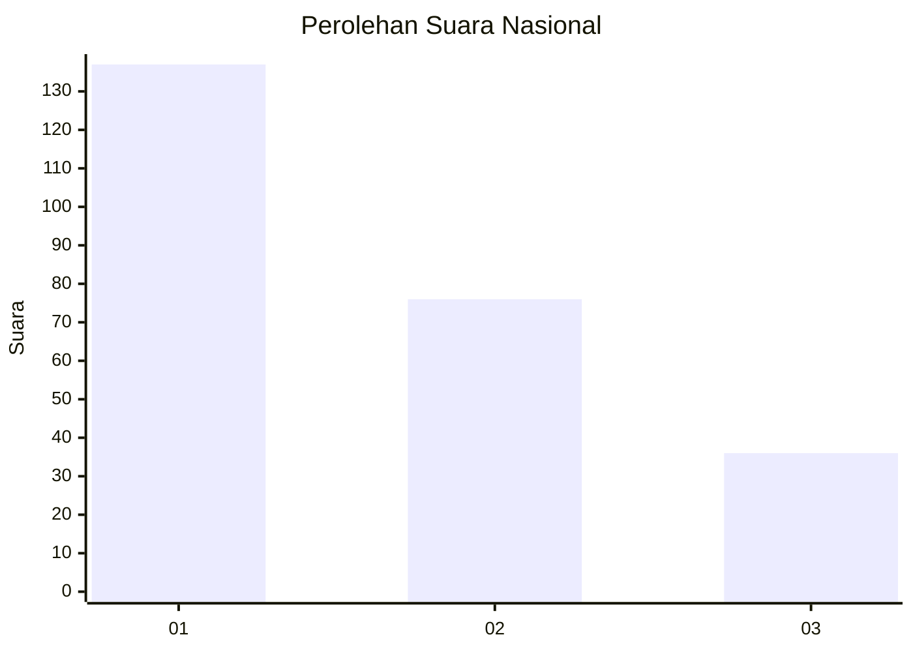
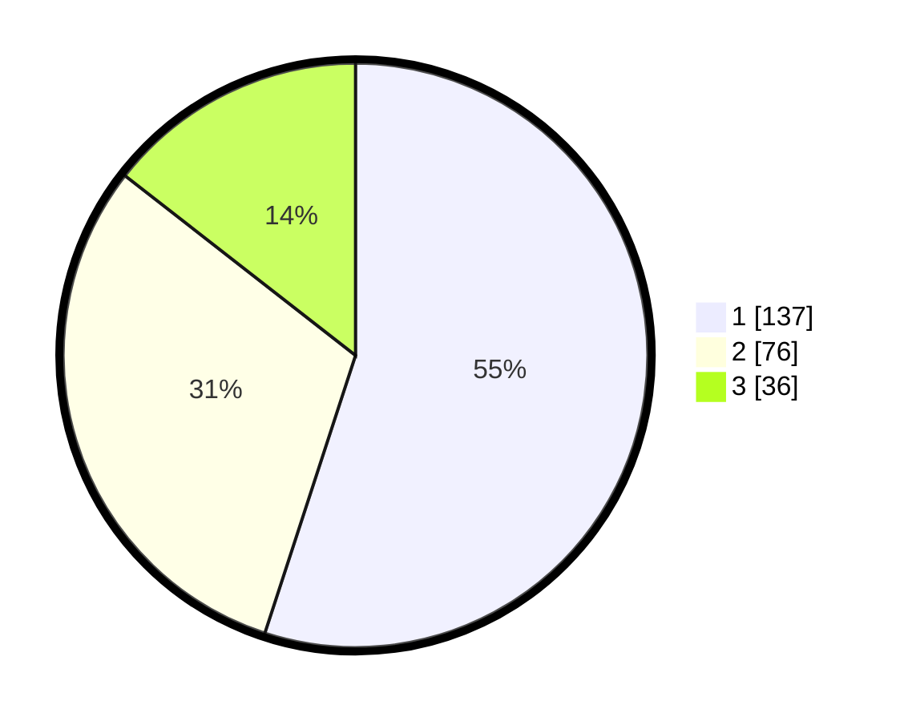

# Hasil

## Grafik

## Tabel

| No.    | Nama Paslon    | Suara | Suara (raw) | Persentase |
|:------ |:-------------- | -----:| -----------:| ----------:|
| 100025 | ANIES MUHAIMIN | 137   | [137][p-1]  | 55,02      |
| 100026 | PRABOWO GIBRAN | 76    | [76][p-2]   | 30,52      |
| 100027 | GANJAR MAHFUD  | 36    | [36][p-3]   | 14,46      |

[p-1]: https://github.com/gigit-pemilu/pemilu-2024/blob/main/pilpres/hitung-suara/sub/31-dki-jakarta/sub/74-jakarta-selatan/sub/08-pancoran/sub/1002-kalibata/sub/105-tps/sub/paslon-1.txt
[p-2]: https://github.com/gigit-pemilu/pemilu-2024/blob/main/pilpres/hitung-suara/sub/31-dki-jakarta/sub/74-jakarta-selatan/sub/08-pancoran/sub/1002-kalibata/sub/105-tps/sub/paslon-2.txt
[p-3]: https://github.com/gigit-pemilu/pemilu-2024/blob/main/pilpres/hitung-suara/sub/31-dki-jakarta/sub/74-jakarta-selatan/sub/08-pancoran/sub/1002-kalibata/sub/105-tps/sub/paslon-3.txt

## Foto C Plano

https://sirekap-obj-formc.kpu.go.id/6c71/pemilu/ppwp/31/74/08/10/02/3174081002105-20240214-214420--d172df47-6aa2-4a8e-9297-034999fb3d1d.jpg

https://sirekap-obj-formc.kpu.go.id/6c71/pemilu/ppwp/31/74/08/10/02/3174081002105-20240214-214558--59b0e622-9ec5-4f08-8b36-3a77b76cb017.jpg

https://sirekap-obj-formc.kpu.go.id/6c71/pemilu/ppwp/31/74/08/10/02/3174081002105-20240214-214730--0b8e3c06-ae96-4f3e-b003-c40aa0dc0edf.jpg

## Metadata

| Key        | Value               |
| ---------- | ------------------- |
| Time Stamp | 2024-02-24 22:31:28 |

