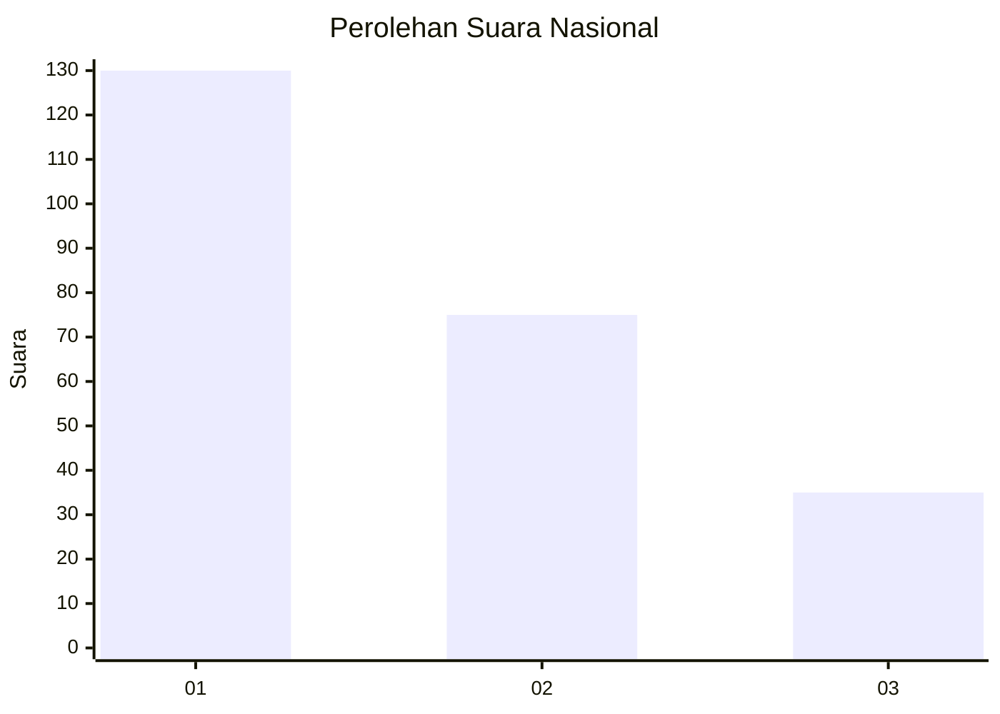
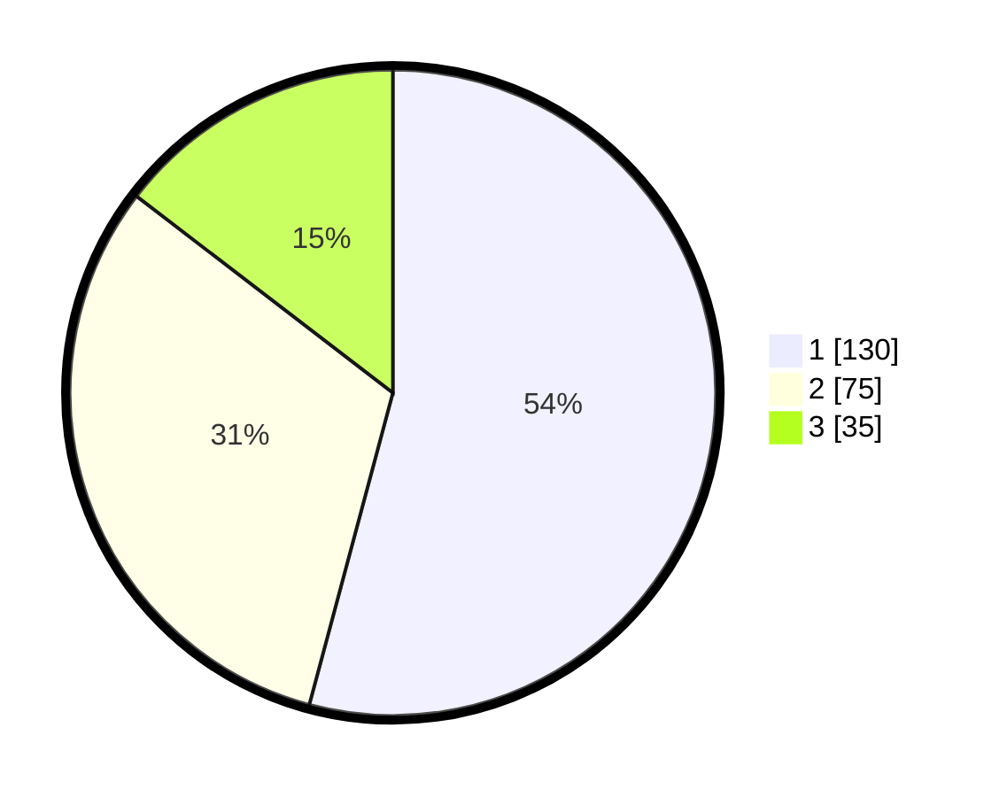

# Hasil

## Grafik

## Tabel

| No.    | Nama Paslon    | Suara | Suara (raw) | Persentase |
|:------ |:-------------- | -----:| -----------:| ----------:|
| 100025 | ANIES MUHAIMIN | 130   | [130][p-1]  | 54,17      |
| 100026 | PRABOWO GIBRAN | 75    | [75][p-2]   | 31,25      |
| 100027 | GANJAR MAHFUD  | 35    | [35][p-3]   | 14,58      |

[p-1]: https://github.com/gigit-pemilu/pemilu-2024/blob/main/pilpres/hitung-suara/sub/31-dki-jakarta/sub/74-jakarta-selatan/sub/08-pancoran/sub/1002-kalibata/sub/110-tps/sub/paslon-1.txt
[p-2]: https://github.com/gigit-pemilu/pemilu-2024/blob/main/pilpres/hitung-suara/sub/31-dki-jakarta/sub/74-jakarta-selatan/sub/08-pancoran/sub/1002-kalibata/sub/110-tps/sub/paslon-2.txt
[p-3]: https://github.com/gigit-pemilu/pemilu-2024/blob/main/pilpres/hitung-suara/sub/31-dki-jakarta/sub/74-jakarta-selatan/sub/08-pancoran/sub/1002-kalibata/sub/110-tps/sub/paslon-3.txt

## Foto C Plano

https://sirekap-obj-formc.kpu.go.id/aeab/pemilu/ppwp/31/74/08/10/02/3174081002110-20240215-005644--88b155df-8305-435a-ab7d-d678a3ef756e.jpg

https://sirekap-obj-formc.kpu.go.id/aeab/pemilu/ppwp/31/74/08/10/02/3174081002110-20240215-005724--d804f46d-40c5-4644-8127-cdb37fc04974.jpg

https://sirekap-obj-formc.kpu.go.id/aeab/pemilu/ppwp/31/74/08/10/02/3174081002110-20240215-005913--ff2ebd64-17dc-416e-ace5-dbaa72788cbb.jpg

## Metadata

| Key        | Value               |
| ---------- | ------------------- |
| Time Stamp | 2024-02-15 15:00:29 |

