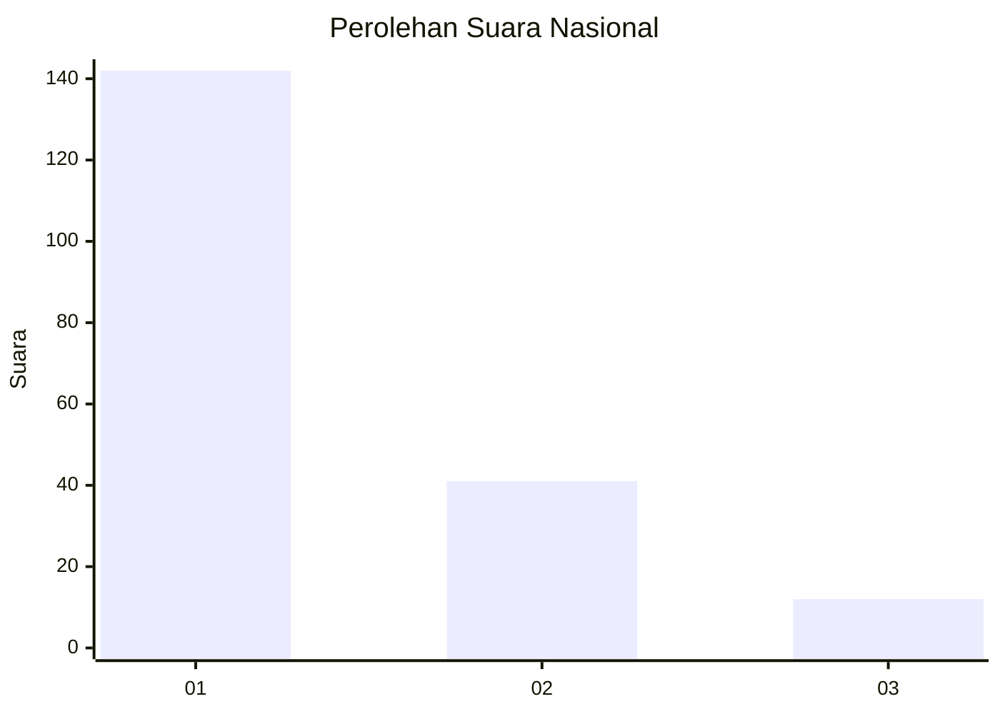
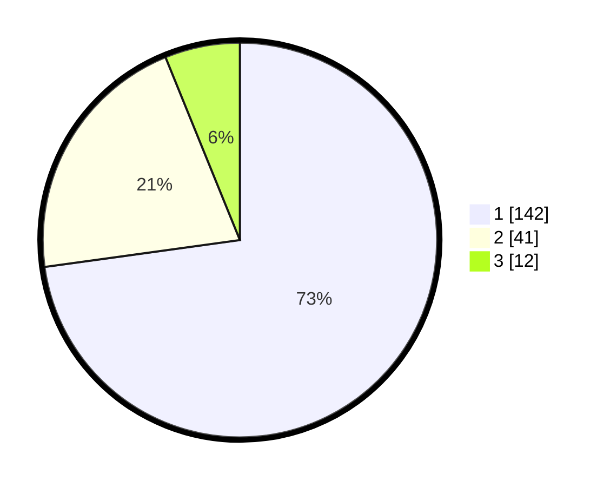

# Hasil

## Grafik

## Tabel

| No. | Nama Paslon    | Suara | Suara (raw) | Persentase |
|:--- |:-------------- | -----:| -----------:| ----------:|
| 1   | ANIES MUHAIMIN | 142   | [142][p-1]  | 72,82      |
| 2   | PRABOWO GIBRAN | 41    | [41][p-2]   | 21,03      |
| 3   | GANJAR MAHFUD  | 12    | [12][p-3]   | 6,15       |

[p-1]: https://github.com/gigit-pemilu/pemilu-2024/blob/main/pilpres/hitung-suara/sub/31-dki-jakarta/sub/74-jakarta-selatan/sub/08-pancoran/sub/1002-kalibata/sub/129-tps/sub/paslon-1.txt
[p-2]: https://github.com/gigit-pemilu/pemilu-2024/blob/main/pilpres/hitung-suara/sub/31-dki-jakarta/sub/74-jakarta-selatan/sub/08-pancoran/sub/1002-kalibata/sub/129-tps/sub/paslon-2.txt
[p-3]: https://github.com/gigit-pemilu/pemilu-2024/blob/main/pilpres/hitung-suara/sub/31-dki-jakarta/sub/74-jakarta-selatan/sub/08-pancoran/sub/1002-kalibata/sub/129-tps/sub/paslon-3.txt

## Foto C Plano

https://sirekap-obj-formc.kpu.go.id/be72/pemilu/ppwp/31/74/08/10/02/3174081002129-20240214-212934--03a17ef8-9351-4842-9e35-b31e300bf540.jpg

https://sirekap-obj-formc.kpu.go.id/be72/pemilu/ppwp/31/74/08/10/02/3174081002129-20240214-213016--f9067fac-c712-4fda-8ab3-a622adfa953a.jpg

https://sirekap-obj-formc.kpu.go.id/be72/pemilu/ppwp/31/74/08/10/02/3174081002129-20240214-213057--f098c31a-abb5-47c2-a6f4-71c32bf91366.jpg

## Metadata

| Key        | Value               |
| ---------- | ------------------- |
| Time Stamp | 2024-02-24 22:31:28 |

