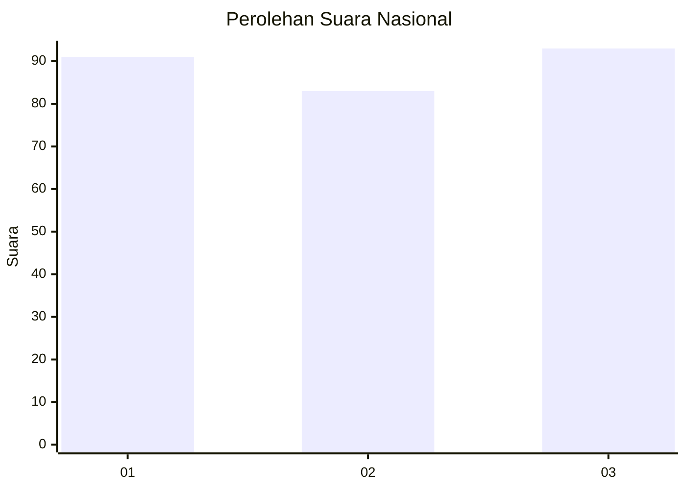
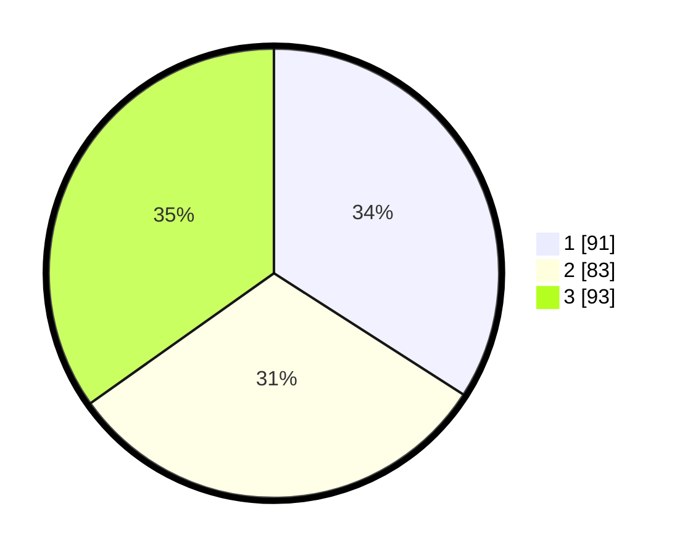

# Hasil

## Grafik

## Tabel

| No.    | Nama Paslon    | Suara | Suara (raw) | Persentase |
|:------ |:-------------- | -----:| -----------:| ----------:|
| 100025 | ANIES MUHAIMIN | 91    | [91][p-1]   | 34,08      |
| 100026 | PRABOWO GIBRAN | 83    | [83][p-2]   | 31,09      |
| 100027 | GANJAR MAHFUD  | 93    | [93][p-3]   | 34,83      |

[p-1]: https://github.com/gigit-pemilu/pemilu-2024/blob/main/pilpres/hitung-suara/sub/31-dki-jakarta/sub/74-jakarta-selatan/sub/08-pancoran/sub/1002-kalibata/sub/131-tps/sub/paslon-1.txt
[p-2]: https://github.com/gigit-pemilu/pemilu-2024/blob/main/pilpres/hitung-suara/sub/31-dki-jakarta/sub/74-jakarta-selatan/sub/08-pancoran/sub/1002-kalibata/sub/131-tps/sub/paslon-2.txt
[p-3]: https://github.com/gigit-pemilu/pemilu-2024/blob/main/pilpres/hitung-suara/sub/31-dki-jakarta/sub/74-jakarta-selatan/sub/08-pancoran/sub/1002-kalibata/sub/131-tps/sub/paslon-3.txt

## Foto C Plano

https://sirekap-obj-formc.kpu.go.id/be1c/pemilu/ppwp/31/74/08/10/02/3174081002131-20240218-123327--047e1a0b-33ab-40d9-a97a-9f28dfb7a62d.jpg

https://sirekap-obj-formc.kpu.go.id/be1c/pemilu/ppwp/31/74/08/10/02/3174081002131-20240218-114430--a5aa63df-8b00-412f-baa4-f84b176e3c17.jpg

https://sirekap-obj-formc.kpu.go.id/be1c/pemilu/ppwp/31/74/08/10/02/3174081002131-20240218-123409--4a73fb09-2a51-46ff-90c5-343b24cecb10.jpg

## Metadata

| Key        | Value               |
| ---------- | ------------------- |
| Time Stamp | 2024-02-19 10:00:00 |

