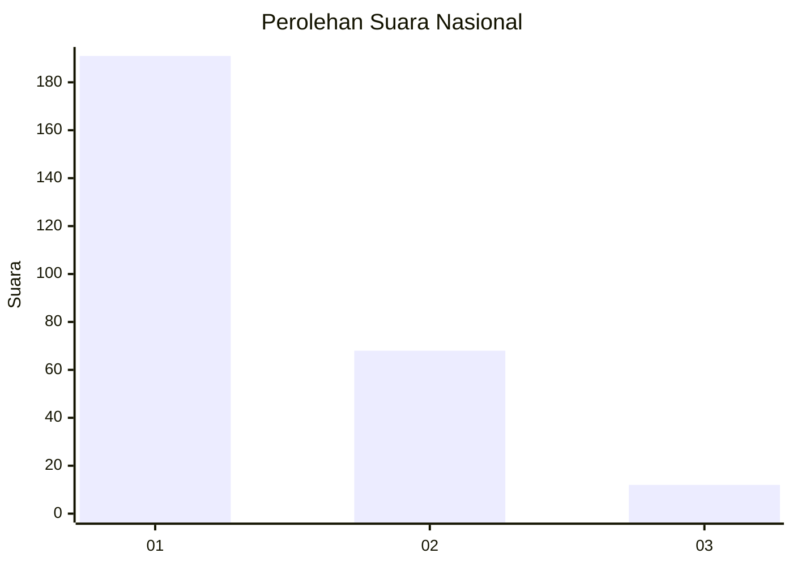
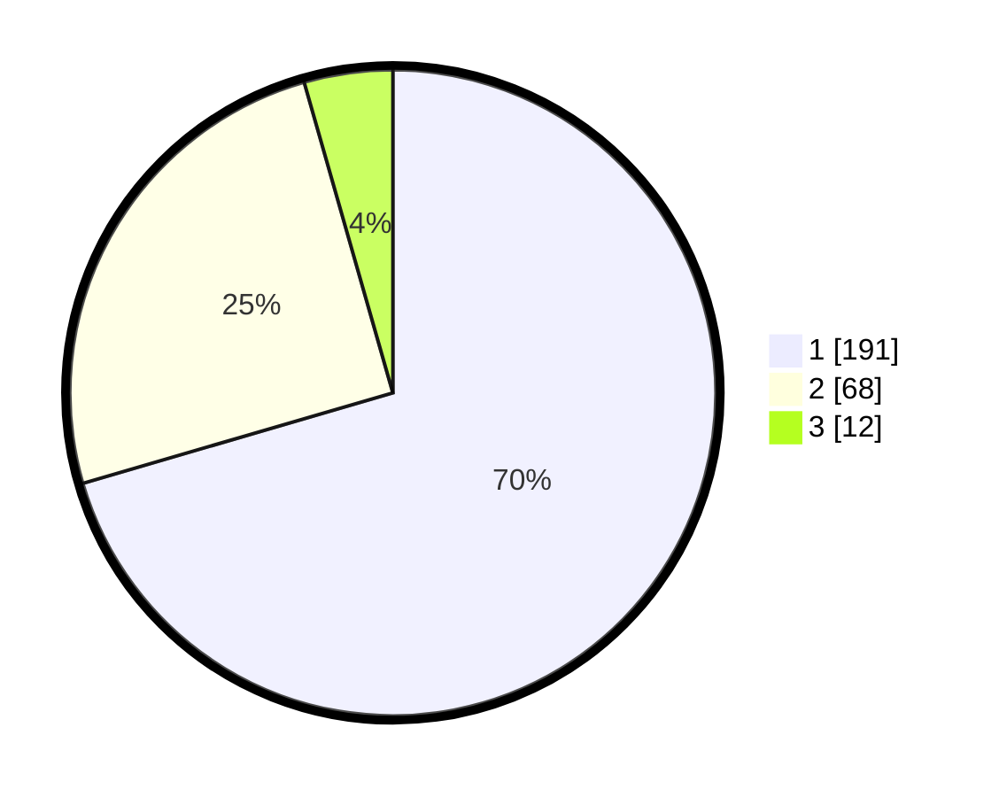

# Hasil

## Grafik

## Tabel

| No.    | Nama Paslon    | Suara | Suara (raw) | Persentase |
|:------ |:-------------- | -----:| -----------:| ----------:|
| 100025 | ANIES MUHAIMIN | 191   | [191][p-1]  | 70,48      |
| 100026 | PRABOWO GIBRAN | 68    | [68][p-2]   | 25,09      |
| 100027 | GANJAR MAHFUD  | 12    | [12][p-3]   | 4,43       |

[p-1]: https://github.com/gigit-pemilu/pemilu-2024/blob/main/pilpres/hitung-suara/sub/31-dki-jakarta/sub/74-jakarta-selatan/sub/08-pancoran/sub/1002-kalibata/sub/134-tps/sub/paslon-1.txt
[p-2]: https://github.com/gigit-pemilu/pemilu-2024/blob/main/pilpres/hitung-suara/sub/31-dki-jakarta/sub/74-jakarta-selatan/sub/08-pancoran/sub/1002-kalibata/sub/134-tps/sub/paslon-2.txt
[p-3]: https://github.com/gigit-pemilu/pemilu-2024/blob/main/pilpres/hitung-suara/sub/31-dki-jakarta/sub/74-jakarta-selatan/sub/08-pancoran/sub/1002-kalibata/sub/134-tps/sub/paslon-3.txt

## Foto C Plano

https://sirekap-obj-formc.kpu.go.id/c7b2/pemilu/ppwp/31/74/08/10/02/3174081002134-20240214-213833--cebbd68c-7cde-46fd-a965-ffebae3aa974.jpg

https://sirekap-obj-formc.kpu.go.id/c7b2/pemilu/ppwp/31/74/08/10/02/3174081002134-20240214-214315--b54dfeb1-5029-4dd9-a7c7-1b5b5b5f1d0d.jpg

https://sirekap-obj-formc.kpu.go.id/c7b2/pemilu/ppwp/31/74/08/10/02/3174081002134-20240214-214359--c9700b3d-4eb9-49ef-bbc3-dc9fdbf83c4b.jpg

## Metadata

| Key        | Value               |
| ---------- | ------------------- |
| Time Stamp | 2024-02-24 22:31:28 |

