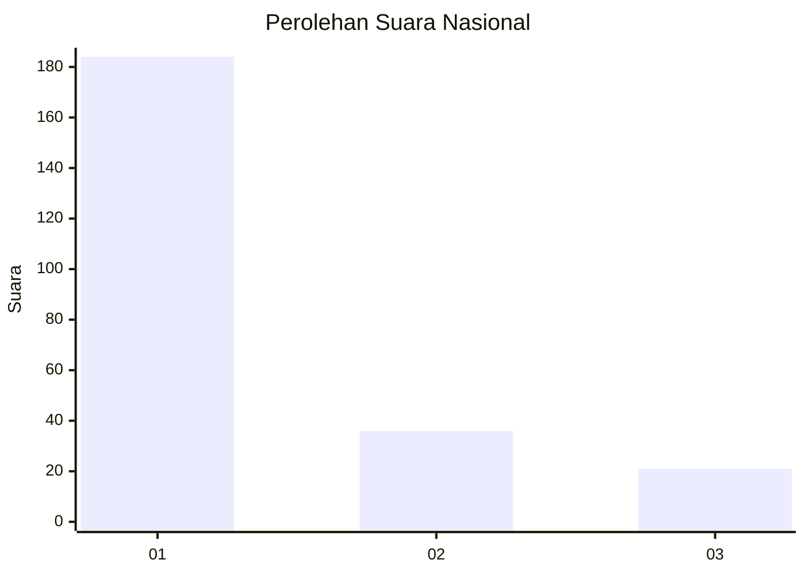
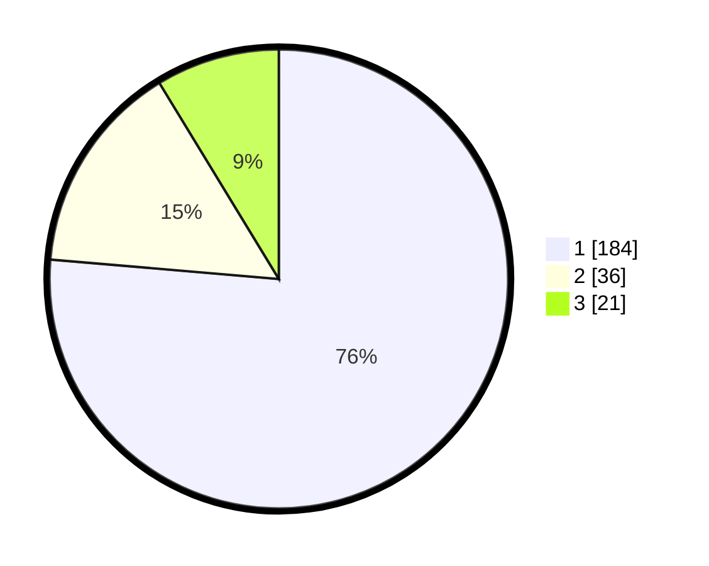

# Hasil

## Grafik

## Tabel

| No. | Nama Paslon    | Suara | Suara (raw) | Persentase |
|:--- |:-------------- | -----:| -----------:| ----------:|
| 1   | ANIES MUHAIMIN | 184   | [184][p-1]  | 76,35      |
| 2   | PRABOWO GIBRAN | 36    | [36][p-2]   | 14,94      |
| 3   | GANJAR MAHFUD  | 21    | [21][p-3]   | 8,71       |

[p-1]: https://github.com/gigit-pemilu/pemilu-2024/blob/main/pilpres/hitung-suara/sub/31-dki-jakarta/sub/74-jakarta-selatan/sub/08-pancoran/sub/1002-kalibata/sub/135-tps/sub/paslon-1.txt
[p-2]: https://github.com/gigit-pemilu/pemilu-2024/blob/main/pilpres/hitung-suara/sub/31-dki-jakarta/sub/74-jakarta-selatan/sub/08-pancoran/sub/1002-kalibata/sub/135-tps/sub/paslon-2.txt
[p-3]: https://github.com/gigit-pemilu/pemilu-2024/blob/main/pilpres/hitung-suara/sub/31-dki-jakarta/sub/74-jakarta-selatan/sub/08-pancoran/sub/1002-kalibata/sub/135-tps/sub/paslon-3.txt

## Foto C Plano

https://sirekap-obj-formc.kpu.go.id/f6b8/pemilu/ppwp/31/74/08/10/02/3174081002135-20240215-143151--515c7da4-a84d-4efc-a42b-ab1670603a37.jpg

https://sirekap-obj-formc.kpu.go.id/f6b8/pemilu/ppwp/31/74/08/10/02/3174081002135-20240215-143211--96d9bffd-443c-4eb4-9f2b-eb2f1dc6caa7.jpg

https://sirekap-obj-formc.kpu.go.id/f6b8/pemilu/ppwp/31/74/08/10/02/3174081002135-20240215-143231--c44398bd-78a6-42ae-b578-34be44fb9603.jpg

## Metadata

| Key        | Value               |
| ---------- | ------------------- |
| Time Stamp | 2024-02-24 22:31:28 |

