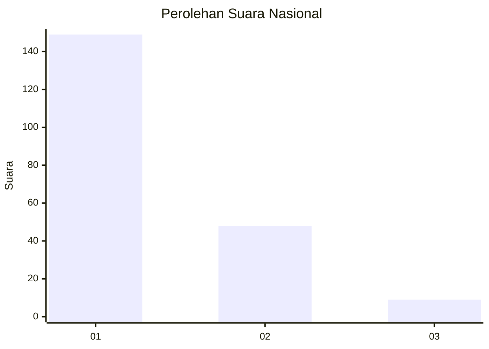
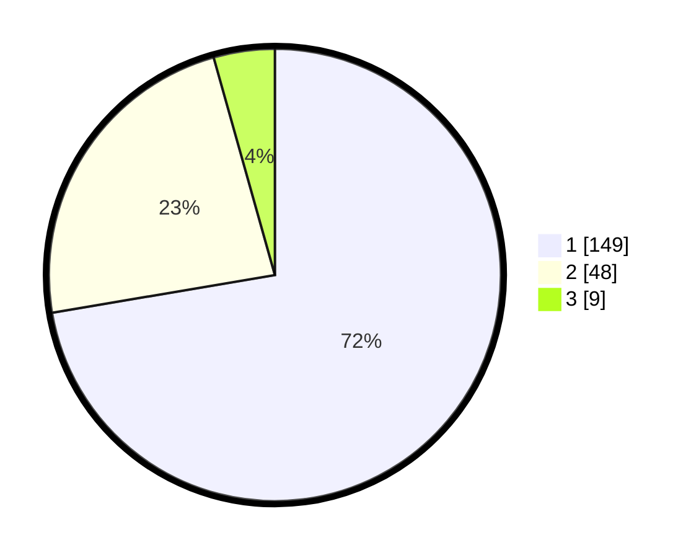

# Hasil

## Grafik

## Tabel

| No.    | Nama Paslon    | Suara | Suara (raw) | Persentase |
|:------ |:-------------- | -----:| -----------:| ----------:|
| 100025 | ANIES MUHAIMIN | 149   | [149][p-1]  | 72,33      |
| 100026 | PRABOWO GIBRAN | 48    | [48][p-2]   | 23,30      |
| 100027 | GANJAR MAHFUD  | 9     | [9][p-3]    | 4,37       |

[p-1]: https://github.com/gigit-pemilu/pemilu-2024/blob/main/pilpres/hitung-suara/sub/31-dki-jakarta/sub/74-jakarta-selatan/sub/08-pancoran/sub/1002-kalibata/sub/136-tps/sub/paslon-1.txt
[p-2]: https://github.com/gigit-pemilu/pemilu-2024/blob/main/pilpres/hitung-suara/sub/31-dki-jakarta/sub/74-jakarta-selatan/sub/08-pancoran/sub/1002-kalibata/sub/136-tps/sub/paslon-2.txt
[p-3]: https://github.com/gigit-pemilu/pemilu-2024/blob/main/pilpres/hitung-suara/sub/31-dki-jakarta/sub/74-jakarta-selatan/sub/08-pancoran/sub/1002-kalibata/sub/136-tps/sub/paslon-3.txt

## Foto C Plano

https://sirekap-obj-formc.kpu.go.id/9062/pemilu/ppwp/31/74/08/10/02/3174081002136-20240214-223658--642374bb-c3c2-46bf-a14a-ee4a03e2ef9d.jpg

https://sirekap-obj-formc.kpu.go.id/9062/pemilu/ppwp/31/74/08/10/02/3174081002136-20240214-223753--21fee6ee-3ed4-491c-97cb-94e23763f254.jpg

https://sirekap-obj-formc.kpu.go.id/9062/pemilu/ppwp/31/74/08/10/02/3174081002136-20240214-223853--4473b1b9-62d3-447c-b6d8-e4410da32071.jpg

## Metadata

| Key        | Value               |
| ---------- | ------------------- |
| Time Stamp | 2024-02-24 22:31:28 |

