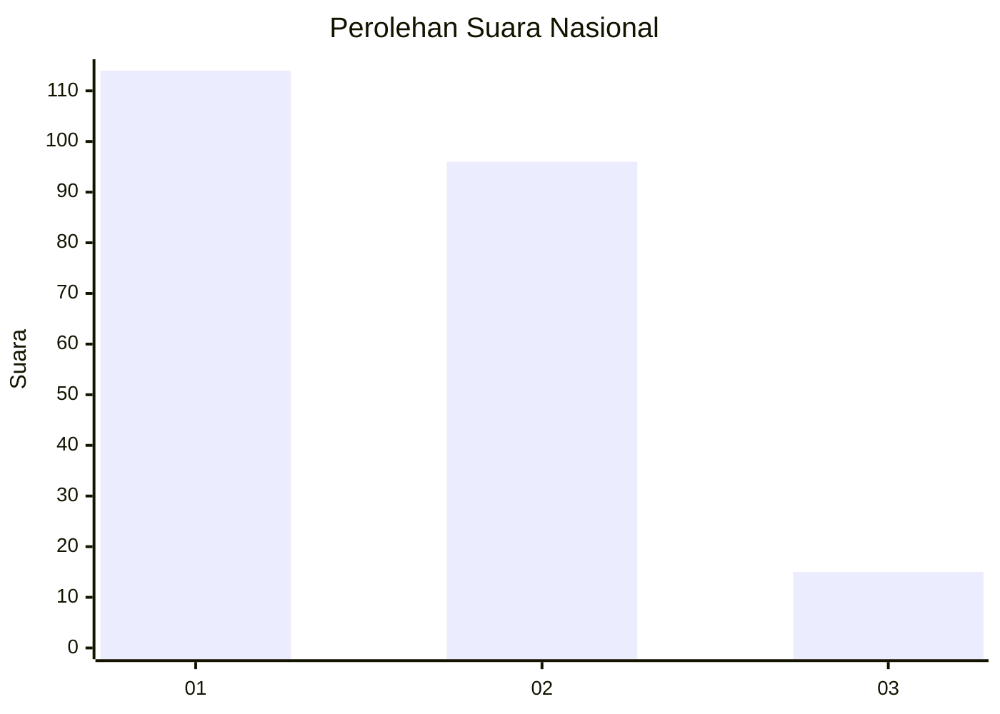
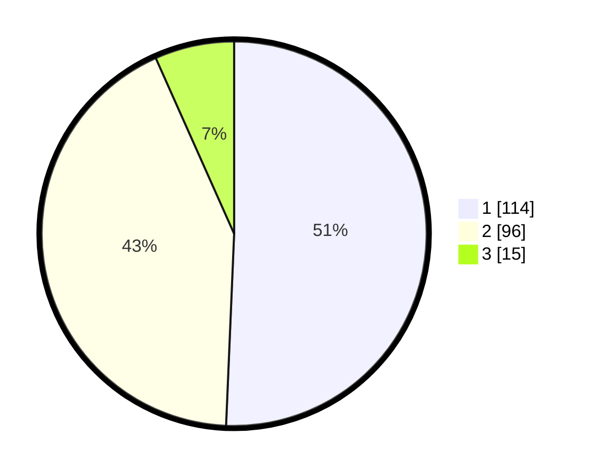

# Hasil

## Grafik

## Tabel

| No.    | Nama Paslon    | Suara | Suara (raw) | Persentase |
|:------ |:-------------- | -----:| -----------:| ----------:|
| 100025 | ANIES MUHAIMIN | 114   | [114][p-1]  | 50,67      |
| 100026 | PRABOWO GIBRAN | 96    | [96][p-2]   | 42,67      |
| 100027 | GANJAR MAHFUD  | 15    | [15][p-3]   | 6,67       |

[p-1]: https://github.com/gigit-pemilu/pemilu-2024/blob/main/pilpres/hitung-suara/sub/31-dki-jakarta/sub/74-jakarta-selatan/sub/08-pancoran/sub/1003-rawajati/sub/017-tps/sub/paslon-1.txt
[p-2]: https://github.com/gigit-pemilu/pemilu-2024/blob/main/pilpres/hitung-suara/sub/31-dki-jakarta/sub/74-jakarta-selatan/sub/08-pancoran/sub/1003-rawajati/sub/017-tps/sub/paslon-2.txt
[p-3]: https://github.com/gigit-pemilu/pemilu-2024/blob/main/pilpres/hitung-suara/sub/31-dki-jakarta/sub/74-jakarta-selatan/sub/08-pancoran/sub/1003-rawajati/sub/017-tps/sub/paslon-3.txt

## Foto C Plano

https://sirekap-obj-formc.kpu.go.id/6ea6/pemilu/ppwp/31/74/08/10/03/3174081003017-20240215-021232--a210fe51-39a3-4e49-b3fc-1c6369192243.jpg

https://sirekap-obj-formc.kpu.go.id/6ea6/pemilu/ppwp/31/74/08/10/03/3174081003017-20240215-021158--0848ae10-86fe-492e-a212-5cc03e861aa8.jpg

https://sirekap-obj-formc.kpu.go.id/6ea6/pemilu/ppwp/31/74/08/10/03/3174081003017-20240215-021029--246eeeaa-b1e5-42ad-84e2-32381e02ceec.jpg

## Metadata

| Key        | Value               |
| ---------- | ------------------- |
| Time Stamp | 2024-02-24 22:31:28 |

