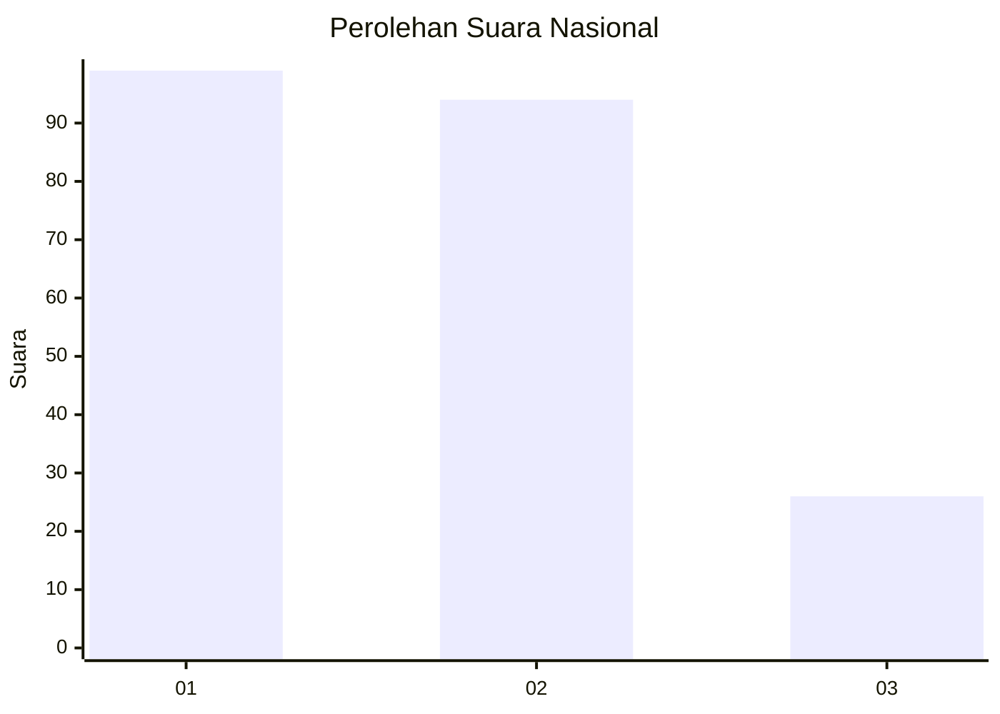
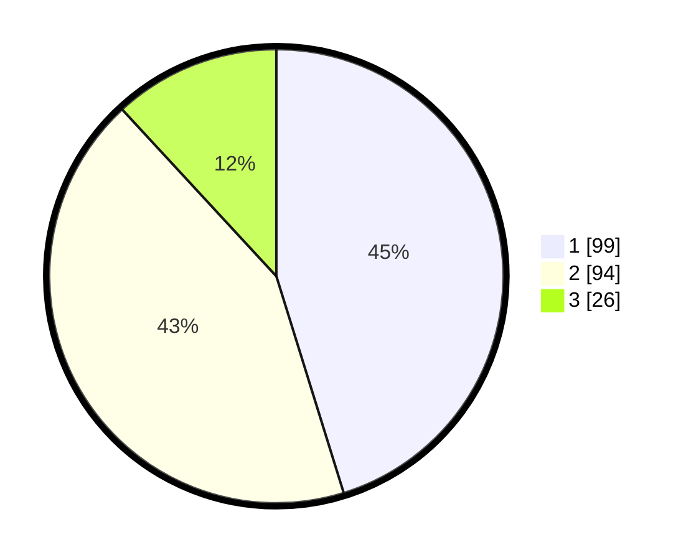

# Hasil

## Grafik

## Tabel

| No.    | Nama Paslon    | Suara | Suara (raw) | Persentase |
|:------ |:-------------- | -----:| -----------:| ----------:|
| 100025 | ANIES MUHAIMIN | 99    | [99][p-1]   | 45,21      |
| 100026 | PRABOWO GIBRAN | 94    | [94][p-2]   | 42,92      |
| 100027 | GANJAR MAHFUD  | 26    | [26][p-3]   | 11,87      |

[p-1]: https://github.com/gigit-pemilu/pemilu-2024/blob/main/pilpres/hitung-suara/sub/31-dki-jakarta/sub/74-jakarta-selatan/sub/08-pancoran/sub/1003-rawajati/sub/018-tps/sub/paslon-1.txt
[p-2]: https://github.com/gigit-pemilu/pemilu-2024/blob/main/pilpres/hitung-suara/sub/31-dki-jakarta/sub/74-jakarta-selatan/sub/08-pancoran/sub/1003-rawajati/sub/018-tps/sub/paslon-2.txt
[p-3]: https://github.com/gigit-pemilu/pemilu-2024/blob/main/pilpres/hitung-suara/sub/31-dki-jakarta/sub/74-jakarta-selatan/sub/08-pancoran/sub/1003-rawajati/sub/018-tps/sub/paslon-3.txt

## Foto C Plano

https://sirekap-obj-formc.kpu.go.id/3416/pemilu/ppwp/31/74/08/10/03/3174081003018-20240214-230808--cf4bc56f-3045-4fca-b49a-1ea96567e023.jpg

https://sirekap-obj-formc.kpu.go.id/3416/pemilu/ppwp/31/74/08/10/03/3174081003018-20240214-230832--20ce79d9-d625-41b5-8feb-52d75850d4e0.jpg

https://sirekap-obj-formc.kpu.go.id/3416/pemilu/ppwp/31/74/08/10/03/3174081003018-20240214-230921--b2d91966-6be9-4137-8e2e-65d534bafe98.jpg

## Metadata

| Key        | Value               |
| ---------- | ------------------- |
| Time Stamp | 2024-02-24 22:31:28 |

