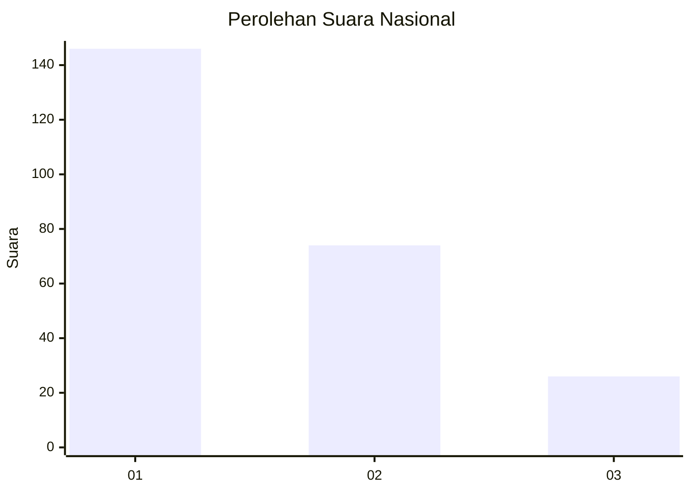
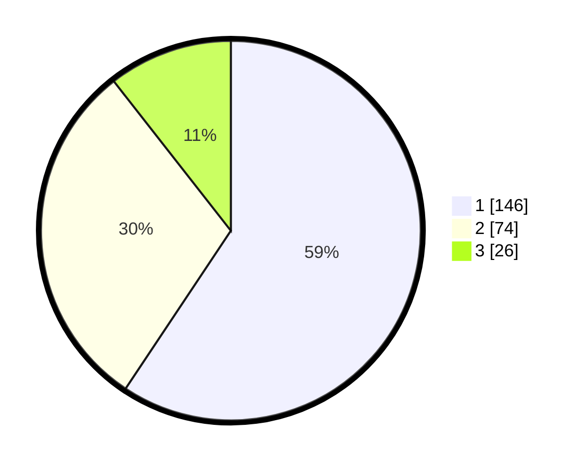

# Hasil

## Grafik

## Tabel

| No.    | Nama Paslon    | Suara | Suara (raw) | Persentase |
|:------ |:-------------- | -----:| -----------:| ----------:|
| 100025 | ANIES MUHAIMIN | 146   | [146][p-1]  | 59,35      |
| 100026 | PRABOWO GIBRAN | 74    | [74][p-2]   | 30,08      |
| 100027 | GANJAR MAHFUD  | 26    | [26][p-3]   | 10,57      |

[p-1]: https://github.com/gigit-pemilu/pemilu-2024/blob/main/pilpres/hitung-suara/sub/31-dki-jakarta/sub/74-jakarta-selatan/sub/08-pancoran/sub/1003-rawajati/sub/021-tps/sub/paslon-1.txt
[p-2]: https://github.com/gigit-pemilu/pemilu-2024/blob/main/pilpres/hitung-suara/sub/31-dki-jakarta/sub/74-jakarta-selatan/sub/08-pancoran/sub/1003-rawajati/sub/021-tps/sub/paslon-2.txt
[p-3]: https://github.com/gigit-pemilu/pemilu-2024/blob/main/pilpres/hitung-suara/sub/31-dki-jakarta/sub/74-jakarta-selatan/sub/08-pancoran/sub/1003-rawajati/sub/021-tps/sub/paslon-3.txt

## Foto C Plano

https://sirekap-obj-formc.kpu.go.id/8035/pemilu/ppwp/31/74/08/10/03/3174081003021-20240214-204135--1242b245-6cda-44d4-889f-41655d3d10b4.jpg

https://sirekap-obj-formc.kpu.go.id/8035/pemilu/ppwp/31/74/08/10/03/3174081003021-20240214-204248--b29f3b55-67d5-4637-90b3-39adf7ea4bc7.jpg

https://sirekap-obj-formc.kpu.go.id/8035/pemilu/ppwp/31/74/08/10/03/3174081003021-20240214-204519--6c2c1544-3618-44fe-a853-e7a422ddca10.jpg

## Metadata

| Key        | Value               |
| ---------- | ------------------- |
| Time Stamp | 2024-02-24 22:31:28 |

