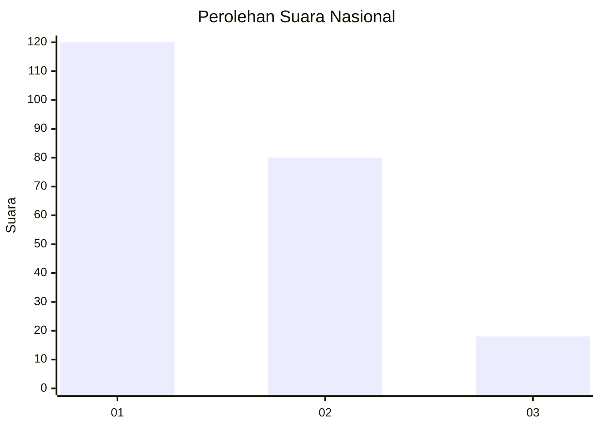
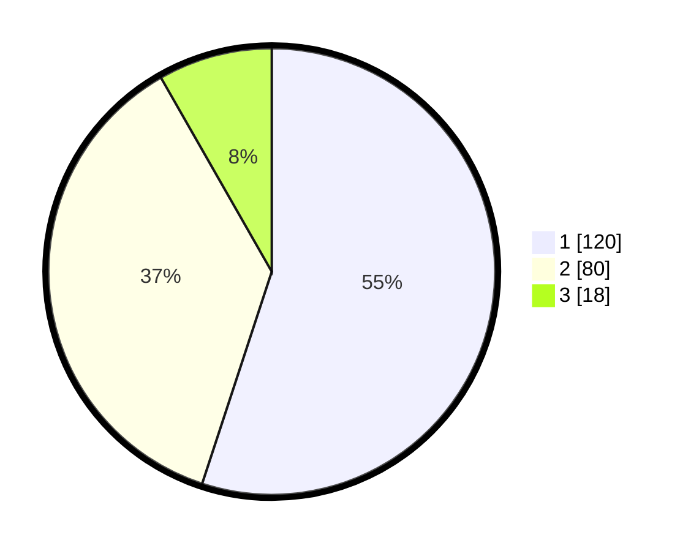

# Hasil

## Grafik

## Tabel

| No.    | Nama Paslon    | Suara | Suara (raw) | Persentase |
|:------ |:-------------- | -----:| -----------:| ----------:|
| 100025 | ANIES MUHAIMIN | 120   | [120][p-1]  | 55,05      |
| 100026 | PRABOWO GIBRAN | 80    | [80][p-2]   | 36,70      |
| 100027 | GANJAR MAHFUD  | 18    | [18][p-3]   | 8,26       |

[p-1]: https://github.com/gigit-pemilu/pemilu-2024/blob/main/pilpres/hitung-suara/sub/31-dki-jakarta/sub/74-jakarta-selatan/sub/08-pancoran/sub/1003-rawajati/sub/039-tps/sub/paslon-1.txt
[p-2]: https://github.com/gigit-pemilu/pemilu-2024/blob/main/pilpres/hitung-suara/sub/31-dki-jakarta/sub/74-jakarta-selatan/sub/08-pancoran/sub/1003-rawajati/sub/039-tps/sub/paslon-2.txt
[p-3]: https://github.com/gigit-pemilu/pemilu-2024/blob/main/pilpres/hitung-suara/sub/31-dki-jakarta/sub/74-jakarta-selatan/sub/08-pancoran/sub/1003-rawajati/sub/039-tps/sub/paslon-3.txt

## Foto C Plano

https://sirekap-obj-formc.kpu.go.id/2aef/pemilu/ppwp/31/74/08/10/03/3174081003039-20240214-221932--8d294876-cbe6-4abe-9806-be7e19ee8f30.jpg

https://sirekap-obj-formc.kpu.go.id/2aef/pemilu/ppwp/31/74/08/10/03/3174081003039-20240214-221958--527494f6-1ec2-49f9-a8e7-f771ac6cbc64.jpg

https://sirekap-obj-formc.kpu.go.id/2aef/pemilu/ppwp/31/74/08/10/03/3174081003039-20240214-222029--2de162d0-e792-43f8-a797-151f60c95247.jpg

## Metadata

| Key        | Value               |
| ---------- | ------------------- |
| Time Stamp | 2024-02-24 22:31:28 |

