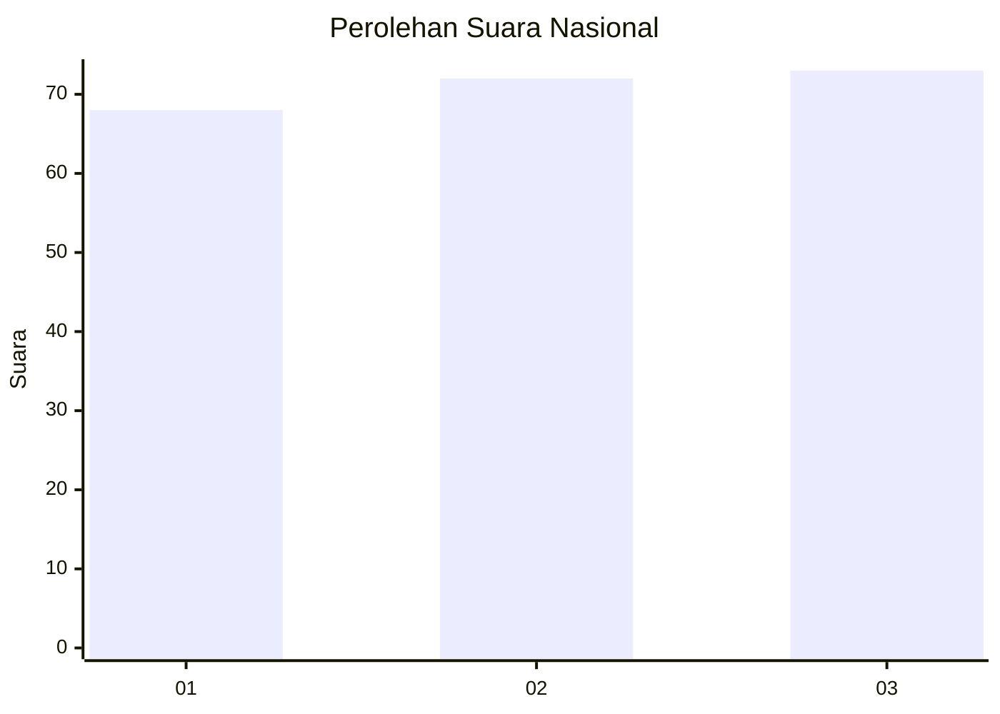
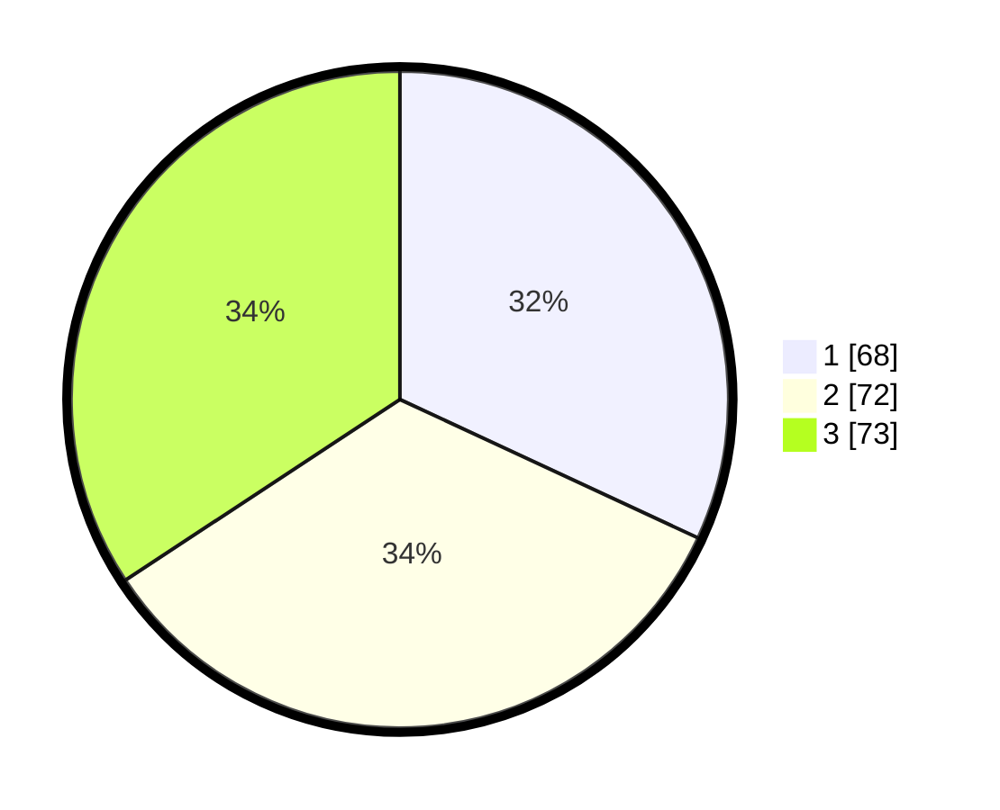

# Hasil

## Grafik

## Tabel

| No.    | Nama Paslon    | Suara | Suara (raw) | Persentase |
|:------ |:-------------- | -----:| -----------:| ----------:|
| 100025 | ANIES MUHAIMIN | 68    | [68][p-1]   | 31,92      |
| 100026 | PRABOWO GIBRAN | 72    | [72][p-2]   | 33,80      |
| 100027 | GANJAR MAHFUD  | 73    | [73][p-3]   | 34,27      |

[p-1]: https://github.com/gigit-pemilu/pemilu-2024/blob/main/pilpres/hitung-suara/sub/31-dki-jakarta/sub/74-jakarta-selatan/sub/08-pancoran/sub/1003-rawajati/sub/050-tps/sub/paslon-1.txt
[p-2]: https://github.com/gigit-pemilu/pemilu-2024/blob/main/pilpres/hitung-suara/sub/31-dki-jakarta/sub/74-jakarta-selatan/sub/08-pancoran/sub/1003-rawajati/sub/050-tps/sub/paslon-2.txt
[p-3]: https://github.com/gigit-pemilu/pemilu-2024/blob/main/pilpres/hitung-suara/sub/31-dki-jakarta/sub/74-jakarta-selatan/sub/08-pancoran/sub/1003-rawajati/sub/050-tps/sub/paslon-3.txt

## Foto C Plano

https://sirekap-obj-formc.kpu.go.id/394f/pemilu/ppwp/31/74/08/10/03/3174081003050-20240216-100407--d6bd887c-3efe-4f55-a785-3759c0f64eb3.jpg

https://sirekap-obj-formc.kpu.go.id/394f/pemilu/ppwp/31/74/08/10/03/3174081003050-20240216-094956--eed7a31f-3ec0-429a-ac87-bed81093b2fa.jpg

https://sirekap-obj-formc.kpu.go.id/394f/pemilu/ppwp/31/74/08/10/03/3174081003050-20240216-095150--6bb7c408-59b4-4db3-b6fc-3735b788f043.jpg

## Metadata

| Key        | Value               |
| ---------- | ------------------- |
| Time Stamp | 2024-02-24 22:31:28 |

