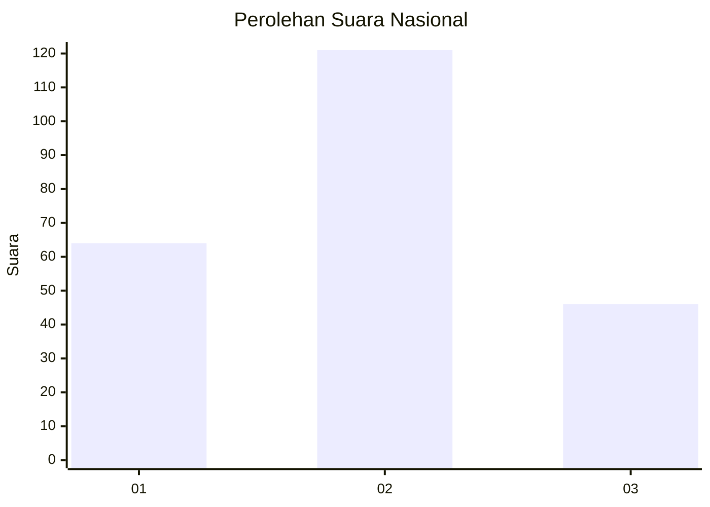
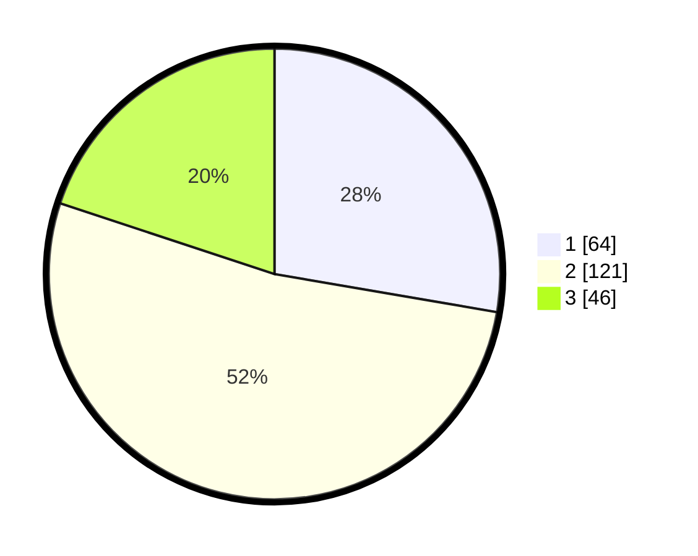

# Hasil

## Grafik

## Tabel

| No.    | Nama Paslon    | Suara | Suara (raw) | Persentase |
|:------ |:-------------- | -----:| -----------:| ----------:|
| 100025 | ANIES MUHAIMIN | 64    | [64][p-1]   | 27,71      |
| 100026 | PRABOWO GIBRAN | 121   | [121][p-2]  | 52,38      |
| 100027 | GANJAR MAHFUD  | 46    | [46][p-3]   | 19,91      |

[p-1]: https://github.com/gigit-pemilu/pemilu-2024/blob/main/pilpres/hitung-suara/sub/31-dki-jakarta/sub/74-jakarta-selatan/sub/08-pancoran/sub/1003-rawajati/sub/067-tps/sub/paslon-1.txt
[p-2]: https://github.com/gigit-pemilu/pemilu-2024/blob/main/pilpres/hitung-suara/sub/31-dki-jakarta/sub/74-jakarta-selatan/sub/08-pancoran/sub/1003-rawajati/sub/067-tps/sub/paslon-2.txt
[p-3]: https://github.com/gigit-pemilu/pemilu-2024/blob/main/pilpres/hitung-suara/sub/31-dki-jakarta/sub/74-jakarta-selatan/sub/08-pancoran/sub/1003-rawajati/sub/067-tps/sub/paslon-3.txt

## Foto C Plano

https://sirekap-obj-formc.kpu.go.id/1447/pemilu/ppwp/31/74/08/10/03/3174081003067-20240215-020805--d25fc4a0-77fe-4cc0-a728-489bfde1ee35.jpg

https://sirekap-obj-formc.kpu.go.id/1447/pemilu/ppwp/31/74/08/10/03/3174081003067-20240215-020857--8252b8f3-ca2b-4370-9308-db82eddb2e97.jpg

https://sirekap-obj-formc.kpu.go.id/1447/pemilu/ppwp/31/74/08/10/03/3174081003067-20240215-020943--04597c87-881f-4721-bca6-f04782cc710d.jpg

## Metadata

| Key        | Value               |
| ---------- | ------------------- |
| Time Stamp | 2024-02-24 22:31:28 |

