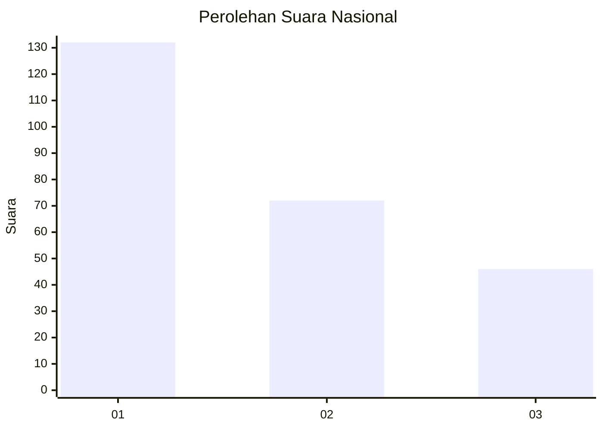
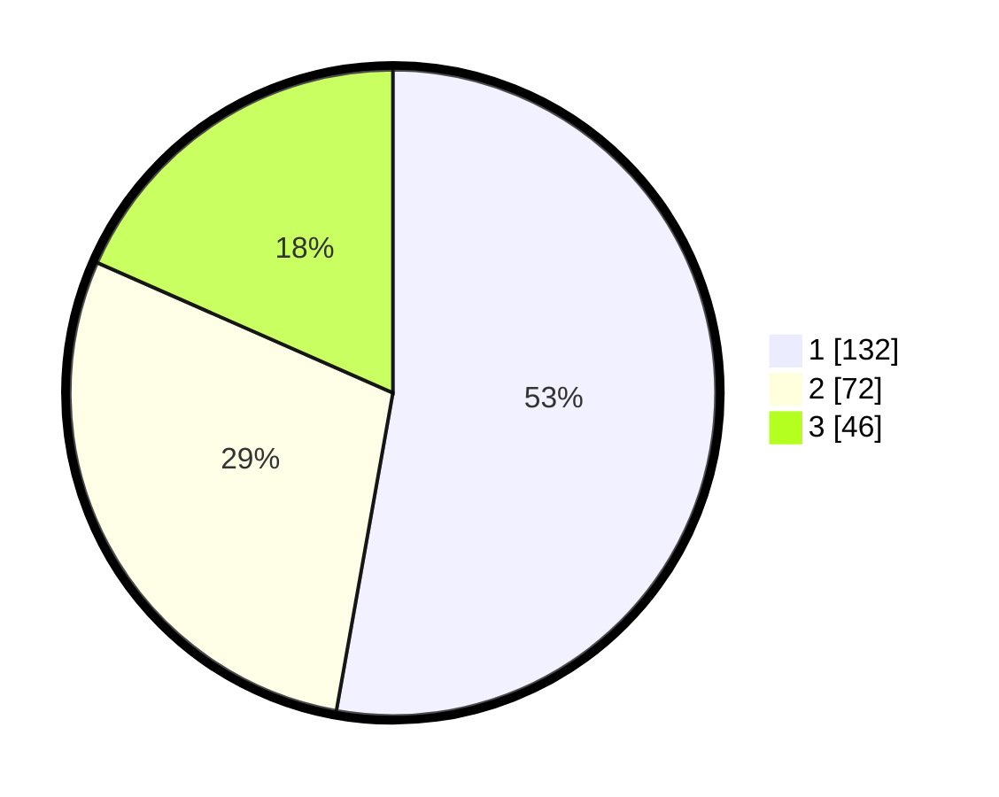

# Hasil

## Grafik

## Tabel

| No. | Nama Paslon    | Suara | Suara (raw) | Persentase |
|:--- |:-------------- | -----:| -----------:| ----------:|
| 1   | ANIES MUHAIMIN | 132   | [132][p-1]  | 52,80      |
| 2   | PRABOWO GIBRAN | 72    | [72][p-2]   | 28,80      |
| 3   | GANJAR MAHFUD  | 46    | [46][p-3]   | 18,40      |

[p-1]: https://github.com/gigit-pemilu/pemilu-2024/blob/main/pilpres/hitung-suara/sub/31-dki-jakarta/sub/74-jakarta-selatan/sub/08-pancoran/sub/1004-duren-tiga/sub/019-tps/sub/paslon-1.txt
[p-2]: https://github.com/gigit-pemilu/pemilu-2024/blob/main/pilpres/hitung-suara/sub/31-dki-jakarta/sub/74-jakarta-selatan/sub/08-pancoran/sub/1004-duren-tiga/sub/019-tps/sub/paslon-2.txt
[p-3]: https://github.com/gigit-pemilu/pemilu-2024/blob/main/pilpres/hitung-suara/sub/31-dki-jakarta/sub/74-jakarta-selatan/sub/08-pancoran/sub/1004-duren-tiga/sub/019-tps/sub/paslon-3.txt

## Foto C Plano

https://sirekap-obj-formc.kpu.go.id/9109/pemilu/ppwp/31/74/08/10/04/3174081004019-20240214-231421--4cbd4630-5eb5-4f9d-9769-c20992ea8ab3.jpg

https://sirekap-obj-formc.kpu.go.id/9109/pemilu/ppwp/31/74/08/10/04/3174081004019-20240214-230413--ba7f266e-023a-44b9-ab0e-709d648064a5.jpg

https://sirekap-obj-formc.kpu.go.id/9109/pemilu/ppwp/31/74/08/10/04/3174081004019-20240214-231149--0c380d2d-3c18-413d-9cf1-5c64e51d3735.jpg

## Metadata

| Key        | Value               |
| ---------- | ------------------- |
| Time Stamp | 2024-02-24 22:31:28 |

