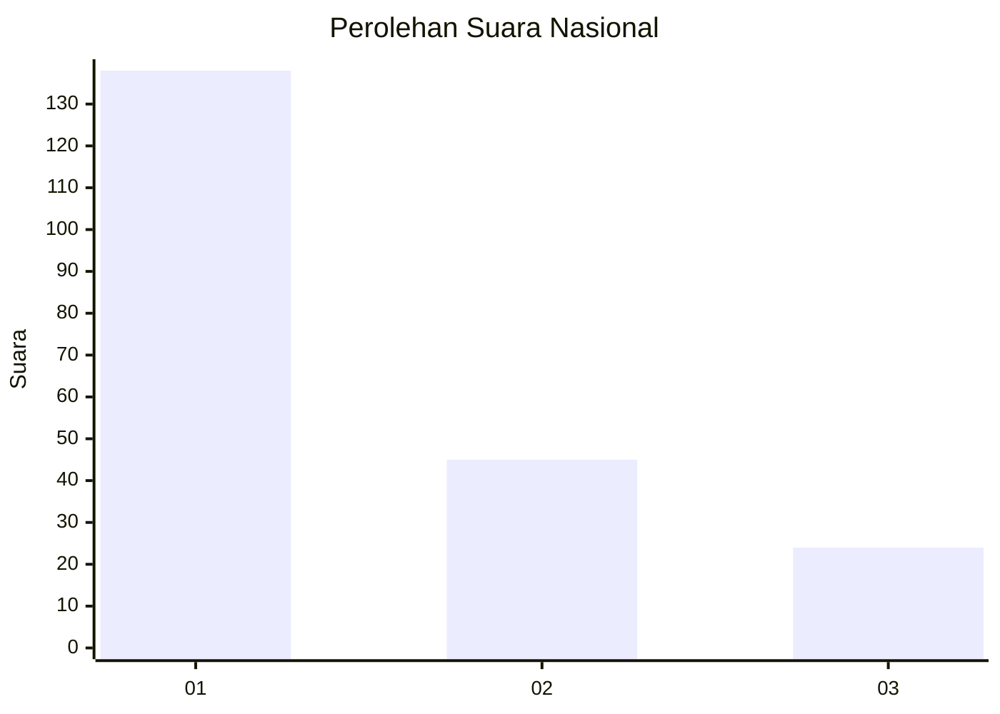
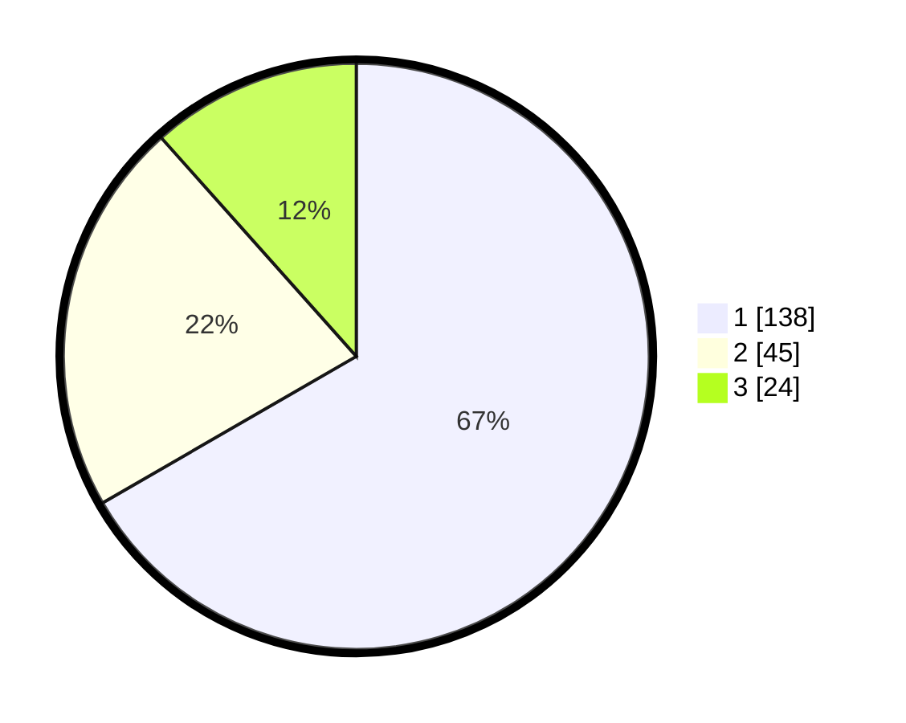

# Hasil

## Grafik

## Tabel

| No.    | Nama Paslon    | Suara | Suara (raw) | Persentase |
|:------ |:-------------- | -----:| -----------:| ----------:|
| 100025 | ANIES MUHAIMIN | 138   | [138][p-1]  | 66,67      |
| 100026 | PRABOWO GIBRAN | 45    | [45][p-2]   | 21,74      |
| 100027 | GANJAR MAHFUD  | 24    | [24][p-3]   | 11,59      |

[p-1]: https://github.com/gigit-pemilu/pemilu-2024/blob/main/pilpres/hitung-suara/sub/31-dki-jakarta/sub/74-jakarta-selatan/sub/08-pancoran/sub/1004-duren-tiga/sub/040-tps/sub/paslon-1.txt
[p-2]: https://github.com/gigit-pemilu/pemilu-2024/blob/main/pilpres/hitung-suara/sub/31-dki-jakarta/sub/74-jakarta-selatan/sub/08-pancoran/sub/1004-duren-tiga/sub/040-tps/sub/paslon-2.txt
[p-3]: https://github.com/gigit-pemilu/pemilu-2024/blob/main/pilpres/hitung-suara/sub/31-dki-jakarta/sub/74-jakarta-selatan/sub/08-pancoran/sub/1004-duren-tiga/sub/040-tps/sub/paslon-3.txt

## Foto C Plano

https://sirekap-obj-formc.kpu.go.id/0448/pemilu/ppwp/31/74/08/10/04/3174081004040-20240226-115322--8efc3f60-2454-40f4-88bd-463367122dd5.jpg

https://sirekap-obj-formc.kpu.go.id/0448/pemilu/ppwp/31/74/08/10/04/3174081004040-20240226-115346--87deb4dc-3c3c-437e-bed5-529db50ee4ed.jpg

https://sirekap-obj-formc.kpu.go.id/0448/pemilu/ppwp/31/74/08/10/04/3174081004040-20240226-115411--f6eb2073-2431-48f5-9c76-a91361b9b36c.jpg

## Metadata

| Key        | Value               |
| ---------- | ------------------- |
| Time Stamp | 2024-02-26 12:00:00 |

## DATA PEMILIH TETAP

Jumlah pemilih dalam DPT: **225**.
 * L: **222**.
 * P: **222**.

## DATA PENGGUNA HAK PILIH

Jumlah pengguna hak pilih dalam DPT: **194**.
 * L: **97**.
 * P: **707**.

Jumlah pengguna hak pilih dalam DPTb: **6**.
 * L: **5**.
 * P: **82**.

Jumlah pengguna hak pilih dalam DPK: **10**.
 * L: **7**.
 * P: **7**.

Jumlah pengguna hak pilih: **220**.
 * L: **44**.
 * P: **122**.

## JUMLAH SUARA SAH DAN TIDAK SAH

JUMLAH SELURUH SUARA SAH: **207**.

JUMLAH SUARA TIDAK SAH: **3**.

JUMLAH SELURUH SUARA SAH DAN SUARA TIDAK SAH: **210**.

