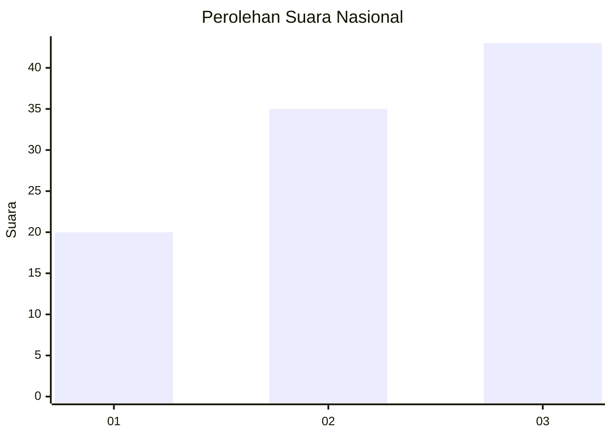
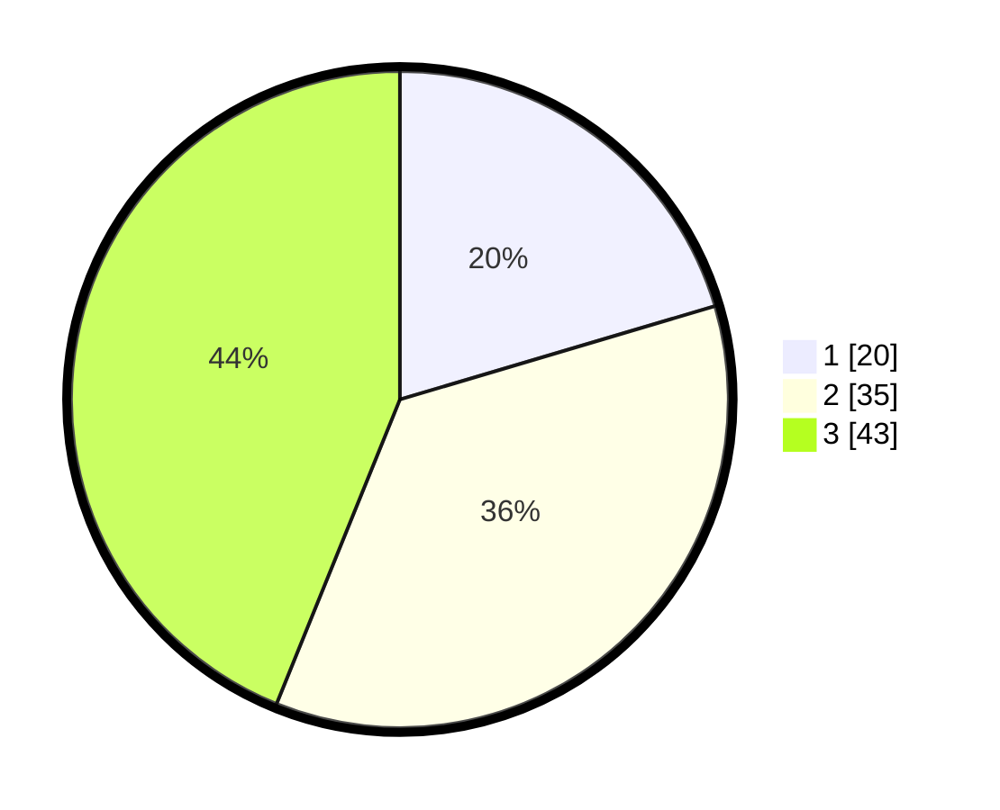

# Hasil

## Grafik

## Tabel

| No.    | Nama Paslon    | Suara | Suara (raw) | Persentase |
|:------ |:-------------- | -----:| -----------:| ----------:|
| 100025 | ANIES MUHAIMIN | 20    | [20][p-1]   | 20,41      |
| 100026 | PRABOWO GIBRAN | 35    | [35][p-2]   | 35,71      |
| 100027 | GANJAR MAHFUD  | 43    | [43][p-3]   | 43,88      |

[p-1]: https://github.com/gigit-pemilu/pemilu-2024/blob/main/pilpres/hitung-suara/sub/31-dki-jakarta/sub/74-jakarta-selatan/sub/08-pancoran/sub/1004-duren-tiga/sub/078-tps/sub/paslon-1.txt
[p-2]: https://github.com/gigit-pemilu/pemilu-2024/blob/main/pilpres/hitung-suara/sub/31-dki-jakarta/sub/74-jakarta-selatan/sub/08-pancoran/sub/1004-duren-tiga/sub/078-tps/sub/paslon-2.txt
[p-3]: https://github.com/gigit-pemilu/pemilu-2024/blob/main/pilpres/hitung-suara/sub/31-dki-jakarta/sub/74-jakarta-selatan/sub/08-pancoran/sub/1004-duren-tiga/sub/078-tps/sub/paslon-3.txt

## Foto C Plano

https://sirekap-obj-formc.kpu.go.id/f2b5/pemilu/ppwp/31/74/08/10/04/3174081004078-20240226-200759--0a692958-5988-456a-9e3e-0a90f5507cff.jpg

https://sirekap-obj-formc.kpu.go.id/f2b5/pemilu/ppwp/31/74/08/10/04/3174081004078-20240226-200948--a04a207e-6797-4b3a-81f3-5d9996ef17b7.jpg

https://sirekap-obj-formc.kpu.go.id/f2b5/pemilu/ppwp/31/74/08/10/04/3174081004078-20240226-200829--0c740217-efa2-4620-b2eb-1e47a9b9fddc.jpg

## Metadata

| Key        | Value               |
| ---------- | ------------------- |
| Time Stamp | 2024-02-26 21:00:00 |

## DATA PEMILIH TETAP

Jumlah pemilih dalam DPT: **121**.
 * L: **33**.
 * P: **39**.

## DATA PENGGUNA HAK PILIH

Jumlah pengguna hak pilih dalam DPT: **225**.
 * L: **114**.
 * P: **112**.

Jumlah pengguna hak pilih dalam DPTb: **77**.
 * L: **999**.
 * P: **337**.

Jumlah pengguna hak pilih dalam DPK: **5**.
 * L: **3**.
 * P: **502**.

Jumlah pengguna hak pilih: **243**.
 * L: **120**.
 * P: **121**.

## JUMLAH SUARA SAH DAN TIDAK SAH

JUMLAH SELURUH SUARA SAH: **197**.

JUMLAH SUARA TIDAK SAH: **1**.

JUMLAH SELURUH SUARA SAH DAN SUARA TIDAK SAH: **198**.

