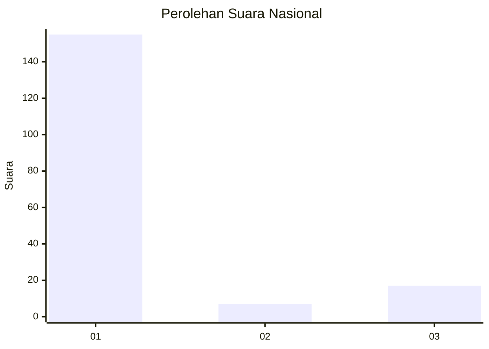
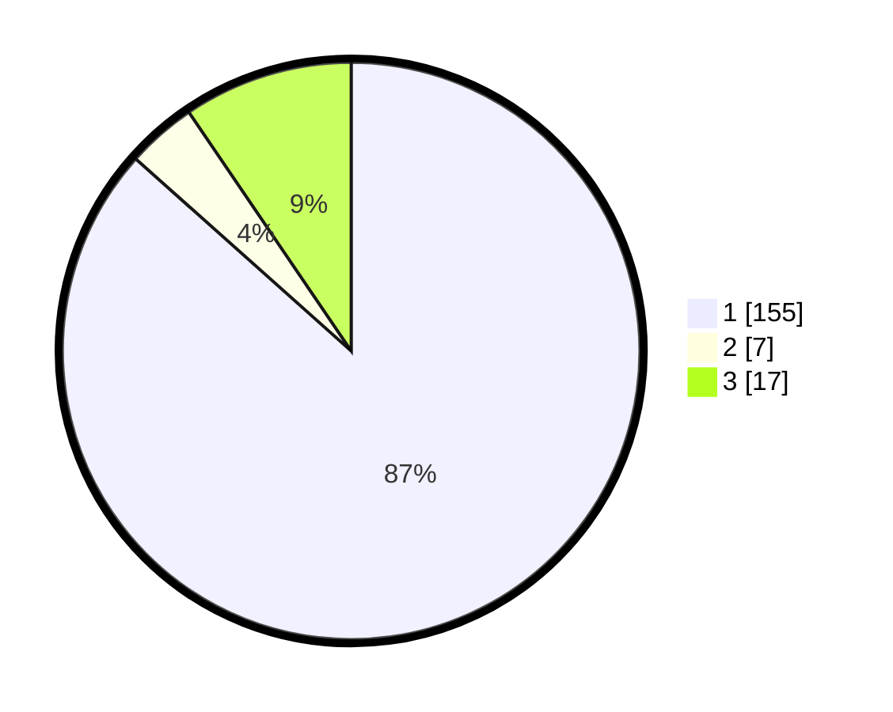

# Hasil

## Grafik

## Tabel

| No. | Nama Paslon    | Suara | Suara (raw) | Persentase |
|:--- |:-------------- | -----:| -----------:| ----------:|
| 1   | ANIES MUHAIMIN | 155   | [155][p-1]  | 86,59      |
| 2   | PRABOWO GIBRAN | 7     | [7][p-2]    | 3,91       |
| 3   | GANJAR MAHFUD  | 17    | [17][p-3]   | 9,50       |

[p-1]: https://github.com/gigit-pemilu/pemilu-2024/blob/main/pilpres/hitung-suara/sub/31-dki-jakarta/sub/74-jakarta-selatan/sub/08-pancoran/sub/1004-duren-tiga/sub/087-tps/sub/paslon-1.txt
[p-2]: https://github.com/gigit-pemilu/pemilu-2024/blob/main/pilpres/hitung-suara/sub/31-dki-jakarta/sub/74-jakarta-selatan/sub/08-pancoran/sub/1004-duren-tiga/sub/087-tps/sub/paslon-2.txt
[p-3]: https://github.com/gigit-pemilu/pemilu-2024/blob/main/pilpres/hitung-suara/sub/31-dki-jakarta/sub/74-jakarta-selatan/sub/08-pancoran/sub/1004-duren-tiga/sub/087-tps/sub/paslon-3.txt

## Foto C Plano

https://sirekap-obj-formc.kpu.go.id/65cd/pemilu/ppwp/31/74/08/10/04/3174081004087-20240225-173416--10fda407-9b87-4975-ad87-6dab4aa7947c.jpg

https://sirekap-obj-formc.kpu.go.id/65cd/pemilu/ppwp/31/74/08/10/04/3174081004087-20240225-173507--594633ef-fdbc-4df2-a6a0-c80c0caa2a66.jpg

https://sirekap-obj-formc.kpu.go.id/65cd/pemilu/ppwp/31/74/08/10/04/3174081004087-20240225-173545--08d3f30d-8b6c-47c0-8c86-a74076996ff4.jpg

## Metadata

| Key        | Value               |
| ---------- | ------------------- |
| Time Stamp | 2024-02-25 18:00:00 |

## DATA PEMILIH TETAP

Jumlah pemilih dalam DPT: **267**.
 * L: **140**.
 * P: **157**.

## DATA PENGGUNA HAK PILIH

Jumlah pengguna hak pilih dalam DPT: **210**.
 * L: **110**.
 * P: **104**.

Jumlah pengguna hak pilih dalam DPTb: **556**.
 * L: **42**.
 * P: **6**.

Jumlah pengguna hak pilih dalam DPK: **704**.
 * L: **403**.
 * P: **1**.

Jumlah pengguna hak pilih: **225**.
 * L: **515**.
 * P: **155**.

## JUMLAH SUARA SAH DAN TIDAK SAH

JUMLAH SELURUH SUARA SAH: **555**.

JUMLAH SUARA TIDAK SAH: **65**.

JUMLAH SELURUH SUARA SAH DAN SUARA TIDAK SAH: **225**.

