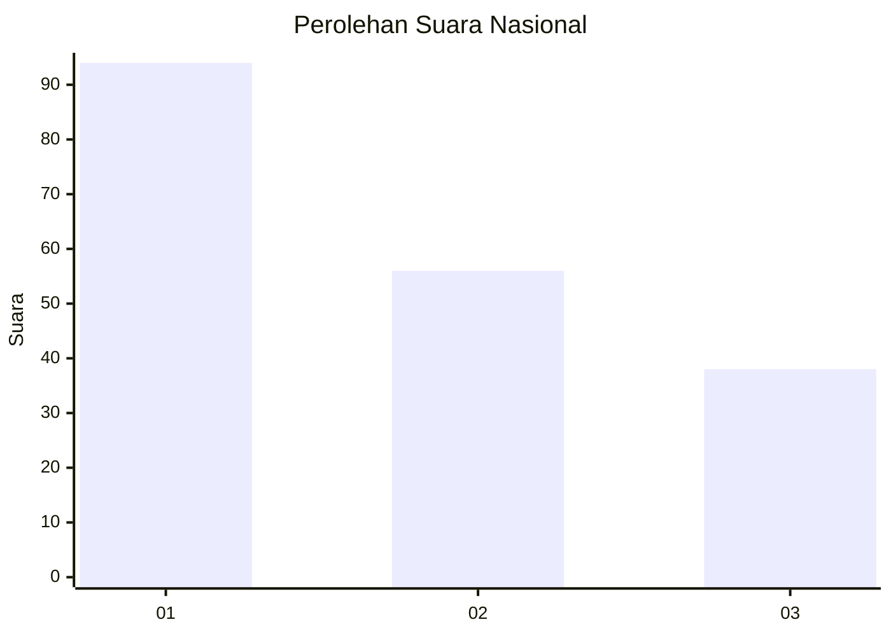
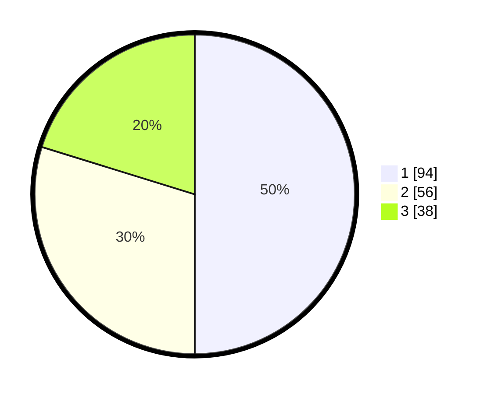

# Hasil

## Grafik

## Tabel

| No.    | Nama Paslon    | Suara | Suara (raw) | Persentase |
|:------ |:-------------- | -----:| -----------:| ----------:|
| 100025 | ANIES MUHAIMIN | 94    | [94][p-1]   | 50,00      |
| 100026 | PRABOWO GIBRAN | 56    | [56][p-2]   | 29,79      |
| 100027 | GANJAR MAHFUD  | 38    | [38][p-3]   | 20,21      |

[p-1]: https://github.com/gigit-pemilu/pemilu-2024/blob/main/pilpres/hitung-suara/sub/31-dki-jakarta/sub/74-jakarta-selatan/sub/08-pancoran/sub/1004-duren-tiga/sub/090-tps/sub/paslon-1.txt
[p-2]: https://github.com/gigit-pemilu/pemilu-2024/blob/main/pilpres/hitung-suara/sub/31-dki-jakarta/sub/74-jakarta-selatan/sub/08-pancoran/sub/1004-duren-tiga/sub/090-tps/sub/paslon-2.txt
[p-3]: https://github.com/gigit-pemilu/pemilu-2024/blob/main/pilpres/hitung-suara/sub/31-dki-jakarta/sub/74-jakarta-selatan/sub/08-pancoran/sub/1004-duren-tiga/sub/090-tps/sub/paslon-3.txt

## Foto C Plano

https://sirekap-obj-formc.kpu.go.id/4d40/pemilu/ppwp/31/74/08/10/04/3174081004090-20240214-155529--e3d0f914-898b-4423-9f7b-e8fc0033eb94.jpg

https://sirekap-obj-formc.kpu.go.id/4d40/pemilu/ppwp/31/74/08/10/04/3174081004090-20240214-160111--b7a73767-aa30-4241-bd67-981b6ed8f484.jpg

https://sirekap-obj-formc.kpu.go.id/4d40/pemilu/ppwp/31/74/08/10/04/3174081004090-20240214-160135--e84e9719-cf90-41b7-8fcd-af2b17c2ead6.jpg

## Metadata

| Key        | Value               |
| ---------- | ------------------- |
| Time Stamp | 2024-02-24 22:31:28 |

