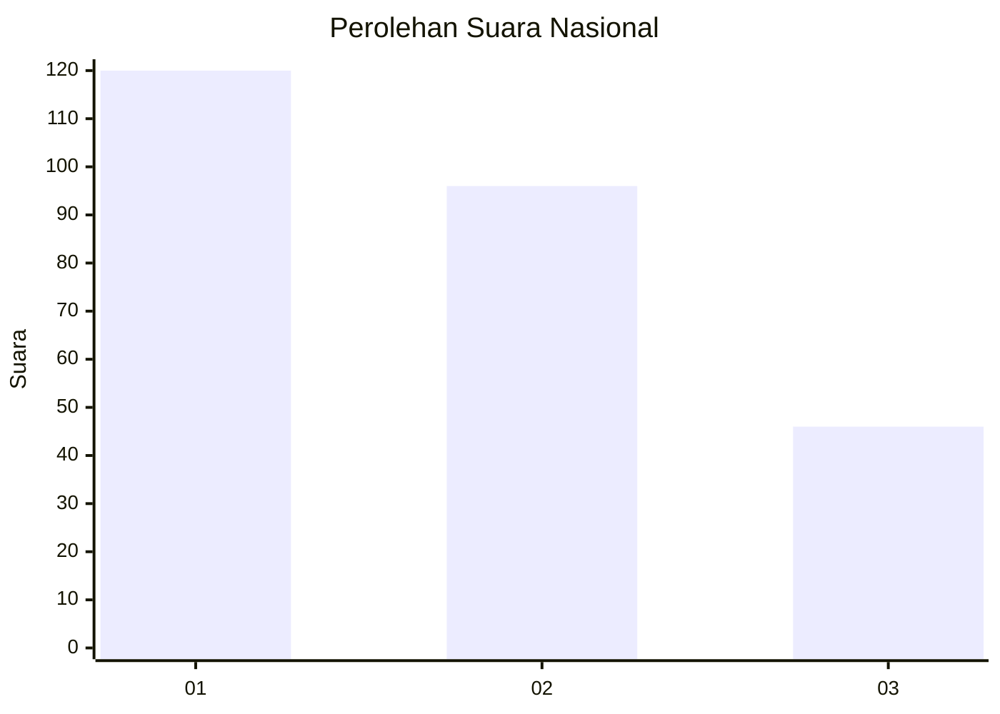
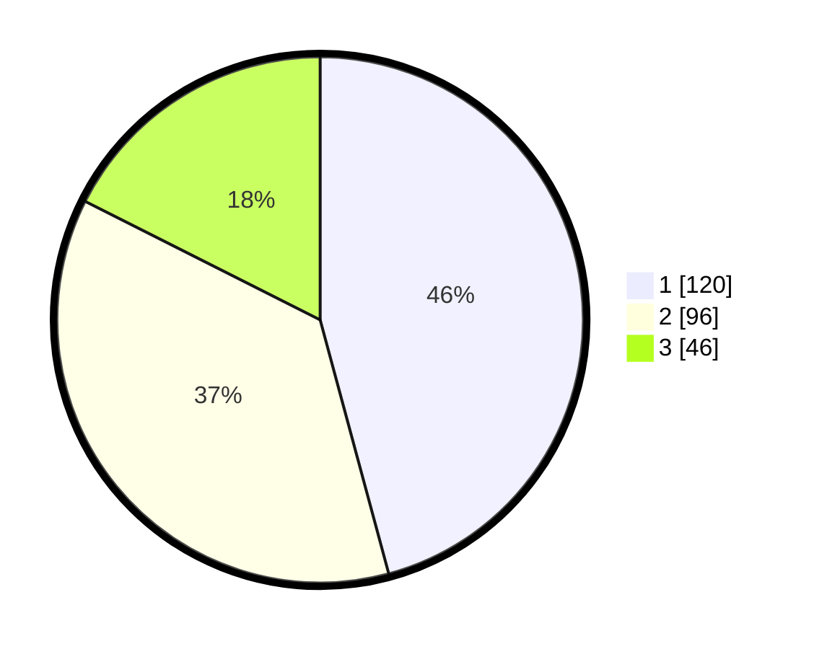

# Hasil

## Grafik

## Tabel

| No. | Nama Paslon    | Suara | Suara (raw) | Persentase |
|:--- |:-------------- | -----:| -----------:| ----------:|
| 1   | ANIES MUHAIMIN | 120   | [120][p-1]  | 45,80      |
| 2   | PRABOWO GIBRAN | 96    | [96][p-2]   | 36,64      |
| 3   | GANJAR MAHFUD  | 46    | [46][p-3]   | 17,56      |

[p-1]: https://github.com/gigit-pemilu/pemilu-2024/blob/main/pilpres/hitung-suara/sub/31-dki-jakarta/sub/74-jakarta-selatan/sub/08-pancoran/sub/1004-duren-tiga/sub/099-tps/sub/paslon-1.txt
[p-2]: https://github.com/gigit-pemilu/pemilu-2024/blob/main/pilpres/hitung-suara/sub/31-dki-jakarta/sub/74-jakarta-selatan/sub/08-pancoran/sub/1004-duren-tiga/sub/099-tps/sub/paslon-2.txt
[p-3]: https://github.com/gigit-pemilu/pemilu-2024/blob/main/pilpres/hitung-suara/sub/31-dki-jakarta/sub/74-jakarta-selatan/sub/08-pancoran/sub/1004-duren-tiga/sub/099-tps/sub/paslon-3.txt

## Foto C Plano

https://sirekap-obj-formc.kpu.go.id/8c3b/pemilu/ppwp/31/74/08/10/04/3174081004099-20240214-190608--ad13ee98-f13c-469d-acf8-37ef72cc5d6e.jpg

https://sirekap-obj-formc.kpu.go.id/8c3b/pemilu/ppwp/31/74/08/10/04/3174081004099-20240214-190613--266cd043-8fa1-4761-b9fc-659d0ba938be.jpg

https://sirekap-obj-formc.kpu.go.id/8c3b/pemilu/ppwp/31/74/08/10/04/3174081004099-20240214-190618--e2bcafde-e3d8-4261-a866-3d7622be2b9f.jpg

## Metadata

| Key        | Value               |
| ---------- | ------------------- |
| Time Stamp | 2024-02-24 22:31:28 |

