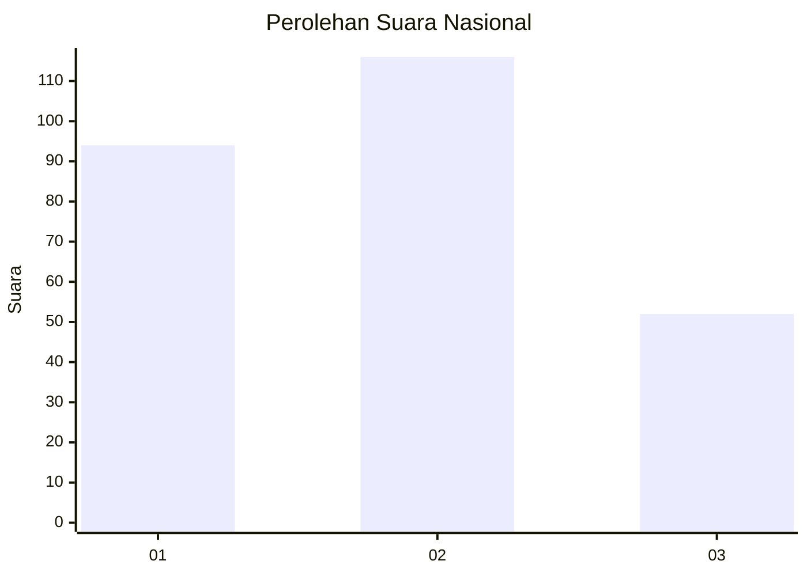
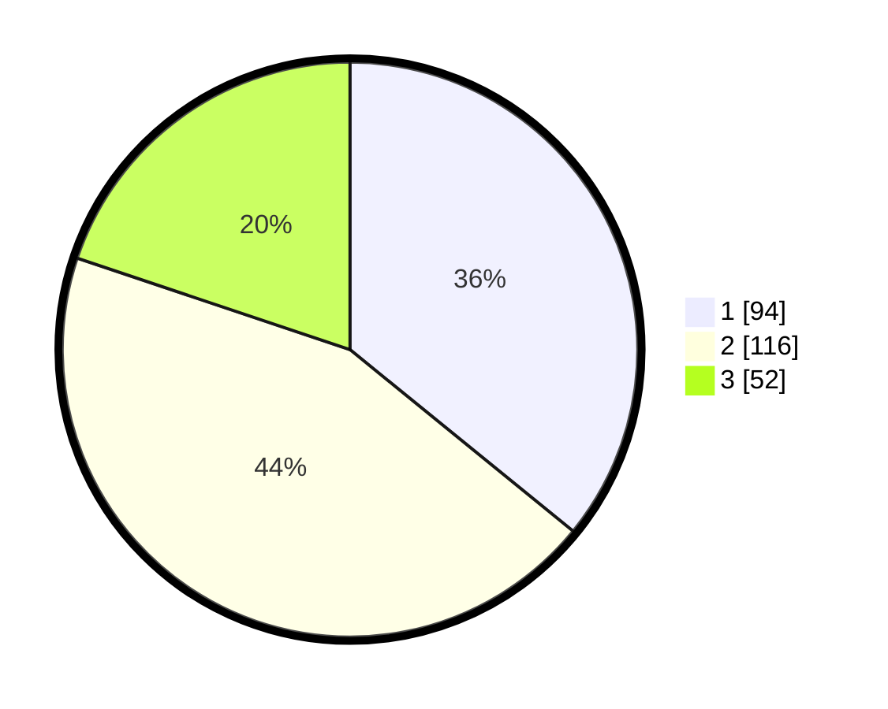

# Hasil

## Grafik

## Tabel

| No.    | Nama Paslon    | Suara | Suara (raw) | Persentase |
|:------ |:-------------- | -----:| -----------:| ----------:|
| 100025 | ANIES MUHAIMIN | 94    | [94][p-1]   | 35,88      |
| 100026 | PRABOWO GIBRAN | 116   | [116][p-2]  | 44,27      |
| 100027 | GANJAR MAHFUD  | 52    | [52][p-3]   | 19,85      |

[p-1]: https://github.com/gigit-pemilu/pemilu-2024/blob/main/pilpres/hitung-suara/sub/31-dki-jakarta/sub/74-jakarta-selatan/sub/08-pancoran/sub/1004-duren-tiga/sub/100-tps/sub/paslon-1.txt
[p-2]: https://github.com/gigit-pemilu/pemilu-2024/blob/main/pilpres/hitung-suara/sub/31-dki-jakarta/sub/74-jakarta-selatan/sub/08-pancoran/sub/1004-duren-tiga/sub/100-tps/sub/paslon-2.txt
[p-3]: https://github.com/gigit-pemilu/pemilu-2024/blob/main/pilpres/hitung-suara/sub/31-dki-jakarta/sub/74-jakarta-selatan/sub/08-pancoran/sub/1004-duren-tiga/sub/100-tps/sub/paslon-3.txt

## Foto C Plano

https://sirekap-obj-formc.kpu.go.id/fabc/pemilu/ppwp/31/74/08/10/04/3174081004100-20240225-111532--161d0c6b-ccda-488a-8c64-1485b23595cc.jpg

https://sirekap-obj-formc.kpu.go.id/fabc/pemilu/ppwp/31/74/08/10/04/3174081004100-20240225-111406--305bb1af-68aa-4ef0-af82-b157bea8d3f8.jpg

https://sirekap-obj-formc.kpu.go.id/fabc/pemilu/ppwp/31/74/08/10/04/3174081004100-20240225-111431--27eecee5-9747-4d2f-820f-abfea045b3ea.jpg

## Metadata

| Key        | Value               |
| ---------- | ------------------- |
| Time Stamp | 2024-02-25 17:00:00 |

## DATA PEMILIH TETAP

Jumlah pemilih dalam DPT: **277**.
 * L: **0**.
 * P: **2**.

## DATA PENGGUNA HAK PILIH

Jumlah pengguna hak pilih dalam DPT: **2**.
 * L: **335**.
 * P: **250**.

Jumlah pengguna hak pilih dalam DPTb: **205**.
 * L: **200**.
 * P: **2**.

Jumlah pengguna hak pilih dalam DPK: **21**.
 * L: **850**.
 * P: **0**.

Jumlah pengguna hak pilih: **27**.
 * L: **0**.
 * P: **20**.

## JUMLAH SUARA SAH DAN TIDAK SAH

JUMLAH SELURUH SUARA SAH: **262**.

JUMLAH SUARA TIDAK SAH: **5**.

JUMLAH SELURUH SUARA SAH DAN SUARA TIDAK SAH: **267**.

