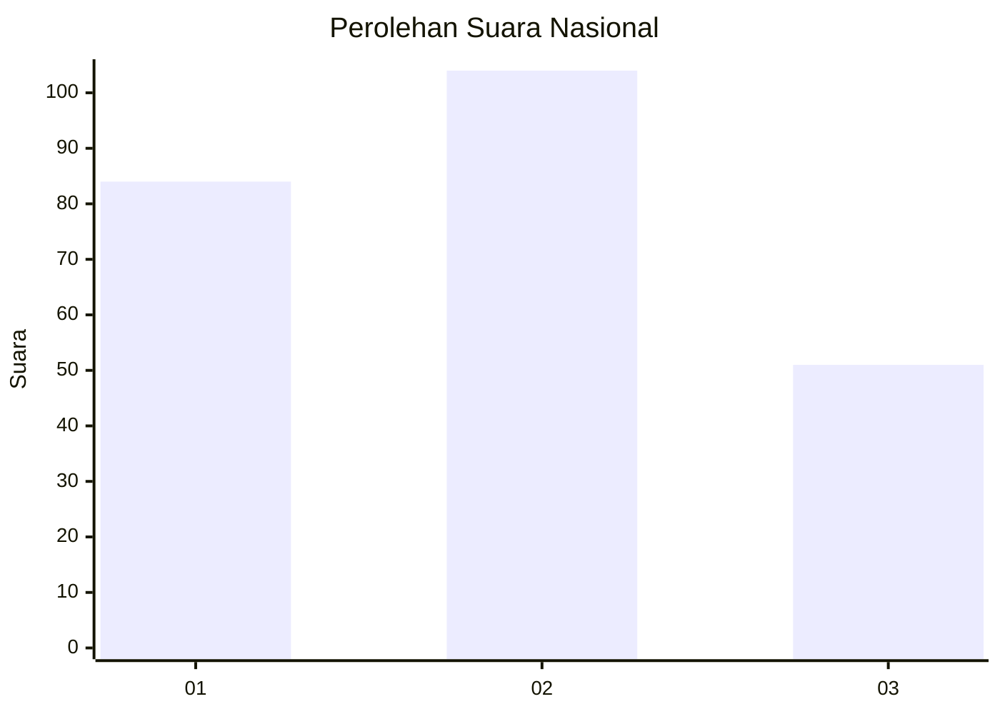
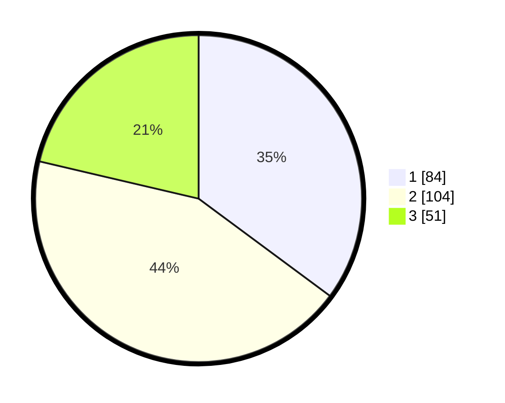

# Hasil

## Grafik

## Tabel

| No.    | Nama Paslon    | Suara | Suara (raw) | Persentase |
|:------ |:-------------- | -----:| -----------:| ----------:|
| 100025 | ANIES MUHAIMIN | 84    | [84][p-1]   | 35,15      |
| 100026 | PRABOWO GIBRAN | 104   | [104][p-2]  | 43,51      |
| 100027 | GANJAR MAHFUD  | 51    | [51][p-3]   | 21,34      |

[p-1]: https://github.com/gigit-pemilu/pemilu-2024/blob/main/pilpres/hitung-suara/sub/31-dki-jakarta/sub/74-jakarta-selatan/sub/08-pancoran/sub/1004-duren-tiga/sub/103-tps/sub/paslon-1.txt
[p-2]: https://github.com/gigit-pemilu/pemilu-2024/blob/main/pilpres/hitung-suara/sub/31-dki-jakarta/sub/74-jakarta-selatan/sub/08-pancoran/sub/1004-duren-tiga/sub/103-tps/sub/paslon-2.txt
[p-3]: https://github.com/gigit-pemilu/pemilu-2024/blob/main/pilpres/hitung-suara/sub/31-dki-jakarta/sub/74-jakarta-selatan/sub/08-pancoran/sub/1004-duren-tiga/sub/103-tps/sub/paslon-3.txt

## Foto C Plano

https://sirekap-obj-formc.kpu.go.id/5fc0/pemilu/ppwp/31/74/08/10/04/3174081004103-20240214-212354--a3161934-ea65-4be7-bd30-e7810c5a9d84.jpg

https://sirekap-obj-formc.kpu.go.id/5fc0/pemilu/ppwp/31/74/08/10/04/3174081004103-20240214-190852--863a6f5b-1cab-421c-8e27-358eb320f218.jpg

https://sirekap-obj-formc.kpu.go.id/5fc0/pemilu/ppwp/31/74/08/10/04/3174081004103-20240214-193730--6b1c7514-9fac-4994-8852-aa103b3cd157.jpg

## Metadata

| Key        | Value               |
| ---------- | ------------------- |
| Time Stamp | 2024-02-15 00:41:44 |

