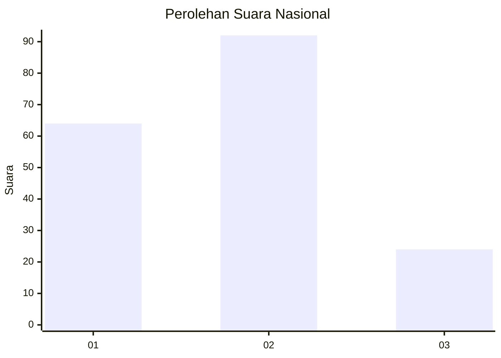
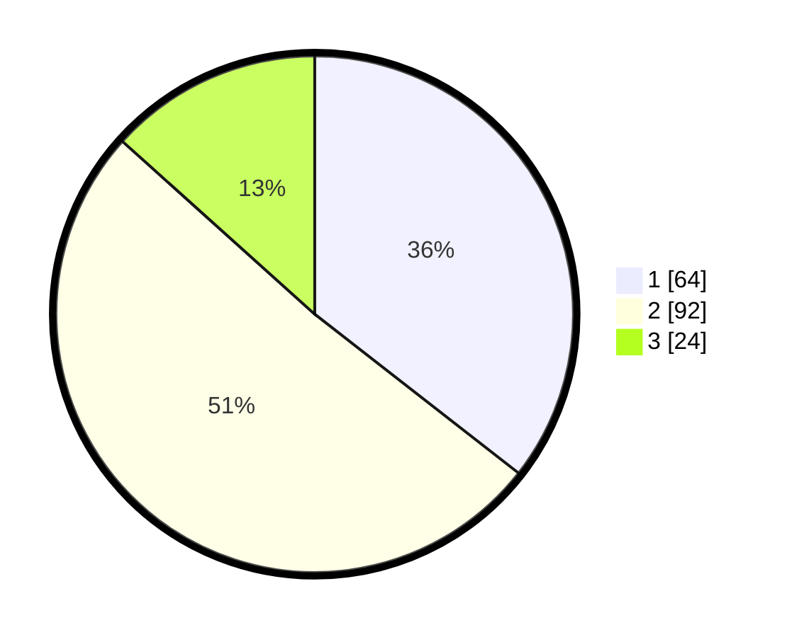

# Hasil

## Grafik

## Tabel

| No.    | Nama Paslon    | Suara | Suara (raw) | Persentase |
|:------ |:-------------- | -----:| -----------:| ----------:|
| 100025 | ANIES MUHAIMIN | 64    | [64][p-1]   | 35,56      |
| 100026 | PRABOWO GIBRAN | 92    | [92][p-2]   | 51,11      |
| 100027 | GANJAR MAHFUD  | 24    | [24][p-3]   | 13,33      |

[p-1]: https://github.com/gigit-pemilu/pemilu-2024/blob/main/pilpres/hitung-suara/sub/31-dki-jakarta/sub/74-jakarta-selatan/sub/08-pancoran/sub/1005-pengadegan/sub/036-tps/sub/paslon-1.txt
[p-2]: https://github.com/gigit-pemilu/pemilu-2024/blob/main/pilpres/hitung-suara/sub/31-dki-jakarta/sub/74-jakarta-selatan/sub/08-pancoran/sub/1005-pengadegan/sub/036-tps/sub/paslon-2.txt
[p-3]: https://github.com/gigit-pemilu/pemilu-2024/blob/main/pilpres/hitung-suara/sub/31-dki-jakarta/sub/74-jakarta-selatan/sub/08-pancoran/sub/1005-pengadegan/sub/036-tps/sub/paslon-3.txt

## Foto C Plano

https://sirekap-obj-formc.kpu.go.id/24ec/pemilu/ppwp/31/74/08/10/05/3174081005036-20240214-235409--01d1163c-1c49-459b-82ae-b41a059412ce.jpg

https://sirekap-obj-formc.kpu.go.id/24ec/pemilu/ppwp/31/74/08/10/05/3174081005036-20240214-235525--8caf4d82-5c38-4a36-9ecb-62cd633b2117.jpg

https://sirekap-obj-formc.kpu.go.id/24ec/pemilu/ppwp/31/74/08/10/05/3174081005036-20240214-235513--e78eb6f6-bffe-4ca5-81d8-e0d1c50f5558.jpg

## Metadata

| Key        | Value               |
| ---------- | ------------------- |
| Time Stamp | 2024-02-24 23:00:00 |

