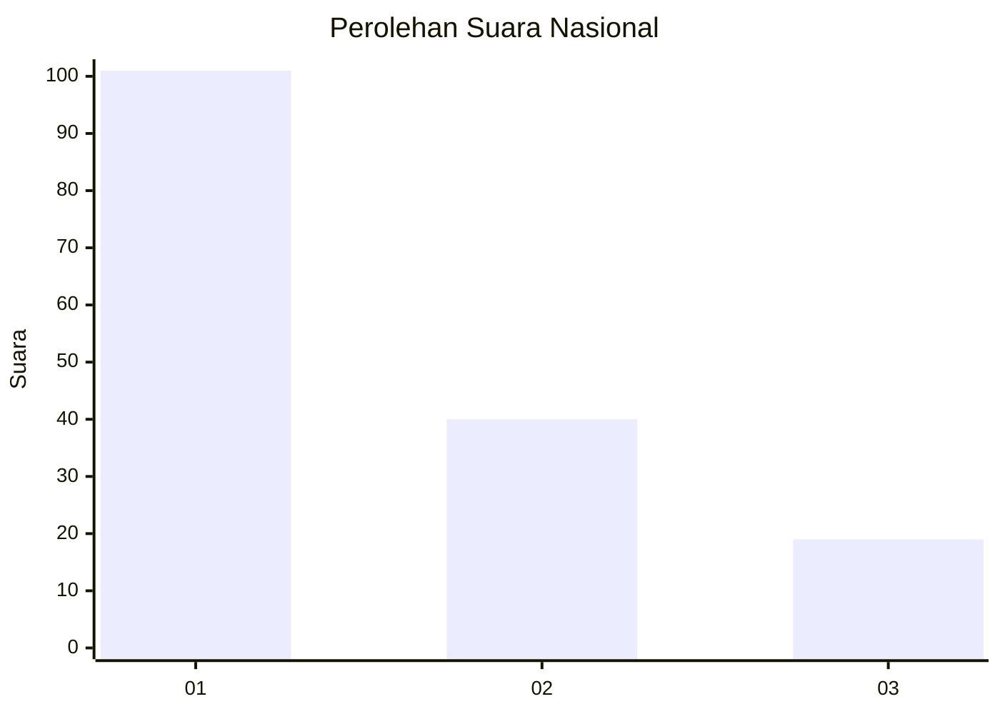
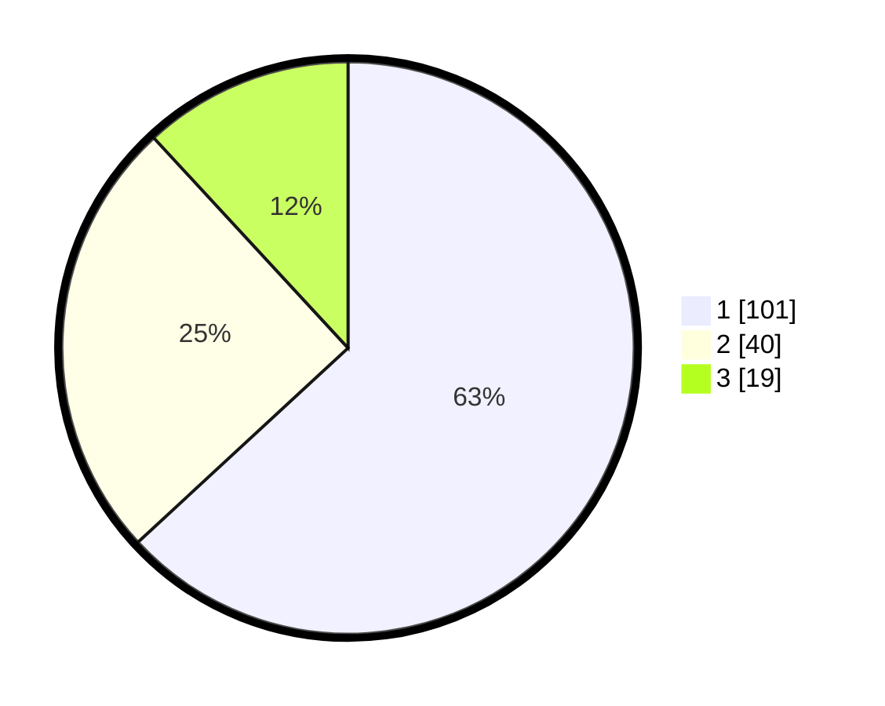

# Hasil

## Grafik

## Tabel

| No.    | Nama Paslon    | Suara | Suara (raw) | Persentase |
|:------ |:-------------- | -----:| -----------:| ----------:|
| 100025 | ANIES MUHAIMIN | 101   | [101][p-1]  | 63,13      |
| 100026 | PRABOWO GIBRAN | 40    | [40][p-2]   | 25,00      |
| 100027 | GANJAR MAHFUD  | 19    | [19][p-3]   | 11,88      |

[p-1]: https://github.com/gigit-pemilu/pemilu-2024/blob/main/pilpres/hitung-suara/sub/31-dki-jakarta/sub/74-jakarta-selatan/sub/08-pancoran/sub/1005-pengadegan/sub/062-tps/sub/paslon-1.txt
[p-2]: https://github.com/gigit-pemilu/pemilu-2024/blob/main/pilpres/hitung-suara/sub/31-dki-jakarta/sub/74-jakarta-selatan/sub/08-pancoran/sub/1005-pengadegan/sub/062-tps/sub/paslon-2.txt
[p-3]: https://github.com/gigit-pemilu/pemilu-2024/blob/main/pilpres/hitung-suara/sub/31-dki-jakarta/sub/74-jakarta-selatan/sub/08-pancoran/sub/1005-pengadegan/sub/062-tps/sub/paslon-3.txt

## Foto C Plano

https://sirekap-obj-formc.kpu.go.id/a5ab/pemilu/ppwp/31/74/08/10/05/3174081005062-20240220-082739--97099bea-0837-484c-a4ba-281317af8142.jpg

https://sirekap-obj-formc.kpu.go.id/a5ab/pemilu/ppwp/31/74/08/10/05/3174081005062-20240220-083005--6b640306-a72b-4d56-9c2e-7bd84b01f7fe.jpg

https://sirekap-obj-formc.kpu.go.id/a5ab/pemilu/ppwp/31/74/08/10/05/3174081005062-20240222-183443--f25cdcf6-1996-440c-90fa-309e415d9a18.jpg

## Metadata

| Key        | Value               |
| ---------- | ------------------- |
| Time Stamp | 2024-02-24 23:00:00 |

