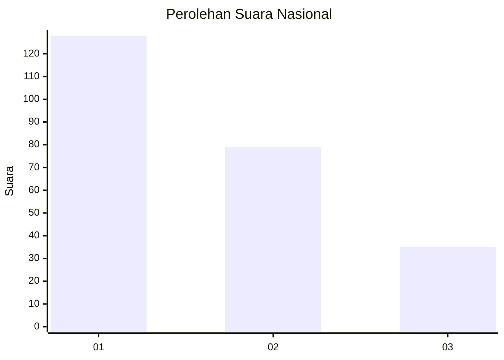
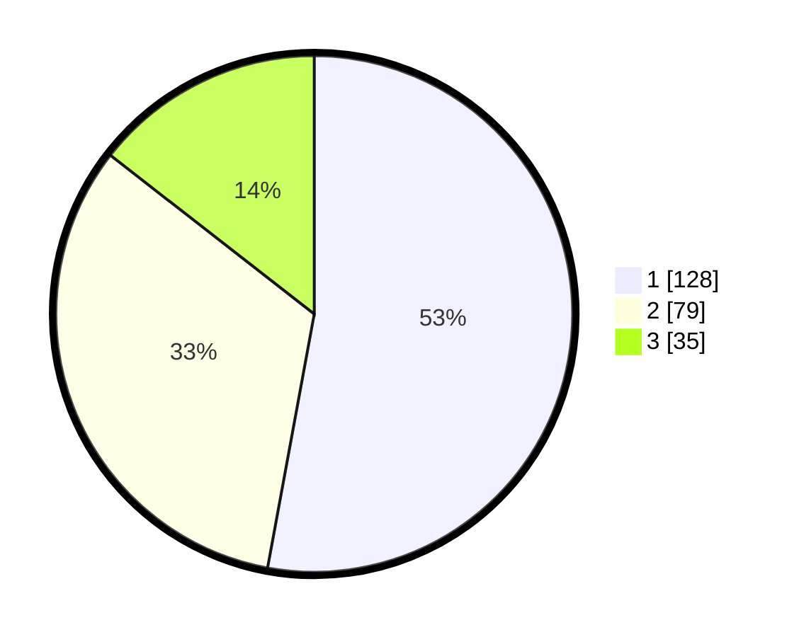

# Hasil

## Grafik

## Tabel

| No.    | Nama Paslon    | Suara | Suara (raw) | Persentase |
|:------ |:-------------- | -----:| -----------:| ----------:|
| 100025 | ANIES MUHAIMIN | 128   | [128][p-1]  | 52,89      |
| 100026 | PRABOWO GIBRAN | 79    | [79][p-2]   | 32,64      |
| 100027 | GANJAR MAHFUD  | 35    | [35][p-3]   | 14,46      |

[p-1]: https://github.com/gigit-pemilu/pemilu-2024/blob/main/pilpres/hitung-suara/sub/31-dki-jakarta/sub/74-jakarta-selatan/sub/08-pancoran/sub/1006-cikoko/sub/007-tps/sub/paslon-1.txt
[p-2]: https://github.com/gigit-pemilu/pemilu-2024/blob/main/pilpres/hitung-suara/sub/31-dki-jakarta/sub/74-jakarta-selatan/sub/08-pancoran/sub/1006-cikoko/sub/007-tps/sub/paslon-2.txt
[p-3]: https://github.com/gigit-pemilu/pemilu-2024/blob/main/pilpres/hitung-suara/sub/31-dki-jakarta/sub/74-jakarta-selatan/sub/08-pancoran/sub/1006-cikoko/sub/007-tps/sub/paslon-3.txt

## Foto C Plano

https://sirekap-obj-formc.kpu.go.id/6fa7/pemilu/ppwp/31/74/08/10/06/3174081006007-20240214-193837--bc2c5caa-0c62-4d88-9983-cdffe2fe1803.jpg

https://sirekap-obj-formc.kpu.go.id/6fa7/pemilu/ppwp/31/74/08/10/06/3174081006007-20240215-000326--a70faf9d-2085-4361-8f7c-c6eeb4593ef1.jpg

https://sirekap-obj-formc.kpu.go.id/6fa7/pemilu/ppwp/31/74/08/10/06/3174081006007-20240214-194000--b226db71-32a9-4331-8574-0ef7fd56293c.jpg

## Metadata

| Key        | Value               |
| ---------- | ------------------- |
| Time Stamp | 2024-02-24 22:31:28 |

